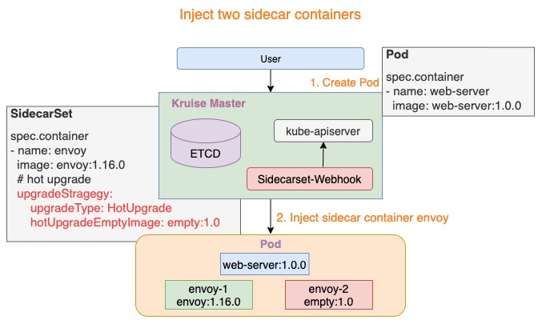
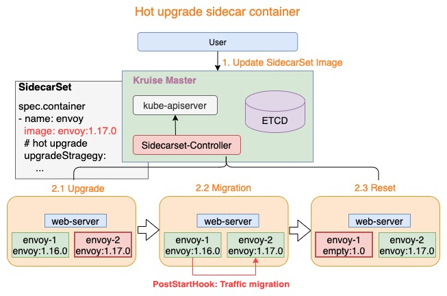

# SidecarSet Hot Upgrade Feature

- SidecarSet supports lossless hot upgrades for stateful sidecar containers, such as Istio Envoy

## Table of Contents

A table of contents is helpful for quickly jumping to sections of a proposal and for highlighting
any additional information provided beyond the standard proposal template.
[Tools for generating](https://github.com/ekalinin/github-markdown-toc) a table of contents from markdown are available.

- [Title](#title)
  - [Table of Contents](#table-of-contents)
  - [Motivation](#motivation)
  - [Proposal](#proposal)
    - [Inject Containers](#inject-containers)
    - [Hot Upgrade](#hot-upgrade)
  - [User Cases](#user-cases)
    - [A Sample Case](#a-sample-case)
    - [Practical sample usage in service mesh](#practical-sample-usage-in-service-mesh)
  - [Implementation History](#implementation-history)

## Motivation

OpenKruise abstracts SidecarSet to manage the sidecar containers in Pod. Please refer to the details: [OpenKruise SidecarSet](https://openkruise.io/en-us/docs/sidecarset.html).
User use SidecarSet to be easily injecting and upgrading sidecar containers, the current upgrade can only meet the requirements of stateless sidecar containers.
A stateless container can be upgraded directly through container restart, without migration of state between the old and new versions, for example: Logtail.

However, there are many scenarios for stateful sidecar containers, such as Istio Envoy, which cannot be upgraded by a direct restart.
The envoy intercepts all the traffic from the pod, and if you restart it directly, it will affect the availability of the business container.

In this proposal, we try to figure out a way to support lossless hot upgrades for stateful sidecar containers.

## Proposal

The SidecarSet implements a hot upgrade mechanism of the stateful sidecar container by adding an empty container. As shown below:

```yaml
apiVersion: apps.kruise.io/v1alpha1
kind: SidecarSet
metadata:
  name: test-sidecarset
spec:
  containers:
  - name: sidecar-name
    ....
    # sidecar container upgrade method
    upgradeStrategy:
      upgradeType: HotUpgrade | ColdUpgrade
      hotUpgradeEmptyImage: {Empty Image}
```
- upgradeType: HotUpgrade indicates hot upgrade for stateful sidecar container; ColdUpgrade is used for stateless sidecar container
- hotUpgradeEmptyImage: when upgradeType=HotUpgrade, user needs to provide an empty container for hot upgrades

**Note: hotUpgradeEmptyImage has the same configuration as the sidecar container, for example: command, lifecycle, probe, etc, but it doesn't do anything.**

Hot upgrade consists of the following two processes:
- inject hot upgrade sidecar containers
- in-place hot upgrade sidecar container

### Inject Containers

When the sidecar container upgradeStrategy=HotUpgrade, the SidecarSet Webhook will inject two containers into the Pod:
1. {sidecarContainer.name}-1: as shown in the figure below: envoy-1, the container run the actual working sidecar container, such as envoy:1.16.0
2. {sidecarContainer.name}-2: as shown in the figure below: envoy-2, the container run the hot upgrade empty container, and it doesn't have to deal with any real logic, as long as it stays in place, such as empty:1.0



### Hot Upgrade

The SidecarSet Controller breaks down the hot upgrade process of the sidecar container into three steps:
1. Upgrade: upgrade the empty container to the new version of the sidecar container, such as envoy-2.Image = envoy:1.17.0
2. Migration: the process completes the state migration of stateful container, which needs to be done by the business itself according to its own container characteristics.
PostStartHook completes the migration of the above process.
(**Note: PostStartHook must block during the migration, and exit when migration complete.**)
3. Reset: the step resets the old version sidecar container into empty container, such as envoy-1.Image = empty:1.0

The above is the complete hot upgrade process. If a Pod needs to be hot upgraded several times, the above three steps can be repeated.



#### Migration Mechanism

SidecarSet Hot upgrade provides an upgrade mechanism for stateful container. The specific state transfer process still needs to be implemented by the business itself.
State migration is a very important step in the hot upgrade process, so i will describe some of the key points below:

**1. Coordination Mechanism**

The state migration process starts with a coordination between the two sidecar containers to decide the migration direction (sidecar-1 -> sidecar-2 or sidecar-2 -> sidecar-1).
Since state migration is always from old -> new version. For this case OpenKruise injects the environment variable **SIDECARSET_VERSION** into the sidecar container by default.
The value of SIDECARSET_VERSION is the resourceVersion of the corresponding SidecarSet, so the larger one is the newer version compared with the two SIDECARSET_VERSION.
As shown below, envoy-2 is the new version of sidecar:
```
$ kubectl describe pods test-pod
  Name:         test-pod
  Namespace:    default
  Annotations:
                version.sidecarset.kruise.io/nginx-sidecar-1: 1097936677
                version.sidecarset.kruise.io/nginx-sidecar-2: 1098297016
  Status:       Running
  Containers:
    nginx-sidecar-1:
      Image:          nginx:1.18
      Environment:
        SIDECARSET_VERSION:   (v1:metadata.annotations['version.sidecarset.kruise.io/nginx-sidecar-1'])
    nginx-sidecar-2:
      Image:          nginx:1.19
      Environment:
        SIDECARSET_VERSION:   (v1:metadata.annotations['version.sidecarset.kruise.io/nginx-sidecar-2'])
```
Although the version of sidecar has been saved in the environment SIDECARSET_VERSION, it still needs a coordination between two sidecars to determine, and recommend to use shared Linux IPC, such as: TCP communication, shared memory, UDS, etc.
The specific business can decide by itself according to its own technology stack.

**Future Planning**

The current coordination mechanism also requires sidecar containers to implement intercommunication,
and this approach increases the development cost of sidecar containers. I will simplify this behavior in the next release by adding a SIDECARSET_VERSION_ALT environment variable. This is shown below:
```
$ kubectl describe pods test-pod
  Name:         test-pod
  Namespace:    default
  Annotations:
                version.sidecarset.kruise.io/nginx-sidecar-1: 1097936677
                version_alt.sidecarset.kruise.io/nginx-sidecar-1: 1098297016
                version.sidecarset.kruise.io/nginx-sidecar-2: 1098297016
                version_alt.sidecarset.kruise.io/nginx-sidecar-2: 1097936677
  Status:       Running
  Containers:
    nginx-sidecar-1:
      Image:          nginx:1.18
      Environment:
        SIDECARSET_VERSION:   (v1:metadata.annotations['version.sidecarset.kruise.io/nginx-sidecar-1'])
        SIDECARSET_VERSION_ALT: (v1:metadata.annotations['version_alt.sidecarset.kruise.io/nginx-sidecar-1'])
    nginx-sidecar-2:
      Image:          nginx:1.19
      Environment:
        SIDECARSET_VERSION:   (v1:metadata.annotations['version.sidecarset.kruise.io/nginx-sidecar-2'])
        SIDECARSET_VERSION_ALT: (v1:metadata.annotations['version_alt.sidecarset.kruise.io/nginx-sidecar-2'])
```
The environment variable SIDECARSET_VERSION_ALT records the version of another sidecar container, therefore,
no longer needs to communicate with each other, in three scenarios:

1. SIDECARSET_VERSION>0, SIDECARSET_VERSION_ALT=0

This scenario indicates that the sidecar is not currently in the hot upgrade process and should perform an initialization operation (e.g., ListenFd)

2. SIDECARSET_VERSION>0, SIDECARSET_VERSION_ALT>0, SIDECARSET_VERSION>SIDECARSET_VERSION_ALT

This scenario indicates that the sidecar is in the process of hot upgrade, and the current version of the sidecar is new, so state migration needs to be performed in the PostStartHook

3. SIDECARSET_VERSION>0, SIDECARSET_VERSION_ALT>0, SIDECARSET_VERSION<SIDECARSET_VERSION_ALT

This scenario indicates that the sidecar is in the process of hot upgrade, and the current version of the sidecar is old, which will only happen if the old sidecar exits abnormally.
so it should not do any listening or other operations after starting, and just running there without doing anything.

**2. State Migration**

State migration is essentially the migration of stateful resources from the old version to the new version without interrupting service to the outside world. For example, for envoy, it is the migration of fd from the old sidecar to the new sidecar. fd can be passed between processes via Unix Domain Socket, but simply passing fd is still far from the goal of hot upgrade.
We can divide fd into two types: ListenFd and ConnectionFd, ListenFd is easier to migrate due to its stateless property, while ConnectionFd is not easy to complete the migration, the recommended migration solution is to migrate ListenFd, ConnectionFd "gracefully offline" and re-establish the connection to the new service process at the next request.

**3. Exception Handling**

- **new version of sidecar container keeps failing to start (non-postStartHook execution failure)**: Image, or some other reasons could cause the repeating start-up failure of the new version of sidecar container. In this failure, the status of the pod will be not ready, but the old version of sidecar still remains running.
under the circumstances, SidecarSet upgrades may be blocked due to the MaxUnavailable restriction, unless a newer success version is released.
- **failure during state migration (e.g. ListenFd migration succeeded, ConnectionFd graceful offline failed)**: In this case, the state resources (e.g. ListenFd) in the old version of the sidecar container will not be automatically restored, and the kubelet will restart the sidecar container at a later time.
In this scenario, PostStartHook may skip the state migration, and performs initialization operations to complete the start of the new version sidecar.
- **old version of sidecar container exit abnormally**: First of all, kubelet will restart the exited container, and after restarting, the sidecar container will first determine whether it’s of old version. If so, it should just keep running but do nothing actually (such as listening for connections)

#### Other Notes
1. For a single hot upgrade sidecar in the sidecarSet, two sidecar containers will be injected (resources.requests will double), so we recommend leaving the resources.requests unset, or set to half of the original resources.requests
2. For the in-place hot upgrade process, if there is no exception in the process, the kubelet will not report any Pod.Status, and the pod will remain ready in the process.
That is, the hot upgrade process will not update the endpoint data, for the client, the hot upgrade pod is continuously available, thus achieving the effect of lossless upgrade.

## User Cases
### A Sample Case
1. Create sidecarSet with hot upgrade sidecar container
```yaml
# sidecarset.yaml
apiVersion: apps.kruise.io/v1alpha1
kind: SidecarSet
metadata:
  name: test-sidecarset
spec:
  selector:
    matchLabels:
      app: main
  containers:
  - name: nginx-sidecar
    image: nginx:1.18
    lifecycle:
      postStart:
        exec:
          # If the environment variable SIDECARSET_VERSION=1, this is the first time sidecar container has been started, and it exit without doing anything
          # If the environment variable SIDECARSET_VERSION>1, indicates that this is a hot upgrade of sidecar container,
          # then the script needs to complete the migration in the hot upgrade
          command:
          - /bin/bash
          - -c
          - /usr/local/bin/nginx-agent migrate
    upgradeStrategy:
      upgradeType: HotUpgrade
      hotUpgradeEmptyImage: empty:1.0.0
```

2. Create pod

```yaml
apiVersion: v1
kind: Pod
metadata:
  labels:
    app: main # matches the SidecarSet's selector
  name: test-pod
spec:
  containers:
  - name: main
    image: busybox:latest
    command:
    - /bin/sh
    - -c
    - sleep 100000
```

3. Get pod with two sidecar containers
```bash
$ kubectl get pods |grep test-pod
test-pod                            3/3     Running   0          79m

$ kubectl describe pods test-pod
Name:         test-pod
Namespace:    default
Status:       Running
Containers:
  nginx-sidecar-1:
    Image:         nginx:1.18
    ...
  nginx-sidecar-2:
    Image:         empty:1.0.0
    ...
  main:
   Image:         busybox:latest
   ...
Conditions:
  Type              Status
  Initialized       True
  Ready             True
  ContainersReady   True
  PodScheduled      True
```

4. Update Sidecar Container Image
```plain
$ kubectl update -f sidecarset.yaml
# sidecarset.yaml
apiVersion: apps.kruise.io/v1alpha1
kind: SidecarSet
metadata:
  name: test-sidecarset
spec:
  selector:
    matchLabels:
      app: main
  containers:
  - name: nginx-sidecar
    # upgrade sidecar nginx version
    # change image from nginx:1.18 to nginx:1.19
    image: nginx:1.19
    lifecycle:
      postStart:
        exec:
        command:
          - /bin/bash
          - -c
          - /usr/local/bin/nginx-agent migrate
    upgradeStrategy:
      upgradeType: HotUpgrade
      hotUpgradeEmptyImage: empty:1.0.0

$ kubectl describe pods test-pod
  Name:         test-pod
  Namespace:    default
  Annotations:  kruise.io/sidecarset-hash:
                  {"test-sidecarset":{"updateTimestamp":"2021-03-15T09:20:58Z","hash":"5dvvb87v46w7f84xwb6wdw6688wbvvf8b44bz698d8xx4fwx446429862d4z6vv5","si...
                kruise.io/sidecarset-hash-without-image:
                  {"test-sidecarset":{"updateTimestamp":"2021-03-15T09:20:58Z","hash":"2vwx84vd424975894d2d62c5d5w97v8fd2c28xwdbx89f7z9d4xxc2v54d5c4bbw","si...
                kruise.io/sidecarset-injected-list: test-sidecarset
                kruise.io/sidecarset-working-hotupgrade-container: {"nginx-sidecar":"nginx-sidecar-2"}
                version.sidecarset.kruise.io/nginx-sidecar-1: 1097936677
                version.sidecarset.kruise.io/nginx-sidecar-2: 1098297016
  Status:       Running
  Containers:
    nginx-sidecar-1:
      Image:          empty:1.0.0
      State:          Running
        Started:      Tue, 09 Mar 2021 16:12:11 +0800
      Ready:          True
      Restart Count:  1
      Environment:
        IS_INJECTED:         true
        SIDECARSET_VERSION:   (v1:metadata.annotations['version.sidecarset.kruise.io/nginx-sidecar-1'])
    nginx-sidecar-2:
      Image:          nginx:1.19
      State:          Running
        Started:      Tue, 09 Mar 2021 16:11:35 +0800
      Ready:          True
      Restart Count:  1
      Environment:
        IS_INJECTED:         true
        SIDECARSET_VERSION:   (v1:metadata.annotations['version.sidecarset.kruise.io/nginx-sidecar-2'])
    main:
      Image:          busybox:latest
      State:          Running
        Started:      Tue, 09 Mar 2021 14:10:21 +0800
```

### Practical sample usage in service mesh
AliYun ASM has realized lossless upgrade of Data Plane based on the hot upgrade capability of SidecarSet.

For details, please refer to: AliYun ASM (help.aliyun.com/document_detail/193804.html).

## Implementation History

- [ ] 09/03/2021: Proposal submission
