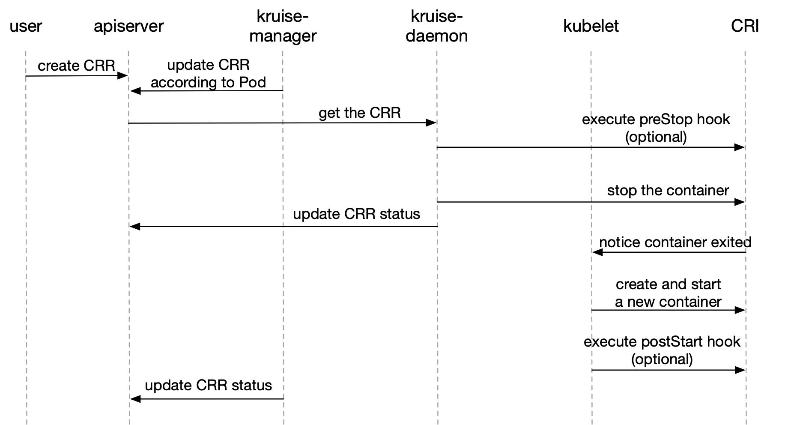

# ContainerRecreateRequest

- Provide a way to let users restart/recreate one or more containers in a Pod.

## Table of Contents

A table of contents is helpful for quickly jumping to sections of a proposal and for highlighting
any additional information provided beyond the standard proposal template.
[Tools for generating](https://github.com/ekalinin/github-markdown-toc) a table of contents from markdown are available.

- [ContainerRecreateRequest](#containerrecreaterequest)
  - [Table of Contents](#table-of-contents)
  - [Motivation](#motivation)
  - [Proposal](#proposal)
    - [User Stories](#user-stories)
      - [Story 1](#story-1)
    - [Implementation Details/Notes/Constraints](#implementation-detailsnotesconstraints)
    - [Risks and Mitigations](#risks-and-mitigations)
  - [Implementation History](#implementation-history)

## Motivation

Now that the only way to recreate a container in an active Pod is to update it in-place.
However, it also requires users to change the image defined in workloads (e.g. CloneSet/Advanced StatefulSet).

We hope to provide a way to let users recreate(restart) one or more containers in any active Pods.
It is useful for some user scenarios, such as:

1. Restart the application in app container.
2. Restart a sidecar container along with app container.

## Proposal

Define a CRD named `ContainerRecreateRequest` (short name `CRR`):

```yaml
apiVersion: apps.kruise.io/v1alpha1
kind: ContainerRecreateRequest
metadata:
  namespace: pod-namespace
  name: xxx
  labels:
    crr.apps.kruise.io/pod-name: pod-name               # injected by kruise webhook
    crr.apps.kruise.io/node-name: node-name-of-the-pod  # injected by kruise webhook
spec:
  podName: pod-name
  containers:
  - name: app
  - name: sidecar
  strategy:
    failurePolicy: Fail                 # or 'Ignore'. If 'Fail', the CRR will finish when one container failed to stop or recreate
    orderedRecreate: false              # 'true' indicates to recreate the next container only if the previous one has recreated completely
    terminationGracePeriodSeconds: 30   # the optional duration in seconds to wait the container terminating gracefully
    unreadyGracePeriodSeconds: 3        # it is the optional duration in seconds to mark Pod as not ready over this duration before executing preStop hook and stopping the container
  activeDeadlineSeconds: 300        # the CRR will be marked as Completed immediately if it has ran over deadline duration since created
  ttlSecondsAfterFinished: 1800     # ttl after this ContainerRecreateRequest has completed
```

1. The containers will be recreated one by one.
  Typically, we will stop the next one once if the previous has stopped, unless the `unreadyGracePeriodSeconds` is set.
2. The `unreadyGracePeriodSeconds` depends on a new feature-gate named `KruisePodReadinessGate`,
  which indicates to inject a readinessGate during each Pod creating.
  Otherwise `unreadyGracePeriodSeconds` can only work for those new Pods created by Kruise that have the readinessGate.
3. If users set `ttlSecondsAfterFinished`, then CRR will automatically be deleted after completed over this time.
  Otherwise, users have to delete the CRR manually.

### Status

Status of CRR looks like this:

```yaml
status:
  completionTime: "2021-03-22T11:53:48Z"
  containerRecreateStates:
  - name: app
    phase: Succeeded
  - name: sidecar
    phase: Succeeded
  phase: Completed
```

The `status.phase` can be:

- `Pending`: this CRR waits to recreate
- `Recreating`: this CRR is recreating
- `Completed`: this CRR has completed, and `status.completionTime` is the timestamp of completion

Note that `status.phase=Completed` does not mean all containers in CRR have recreated successfully.
Users should find the information in `status.containerRecreateStates`.

The `status.containerRecreateStates[x].phase` can be:

- `Pending`: this container waits to recreate
- `Recreating`: this container is recreating
- `Failed`: this container has failed to recreate
- `Succeeded`: this container has succeeded to recreate

**When the CRR has completed, only the containers in `Succeeded` phase are successfully recreated.**

### User Stories

#### Story 1

To restart the service running in one container, user needs to restart the specific container.
It is too EXPENSIVE to recreate the whole Pod.

Related [Issue](https://github.com/openkruise/kruise/issues/495).

### Requirements

`ContainerRecreateRequest` relies on kruise-daemon to stop the container in Pod.

So if the `KruiseDaemon` feature-gate is closed, `ContainerRecreateRequest` will also be disabled.

### Implementation Details/Notes/Constraints



When users create a CRR, webhook will inject the current containerID and restartCount into `spec.containers[x].statusContext`.
And, when **kruise-daemon** starts to execute, it will skip the container if its containerID is not equal to the one in statusContext or the restartCount has been bigger,
which means the container has already been recreated (maybe by in-place update).

For containers, **kruise-daemon** will stop the container with or without preStop hook,
then **kubelet** will create a new container and start again.

While some containers being recreating, the other containers in the same Pod will still be running.

### Risks and Mitigations

- Recreating a container will cause the application in it to start again.
- It is `recreate` rather than `restart`, so the files written in the **rootfs** of the previous container will be lost.
  But the files written in volume will be mounted to the new container.
- There is no problem if the recreation occurs with an in-place update in the same time:
  - If **Kubelet** has stopped or recreated the container because of in-place update, **kruise-daemon** will consider it already recreated.
  - If **kruise-daemon** stops the container, **Kubelet** will keep to in-place update the container to the new image.

## Implementation History

- [ ] 16/03/2021: Proposal submission
