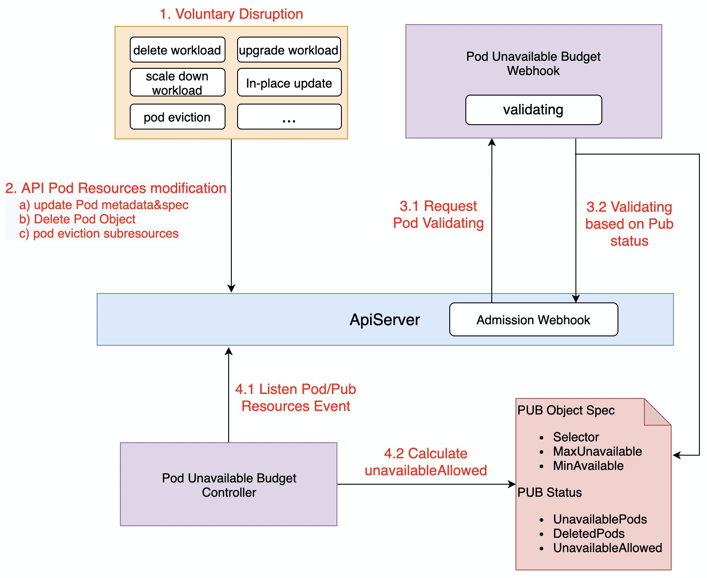

# Pod Unavailable Budget Feature

- In voluntary disruption scenarios, PodUnavailableBudget can achieve the effect of preventing application disruption or SLA degradation, which greatly improves the high availability of application services.

## Table of Contents

A table of contents is helpful for quickly jumping to sections of a proposal and for highlighting
any additional information provided beyond the standard proposal template.
[Tools for generating](https://github.com/ekalinin/github-markdown-toc) a table of contents from markdown are available.

- [Title](#title)
  - [Table of Contents](#table-of-contents)
  - [Motivation](#motivation)
  - [Proposal](#proposal)
    - [API Definition](#api-definition)
    - [Implementation](#implementation)
    - [Pub selector cannot overlap](#pub-selector-cannot-overlap)
    - [Comparison with PDB](#comparison-with-pdb)
  - [Implementation History](#implementation-history)

## Motivation
In kubernetes, powerful workloads (e.g., deployment, statefulset, etc.) are often used to define and manage applications.
It not only manages the number of pods, but also provides powerful rolling capabilities such as MaxUnavailable, Partition, etc.
However, workload can only help the application reach the desired number of pods as fast as possible, but does not guarantee that the number of available pods will remain at the desired value at any given moment.

Kubernetes offers [Pod Disruption Budget](https://kubernetes.io/docs/tasks/run-application/configure-pdb/) to help you run highly available applications even when you introduce frequent [voluntary disruptions](https://kubernetes.io/docs/concepts/workloads/pods/disruptions/).
PDB limits the number of Pods of a replicated application that are down simultaneously from voluntary disruptions. However, it can only constrain the voluntary disruption triggered by the [Eviction API](https://kubernetes.io/docs/tasks/administer-cluster/safely-drain-node/#eviction-api).
For example, when you run kubectl drain, the tool tries to evict all of the Pods on the Node you're taking out of service.

In the following voluntary disruption scenarios, there are still business disruption or SLA degradation situations:
1. The application owner update deployment's pod template for general upgrading, while cluster administrator drain nodes to scale the cluster down(learn about [Cluster Autoscaling](https://github.com/kubernetes/autoscaler/#readme)).
2. The middleware team is using [SidecarSet](https://openkruise.io/en-us/docs/sidecarset.html) to rolling upgrade the sidecar containers of the cluster, e.g. ServiceMesh envoy, while HPA triggers the scale-down of business applications.
3. The application owner and middleware team release the same Pods at the same time based on OpenKruise cloneSet, sidecarSet in-place upgrades

## Proposal
PodUnavailableBudget is an attempt for voluntary disruption, which is not only compatible with Kubernetes PDB protection for Eviction API, but also able to support the protection ability of above scenarios.
### API Definition
```
// PodUnavailableBudgetSpec defines the desired state of PodUnavailableBudget
type PodUnavailableBudgetSpec struct {
	// Selector label query over pods managed by the budget
	Selector *metav1.LabelSelector `json:"selector,omitempty"`

	// TargetReference contains enough information to let you identify an workload for PodUnavailableBudget
	// Selector and TargetReference are mutually exclusive, TargetReference is priority to take effect.
    // Selector is commonly used in scenarios where applications are deployed using multiple workloads,
    // and TargetReference is used for protection against a single workload.
	TargetReference *TargetReference `json:"targetRef,omitempty"`

	// Delete pod, evict pod or update pod specification is allowed if at most "maxUnavailable" pods selected by
	// "selector" or "targetRef"  are unavailable after the above operation for pod.
	// MaxUnavailable and MinAvailable are mutually exclusive, MaxUnavailable is priority to take effect
	MaxUnavailable *intstr.IntOrString `json:"maxUnavailable,omitempty"`

	// Delete pod, evict pod or update pod specification is allowed if at least "minAvailable" pods selected by
	// "selector" or "targetRef" will still be available after the above operation for pod.
	MinAvailable *intstr.IntOrString `json:"minAvailable,omitempty"`
}

// TargetReference contains enough information to let you identify an workload for PodUnavailableBudget
type TargetReference struct {
	// API version of the referent.
	APIVersion string `json:"apiVersion,omitempty"`
	// Kind of the referent.
	Kind string `json:"kind,omitempty"`
	// Name of the referent.
	Name string `json:"name,omitempty"`
}

// PodUnavailableBudgetStatus defines the observed state of PodUnavailableBudget
type PodUnavailableBudgetStatus struct {
	// Most recent generation observed when updating this PUB status. UnavailableAllowed and other
	// status information is valid only if observedGeneration equals to PUB's object generation.
	// +optional
	ObservedGeneration int64 `json:"observedGeneration"`

	// DisruptedPods contains information about pods whose eviction or deletion was
	// processed by the API handler but has not yet been observed by the PodUnavailableBudget controller.
	// +optional
	DisruptedPods map[string]metav1.Time `json:"disruptedPods,omitempty"`

	// UnavailablePods contains information about pods whose specification changed(e.g. inplace-update),
	// once pod is available(consistent and ready) again, it will be removed from the list.
	// +optional
	UnavailablePods map[string]metav1.Time `json:"unavailablePods,omitempty"`

	// UnavailableAllowed number of pod unavailable that are currently allowed
	UnavailableAllowed int32 `json:"unavailableAllowed"`

	// CurrentAvailable current number of available pods
	CurrentAvailable int32 `json:"currentAvailable"`

	// DesiredAvailable minimum desired number of available pods
	DesiredAvailable int32 `json:"desiredAvailable"`

	// TotalReplicas total number of pods counted by this PUB
	TotalReplicas int32 `json:"totalReplicas"`
}
```

### Implementation
This program customizes the PodUnavailableBudget (later referred to as PUB) CRD resource to describe the desired state of the application, and the working mechanism is shown below:



- Many voluntary disruption scenarios can be summarized as modifications to Pod resources, which are divided into the following three categories.
  - Modification of Pod metadata and spec section
  - DeletionPod, i.e. DeletionTimestamp assignment
  - Eviction API
- PUB validating is based on the kubernetes admission webhook mechanism, which decides whether to allow this operation to be executed based on the UnavailableAllowed in the PUB Status:
  - When UnavailableAllowed>0, UnavailableAllowed--, the request is allowed
  - Modification of Pod: insert pod.Name in Status.UnavailablePods(when the Pod upgrade is complete, remove it)
  - Eviction or Deletion Pod: insert pod.Name in Status.DisruptedPods(when the Pod deleted, remove it)
  - When UnavailableAllowed<=0, the request is not allowed, indicates that the modification of the pod will be rejected
- Pub Controller dynamically calculates Pub.Status according to selected Pods
  - DesiredAvailable indicates that minimum desired number of available pods(according to MaxUnavailable or MinAvailable)
  - CurrentAvailable indicates that current number of ready pods(condition.Ready=true)
  - UnavailableAllowed = CurrentAvailable - DesiredAvailable

### Pub selector cannot overlap
Pub.selector selects the pods that this pub needs to protect, and the pod cannot match multiple pubs. So when creating a pub webhook validate will check all other pubs to make sure there is no overlap, e.g.
1. Pub1 selector matchLabels[app] = webserver, Pub2 selector matchLabels[app] = webserver, so selector is overlap and pub2 will not be allowed to create
2. Pub1 selector matchLabels[app] = webserver, Pub2 selector matchLabels[app] = db, so selector isn't overlap and pub2 will be allowed to create
3. Pub1 selector matchLabels[app] = webserver, Pub2 selector matchLabels[backend] = true, because they don't contain the same label key, so they cannot be judged as overlap and pub2 will be allowed to create

**Note: if there is a pod that contains both of the above labels (e.g. labels[app]=webserver, labels[backend]=true), then the pod will match the above Pub1 and Pub2. This is unexpected(undefined) behavior.**

### Comparison with PDB
Kubernetes PodDisruptionBudget implements protection against Pod Eviction based on the EvictionREST interface,
while PodUnavailableBudget intercepts all pod modification requests through the admission webhook validating mechanism (Many voluntary disruption scenarios can be summarized as modifications to Pod resources),
and reject the request if the modification does not satisfy the desired state of the PUB.

Pub contains all the protection capabilities of kubernetes PDB, you can use both, or use pub independently to implement your application protection.

## Implementation History

- [ ] 06/14/2021: Proposal submission
