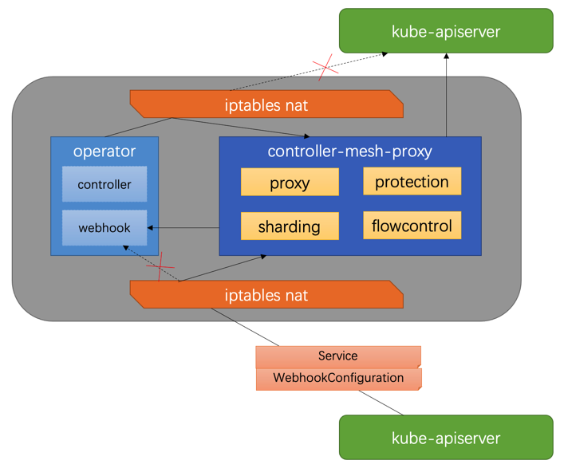
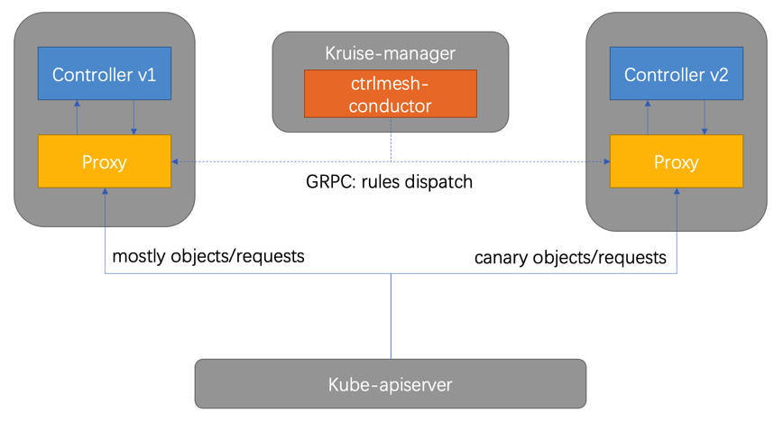
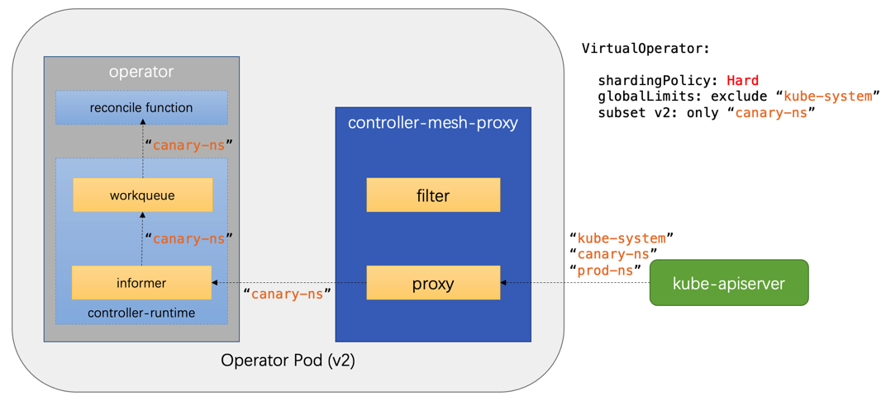
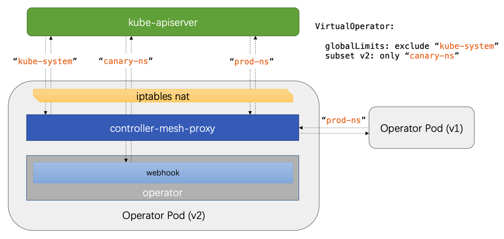

# ControllerMesh

## Table of Contents

A table of contents is helpful for quickly jumping to sections of a proposal and for highlighting
any additional information provided beyond the standard proposal template.
[Tools for generating](https://github.com/ekalinin/github-markdown-toc) a table of contents from markdown are available.

- [ControllerMesh](#controllermesh)
  - [Table of Contents](#table-of-contents)
  - [Motivation](#motivation)
  - [Proposal](#proposal)
    - [Flow control](#flow-control)
    - [User Stories](#user-stories)
    - [Risks and Mitigations](#risks-and-mitigations)
  - [Implementation History](#implementation-history)

## Motivation

ControllerMesh is a solution that helps developers deploy and manage their controllers/operators better:

1. Canary update: the controllers can be updated in canary progress instead of one time replace.
2. Fault injection: it helps developers to verify their reconcile logic in some fault scenarios.
3. Flexible isolation: limits resources of which namespaces can be queried by a controller.
4. Client-side rate-limit and blown.

## Proposal

Generally, we inject a `controller-mesh-proxy` container into each operator Pod.
The proxy container will intercept and handle the connection by between API Server and controllers/webhooks in the Pod.



The `ctrlmesh-conductor` in `kruise-manager` will dispatch rules to the proxies,
so that they can route requests according to the rules.



A core CRD in ControllerMesh is `VirtualOperator`. It contains all rules for user's controller and webhook:

```yaml
apiVersion: ctrlmesh.kruise.io/v1alpha1
kind: VirtualOperator
metadata:
  name: test-operator
  # ...
spec:
  selector:
    matchLabels:
      component: test-operator
  configuration:
    controller:
      leaderElection:
        lockName: test-operator
    webhook:
      certDir: /tmp/webhook-certs
      port: 9443
  route:
    globalLimits:
    - namespaceSelector:
        matchExpressions:
        - key: ns-type
          operator: NotIn
          values:
          - system
    subRules:
    - name: canary-rule
      match:
      - namespaceSelector:
          matchLabels:
            ns-type: canary-1
      - namespaceRegex: "^canary.*"
  subsets:
  - name: v2
    labels:
      version: v2
    routeRules:
    - canary-rule
```

- selector: for all pods of the test-operator
- configuration:
  - controller: configuration for controller, including leader election name
  - webhook: configuration for webhook, including certDir and port of this webhook
- route:
  - globalLimits: limit rules that enable to all pods of test-operator
  - subRules: multiple rules that can define to be used in subsets
- subsets: multiple groups of the pods, each subset has specific labels and its route rules

### Flow control

ControllerMesh will firstly support **Hard Limit** type of flow control,
which means the ctrlmesh-proxy will filter unmatched requests/responses between API Server and local controller/webhook.

Controller:



Webhook:



### User Stories

1. Developers hope to update their operators more smoothly.
2. Cluster administrators hope to limit the operators' connection dynamically.

### Risks and Mitigations

1. The controller/webhook can not get any requests if ctrlmesh-proxy container crashes.
2. Developers can not change the flow rules of their operators if kruise-manager is not working.
3. The performance of controller/webhook will be a little worse.
4. Pod of the operator requires a few more resources because of a ctrlmesh-proxy container injected into it.

## Implementation History

- [ ] 04/08/2021: Proposal submission
