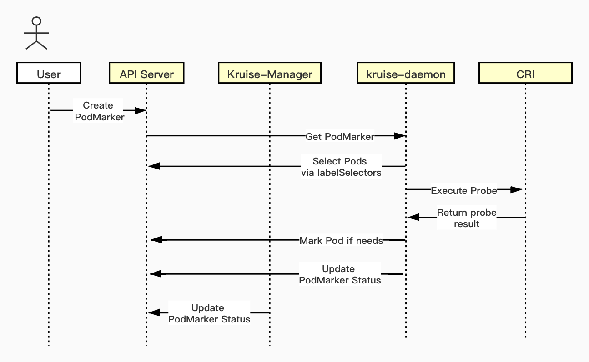

# PodMarker
A new CRD that marks Pods by number, labels, nodes, probes.

## Table of Contents
- [PodMarker](#podmarker)
  - [Table of Contents](#table-of-contents)
  - [Motivation](#motivation)
  - [Proposal](#proposal)
    - [User Stories](#user-stories)
      - [Story 1: Mark Pods by LabelSelector](#story-1-mark-pods-by-labelselector)
      - [Story 2: Mark Pods by User-Defined Probe](#story-2-mark-pods-by-user-defined-probe)
    - [Specification](#specification)
      - [About Spec.Strategy](#about-specstrategy)
      - [About Spec.MatchRequirements](#about-specmatchrequirements)
      - [About Spec.MatchPreferences](#about-specmatchpreferences)
    - [Implementation Plan](#implementation-plan)
      - [WebHook Validation](#webhook-validation)
      - [Controller](#controller)
  - [Implementation History](#implementation-history)

## Motivation
Many advanced K8s workload management features require the use of labels.
In some cases, labels are needed after Pods are created so that adding them to Pod template does not help. For example:

- A canary release plan may want to upgrade X number of Pods out of Y number of total replica. We can add a label to the chosen Pod so that the rollout controller can upgrade these Pods first.

- Mark Pods that satisfy the specific probe (http/tcp/exec). We can add label based on query result so that we can rollback Pods based on the added labels.

- Differentiate Pods with labels according to their different Nodes.

## Proposal
PodMarker is a new namespace-scoped CRD to add/remove labels/annotations of Pods.

### User Stories

#### Story 1: Mark Pods by LabelSelector
```yaml
apiVersion: apps.kruise.io/v1alpha1
kind: PodMarker
metadata:
  name: marker
spec:
  strategy:
    replicas: 10
    confilctPolicy: Overwrite
  matchRequirements:
    podSelector:
      matchLabels:
        app: nginx
    nodeSelector:
      matchLabels:
        arch: x86
  matchPreferences:
  - podSelector:
      matchLabels:
        pod.state: working_online
  - podReady: true
  markItems:
    labels:
      upgradeStrategy: inPlace
    annotations:
      markUpgradeStrategyUsingPodMarker: marker
```
In this story, users may want to only update some Pods about nginx running in x86 arch machines, and they prefer to update the `Ready` Pods with label `"pod.state: working_online"`.

For all Pods that already meet `.spec.matchRequirements`, PodMarker will mark these Pods orderly according to `spec.matchPreferences`:
1. Firstly, mark the Pods with label `pod.state: working_online` **AND** `Ready`;
2. Secondly, mark the Pods with label `pod.state: working_online`;
3. Thirdly, mark the `Ready` Pods;
4. Lastly, mark the other Pods.

This PodMarker will help users mark these pods,
and `spec.strategy` will ensure that at least 10 Pods are marked if there are at least 10 Pods meet `.spec.matchRequirements`.

#### Story 2: Mark Pods by User-Defined Probe
```yaml
apiVersion: apps.kruise.io/v1alpha1
kind: PodMarker
metadata:
  name: marker
spec:
  strategy:
    replicas: 50%
    confilctPolicy: Overwrite
  matchRequirements:
    podSelector:
      matchLabels:
        app: nginx
    nodeSelector:
      matchLabels:
        arch: x86
    podProbes:
    - containers:
        - name: nginx
        - name: sidecar
      probe:
        exec:
          command:
            - cat
            - /tmp/healthy
        initialDelaySeconds: 5
        periodSeconds: 5
      expectation: succeeded
  markItems:
    labels:
      rollback: lastRevision
    annotations:
      markRollbackUsingPodMarker: marker
```
In this story, users define a probe to judge the health of `Pods`. This `PodMarker` will mark those `Pods` which satisfy all the following requirements:
- having label "app: nginx"
- running in the nodes with label "arch: x86"
- probe result is "succeeded"
****

### Specification
#### About Spec.Strategy
- `Strategy.Replicas`:
  - `Strategy.Replicas` can ensure that the number(or percentage) of marked Pods `>=` `Replicas`, unless:
    - `len(satisfiedPods) < Spec.Strategy.Replicas` when `Spec.Strategy.ConflictPolicy` is `"Overwrite"`.
    - `len(satisfiedPods) - len(conflictPods) < Spec.Strategy.Replicas` when `Spec.Strategy.ConflictPolicy` is `"Ignore"`.
  - The number(or percentage) of marked Pods `>` `Replicas` iff the number of already marked Pods `>` `Replicas`.
  - If `Strategy.Replicas` is modified smaller, the PodMarker will shrink the number of marked Pods, and only delete the marks marked by PodMarker;
  - **If users delete PodMarker directly, the marks marked by PodMarker would not be cleaned. Users can remove these marks by setting `.Strategy.Replicas = 0` if need be.**
- `Strategy.ConflictPolicy`:
  - If `ConflictPolicy` is `"Overwrite"`, the labels or annotations, which have the same keys but different values as `spec.MarkItems`,  will be over-written.
  - If `ConflictPolicy` is `"Ignore"`, the PodMarker will treat these conflicting Pods as unmatched Pods.

#### About Spec.MatchRequirements
- **A `Pods` is matched iff it satisfies all the listed `MatchRequirements`.**
- `MatchRequirements.PodProbes`:
  - `PodProbes[x].Probe` is a user-defined probe, PodMarker will execute this probe and get a result(`succeeded` or `failed`).
  - If the probe result matches `PodProbes[x].Expectation`, `MatchRequirements.PodProbes[x]` will be satisfied.
  - Users can define more than one probe requirement, `MatchRequirements.PodProbes` is satisfied iff all probe requirements are satisfied.

#### About Spec.MatchPreferences
- `MatchPreferences` is an ordered list, which describe the priority of matched Pods when marking them;
- `MatchPreferences[i]` has **higher** priority than `MatchPreferences[j]` if `i < j`;
- If `len(MatchPreferences) > 1`, the priority rule is similar to [lexicographic order](https://en.wikipedia.org/wiki/Lexicographic_order).
- We will limit `len(MatchPreferences) < 32`
****

### Implementation Plan
#### WebHook Validation
1. Validate `.Metadata`
2. Validate `.Spec.Strategy`:
- check whether `Replicas` is a number or percentage;
- check two Policies.
3. Validate `.Spec.MatchRequirements`
- check `PodSelector` and `NodeSelector;
- check `PodProbes[x].Probe`;
- check container names;
- check whether `.PodProbes[x].Expectation` is succeeded or failed.
4. Validate `.Spec.MatchPreferences`
5. Validate `.Spec.PodMarkerMarkItems`

#### Controller
**Recognize the Pods Marked by PodMarker**

PodMarker will mark an extra annotation `kruise.io/marked-by-podmarker=<podmarker-name>` on Pods.

**Short-Term Implementation Plan for Controller**

In the first version, PodMarker will not support the `PodProbes`, and we will find a more appropriate opportunity to implement this feature in the future.

**Implement PodProbe in Kruise-Daemon In The Future**

We are going to implement `PodProbe` in `kruise-daemon` in the future due to the following problems:
- The user-defined probes need to interact with containers directly;
- The link between `kruise-controller-manager` and `Pods` may be very long,
  and even `kruise-controller-manager` cannot directly connect with some containers using TCP/HTTP;

I reference the designs of `ContainerRecreateRequest`and `ImagePuller`.
Specifically, `PodMarker` try to probe `Pods` in each `kruise-daemon` instead of controller-manager, this is because `kruise-daemon` run in every node, which can help us avoid many network problems.
Sequence diagram about PodMarker `PodProbe` looks like this:


## Implementation History
- [ ] 08/12/2021: Proposal submission

