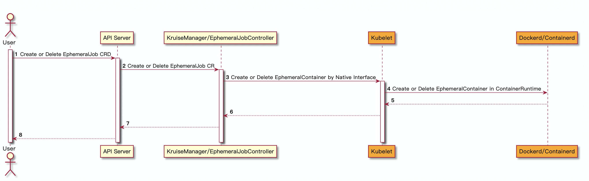
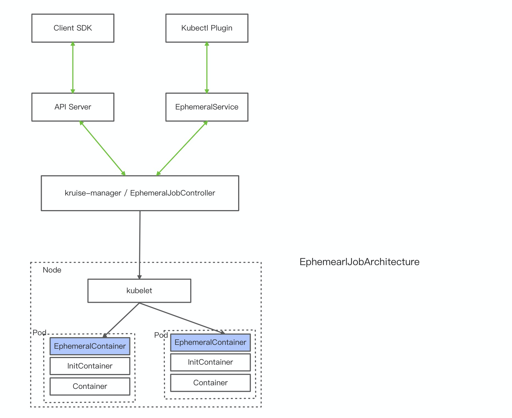

# EphemeralJob Feature

## Table of Contents

- [EphemeralJob Feature](#ephemeraljob-feature)
  - [Table of Contents](#table-of-contents)
  - [Motivation](#motivation)
    - [Goals](#goals)
  - [Proposal](#proposal)
    - [API Definition](#api-definition)
    - [status](#status)
    - [Interactive](#interactive)
    - [EphemeralJob Webhook Verification](#ephemeraljob-webhook-verification)
    - [User Stories](#user-stories)
  - [Implementation History](#implementation-history)

## Motivation

EphemeralContainers is mainly used to handle some temporary tasks.
Compared with ordinary containers, it has the following characteristics:

- After the task runs, the container enters the `Complete` state.

- Does not occupy pod resources.

- EphemeralContainers can share pid namespace with target container.

The current development progress of the EphemeralContainers stays at
Kubernetes v1.22 [alpha]. Currently, the EphemeralContainers only supports
creating interfaces, and does not support removing interfaces.
EphemeralContainers Removing Interface will be launched
in Kubernetes v1.23 as planned,
but observing the recent
[community discussions](https://github.com/kubernetes/kubernetes/issues/101609)
it seems that this feature will be postponed.
Based on the above background, users wish to create and manage
EphemeralContainers in batches.

### Goals

- Implementing a custom controller for EphemeralJob

which control and manage EphemeralContainers in target pods.

## Proposal

Define a CRD named `EphemeralJob` (short name `ejob`):

### API Definition

```yaml
apiVersion: apps.kruise.io/v1alpha1
kind: EphemeralJob
metadata:
  name: hello-world-ephemeral-job
spec:
  selector:
    matchLabels:
      app: helloworld
  replicas: 4
  ttlSecondsAfterCreated: 1800
  parallelism: 1
  template:
    ephemeralContainers:
    - image: busybox:latest
      imagePullPolicy: IfNotPresent # 必须
      terminationMessagePolicy: File  # 必须 'File' or 'FallbackToLogsOnError'
      targetContainerName: helloworld
      name: helloworld-ec
      command:
        - pidof
        - helloworld
      tty: true
      stdin: true
```

1. ejob will match a group of pods by selector fields.

1. ejob provide grey interface by replicas fields.

the number of creating ephemeralcontainer will not exceed replicas.

1. parallelism means parallel running ephemeral containers.

the value of parallelism cannot exceed 10.

1. template describe ephemeralcontainers spec.

1. ttlSecondsAfterCreated means the TTL duration after ephemeral job has created.

if this field is empty, that meas this ejob can exist
for a long time if nobody delete it.

### Status Definition

The status of EphemeralJob looks like this:

```yaml
status:
  failed: 0
  match: 1
  phase: Running
  replicas: 1
  running: 1
  startTime: "2021-08-25T12:43:21Z"
  succeeded: 0
  waiting: 0
  conditions:
  - lastProbeTime: "2021-08-25T12:43:21Z"
    lastTransitionTime: "2021-08-25T12:43:21Z"
    reason: Initialized
    status: "True"
```

The status.phase can be:

- Waiting: this EJOB waits ephemeral containers to be created.

it means no ephemeral container reach to running state.

- Running: some epheramcontainers creating

by this job has reached to running state.

- Succeed: all epheramcontainers creating

by this job has already completed it's task.

- Failed:all epheramcontainers creating by this job has

already failed to complete it's task.

- Error: some errors exits during ephemeralcontaienr creating.

status.failed means the number of failed completed ephemeralcontainers.
status.success means the number of success completed ephemeralcontainers.
status.waiting means the number of waiting ephemeralcontainers.
status.running means the number of running ephemeralcontainers.

status.startTime means the moment of this job created.
status.CompletionTime means the time moment of this job finished.

### Interactive Design

EphemeralJobController create and manage EphemeralContainer
through the interface with the native EphemeralContainer operation interface.
Their basic operation interaction diagram is as follows:



EphemeralJob Architecture diagram is as follows:



### EphemeralJob Webhook Verification

EphemeralJob only supports Create/Delete/update operations for
some specific fields.
During the update operation, only the modification of spec.parallelism and
spec.replicas are allowed in the spec.
Other fields are not allowed to be modified.

`Name`/`image`/`imagePullPolicy`/`terminationMessagePolicy`
/`targetContainerName`
in EphemeralJob.Spec.Template.EphemeralContainers[*] cannot be empty.

### User Stories

#### Story1: Create EphemeralContainers In Batch

The user has a batch of `helloword` applications and hopes to judge
the survival status of these batches of applications through EphemeralJobs.
the command `pidof helloworld` is used to determine whether
the `helloword` application is running.

1. Create application.

```yaml
apiVersion: apps/v1
kind: Deployment
metadata:
  name: helloworld
spec:
  selector:
    matchLabels:
      app: helloworld
  replicas: 2 # tells deployment to run 2 pods matching the template
  template:
    metadata:
      labels:
        app: helloworld
    spec:
      containers:
      - name: helloworld
        image: reg.docker.alibaba-inc.com/zhoushua/helloworld:v1.1
        ports:
        - containerPort: 80
```

1. Simulate the failed application.

```yaml
metadata:
  name: helloworld-no-work
spec:
  selector:
    matchLabels:
      app: helloworld
  replicas: 2
  template:
    metadata:
      labels:
        app: helloworld
    spec:
      containers:
      - name: helloworld
        image: reg.docker.alibaba-inc.com/zhoushua/helloworld:v1.1
        ports:
        - containerPort: 80
        env:
        - name: APP_STATE
          value: "false"
        command:
        - "sleep"
        - "99999"
```

1. Look at the application running status.

 ```yaml
zhoushua@B-H3KJLVDL-0114 zs % kubectl get po --show-labels
NAME                                 READY   STATUS    RESTARTS   AGE   LABELS
helloworld-865cd8865b-nl8lq          1/1     Running   0          34m   app=helloworld,pod-template-hash=865cd8865b
helloworld-865cd8865b-xmtrv          1/1     Running   0          34m   app=helloworld,pod-template-hash=865cd8865b
helloworld-no-work-6cc445bc7-d967c   1/1     Running   0          46s   app=helloworld,pod-template-hash=6cc445bc7
helloworld-no-work-6cc445bc7-t286v   1/1     Running   0          47s   app=helloworld,pod-template-hash=6cc445bc7
```

1. Create a EphemeralJob.

```yaml
apiVersion: apps.kruise.io/v1alpha1
kind: EphemeralJob
metadata:
  name: hello-world-ephemeral-job
spec:
  selector:
    matchLabels:
      app: helloworld
  replicas: 4
  ttlSecondsAfterCreated: 1800
  parallelism: 1
  template:
    ephemeralContainers:
    - image: busybox:latest
      imagePullPolicy: IfNotPresent
      terminationMessagePolicy: File
      targetContainerName: helloworld
      name: helloworld-ec
      command:
        - pidof
        - helloworld
      tty: true
      stdin: true
```

1. look at ephemeraljob status.

```yaml
zhoushua@B-H3KJLVDL-0114 ephmeraljob % kubectl get ejob
NAME                        MATCH   SUCCEED   FAILED   RUNNING   WAITING   AGE
hello-world-ephemeral-job   4       2         2        0         0         82s
```

#### Story2: Share Pid Namespace with Target Container

1. Create a running pod and check the status

```yaml
apiVersion: v1
kind: Pod
metadata:
  name: nginx
  labels:
    env: test
spec:
  containers:
  - name: nginx
    image: nginx
    imagePullPolicy: IfNotPresent
```

```
zhoushua@B-H3KJLVDL-0114 ephmeraljob % kubectl get pod
NAME    READY   STATUS    RESTARTS   AGE
nginx   1/1     Running   0          2m37s
```

1. Create a EphemeralJob and check the status.

```yaml
zhoushua@B-H3KJLVDL-0114 ephmeraljob % cat nginx-ejob.yaml
apiVersion: apps.kruise.io/v1alpha1
kind: EphemeralJob
metadata:
  name: nginx-ephemeral-job
spec:
  selector:
    matchLabels:
      env: test
  replicas: 1
  ttlSecondsAfterCreated: 1800
  parallelism: 1
  template:
    ephemeralContainers:
    - image: busybox:latest
      imagePullPolicy: IfNotPresent # 必须
      terminationMessagePolicy: File  # 必须 'File' or 'FallbackToLogsOnError'
      targetContainerName: nginx
      name: nginx-ec
      command:
        - "sleep"
        - "99999"
      tty: true
      stdin: true
```

```yaml
zhoushua@B-H3KJLVDL-0114 ephmeraljob % kubectl get ejob
NAME                  MATCH   SUCCEED   FAILED   RUNNING   WAITING   AGE
nginx-ephemeral-job   1       0         0        1         0         42s
```

1. At this point, there is already a running EphemeralContainer in the pod.

```yaml
zhoushua@B-H3KJLVDL-0114 ephmeraljob % kubectl get pod nginx -oyaml
apiVersion: v1
kind: Pod
metadata:
  resourceVersion: "3926180"
  uid: 1ab9621b-3fad-40ba-ae39-2ddbbc3e242e
spec:
  containers:
  - image: nginx
    imagePullPolicy: IfNotPresent
    name: nginx
    resources: {}
    terminationMessagePath: /dev/termination-log
    terminationMessagePolicy: File
    volumeMounts:
    - mountPath: /var/run/secrets/kubernetes.io/serviceaccount
      name: default-token-wqpfk
      readOnly: true
  dnsPolicy: ClusterFirst
  enableServiceLinks: true
  ephemeralContainers:
  - command:
    - sleep
    - "99999"
    env:
    - name: ephemeraljob
      value: nginx-ephemeral-job
    image: busybox:latest
    imagePullPolicy: IfNotPresent
    name: nginx-ec
    resources: {}
    stdin: true
    targetContainerName: nginx
    terminationMessagePath: /dev/termination-log
    terminationMessagePolicy: File
    tty: true
  nodeName: kruise-worker
status:
  ephemeralContainerStatuses:
  - containerID: containerd://6e4c12f41d0aeb74d361decc4c37d384fdfc90283f58e3b31361427e08edbf7f
    image: docker.io/library/busybox:latest
    imageID: docker.io/library/busybox@sha256:b37dd066f59a4961024cf4bed74cae5e68ac26b48807292bd12198afa3ecb778
    lastState: {}
    name: nginx-ec
    ready: false
    restartCount: 0
    state:
      running:
        startedAt: "2021-09-24T02:42:22Z"
```

1. Log in EphemeralContainers to view the running process.

```bash
zhoushua@B-H3KJLVDL-0114 ephmeraljob % kubectl exec -it nginx -c nginx-ec sh
/ # ps aux
PID   USER     TIME  COMMAND
    1 root      0:00 nginx: master process nginx -g daemon off;
   32 101       0:00 nginx: worker process
   33 101       0:00 nginx: worker process
   34 101       0:00 nginx: worker process
   35 101       0:00 nginx: worker process
   36 root      0:00 sleep 99999
   42 root      0:00 sh
   48 root      0:00 ps aux
```

## Implementation History

- [ ] 08/29/2021: Proposal submission
