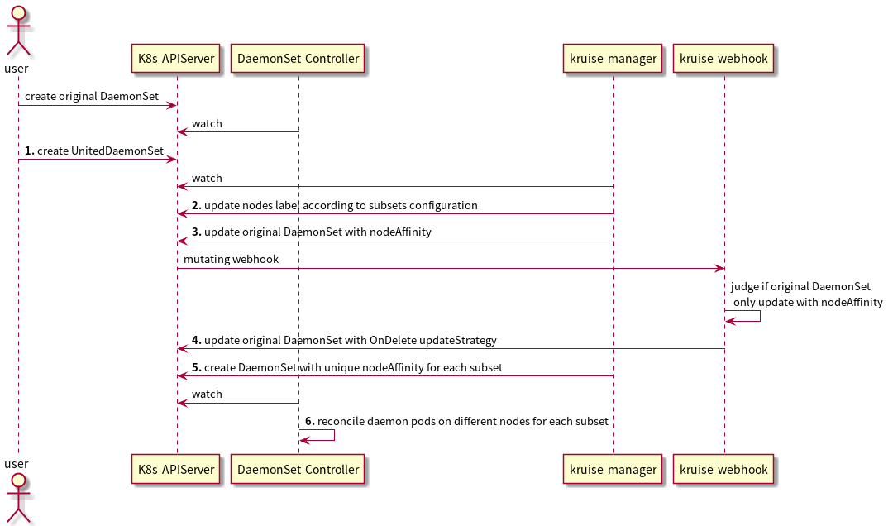

# UnitedDaemonSet
Provide a way to deploy multi-version DaemonSet on different nodes.

## Table of Contents

- [UnitedDaemonSet](#uniteddaemonset)
  - [Table of Contents](#table-of-contents)
  - [Motivation](#motivation)
  - [Proposal](#proposal)
    - [User Stories](#user-stories)
    - [Implementation Details/Notes/Constraints](#implementation-detailsnotesconstraints)
  - [Alternatives](#alternatives)
  - [Implementation History](#implementation-history)

## Motivation

Sometimes users may want to upgrade some daemon pods to version 1.1 and others to version 1.2 on specified nodes. For example, upgrade daemon pods in different CPU architecture nodes independently. A UnitedDaemonSet which is related to the existing DaemonSet can help users to achieve that. The controller will distribute multi-version pods of the existing DaemonSet according to UnitedDaemonSet subsets configuration.

## Proposal

Define UnitedDaemonSet CRD as follows:
```yaml
apiVersion: apps.kruise.io/v1alpha1
kind: UnitedDaemonSet
metadata:
  name: xxx
  namespace: xxx
spec:
  targetRef:
    apiVersion: apps/v1
    kind: DaemonSet
    name: ds-xxx
  subsets:
    - name: subset-a
      selector: # use names or match expressions to assign Nodes (only one of them can be set)
        names:
        - kind-worker
      patch:
        template:
          spec:
            containers:
              - name: nginx
                image: nginx:1.19.0
    - name: subset-b
      selector:
      matchExpressions:
        - key: topology.kubernetes.io/zone
          operator: In
          values:
          - zone-b
      patch:
        template:
          spec:
            containers:
              - name: nginx
                image: nginx:1.18.0
status:
  observedGeneration: 1
  subsetStatuses:
  - name: subset-a
    desiredNumberScheduled: 1
    numberMisscheduled: 0
    matchNodes:
    - kind-worker
  - name: subset-b
    desiredNumberScheduled: 1
    numberMisscheduled: 0
    matchNodes:
    - kind-worker2
```
**spec**:
- `targetRef`: reference to a specific workload, it supports `DaemonSet` in `apps` group
- `subsets`: list of subsets which defines different topologies
  - `name`: name of this subset
  - `selector`: use `names` or `matchExpressions` to assign nodes, the subset DaemonSet can only deploy pods on these nodes. (only one of them can be set)
  - `patch`: the specified strategic patch body of this subset, it will be patched to pods that belong to this subset. ref: [runtime.RawExtension](https://github.com/kubernetes/apimachinery/blob/03ac7a9ade429d715a1a46ceaa3724c18ebae54f/pkg/runtime/types.go#L94)

**status**:
- `subsetStatuses`: statuses of subsets defined in spec
  - `desiredNumberScheduled`: the total number of nodes that should be running the subset daemon pods
  - `numberMisscheduled`: the number of nodes that are running the subset daemon pods, but are not supposed to
  - `matchNodes`: the nodes which is assigned to deploy the subset daemon pods

**If one node is assigned to multi subsets, only the first subset DaemonSet will deploy pod on that node. So users should better not assign one node to multi subsets.**

### User Stories

- Deploy daemon pods with different versions on different nodes.
- When users delete UnitedDaemonSet, all subset DaemonSets will be deleted and only original DaemonSet will be reserved.
### Implementation Details/Notes/Constraints
1. Users create a UnitedDaemonSet which is related to an existing DaemonSet.
2. Kruise manager updates nodes label according to the subsets configuration.
3. Kruise manager updates the original DaemonSet with nodeAffinity.
4. Webhook finds the original DaemonSet is only updated with nodeAffinity, so sets OnDelete updateStrategy.
5. Kruise manager creates DaemonSet for each subset. Each subset DaemonSet will configure with unique nodeAffinity.
6. Then DaemonSet controller will reconcile the DaemonSets by each DaemonSet's nodeAffinity and nodeAffinity.
7. In future, UnitedDaemonSet can configure update strategy for each subset. Example: 1. parallelism; 2. hotupgrade; 3. etc.



## Alternatives

Both UnitedDeployment and WorkloadSpread are used to distribute workload in different subsets, but DaemonSet is not supported. And AdvancedDaemonSet is used to enhance the rolling update workflow of default DaemonSet, but can't distribute DaemonSet in different subsets. UnitedDaemonSet can distribute DaemonSet in different subsets, and requires no workload API changes.

## Implementation History

- [ ] MM/DD/YYYY: Proposed idea in an issue or [community meeting]
