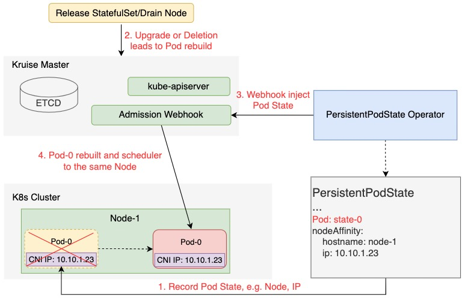

# Persistent Pod State

## Table of Contents

A table of contents is helpful for quickly jumping to sections of a proposal and for highlighting
any additional information provided beyond the standard proposal template.
[Tools for generating](https://github.com/ekalinin/github-markdown-toc) a table of contents from markdown are available.

- [Title](#title)
- [Table of Contents](#table-of-contents)
- [Motivation](#motivation)
- [Proposal](#proposal)
- [API Definition](#api-definition)
- [Implementation](#implementation)
- [StaticIP Scheduler Practice](#staticip-scheduler-practice)

## Motivation
In the K8S world Pods are the smallest unit of immutable infrastructure. Any change in application or environment, e.g., business release, machine eviction, or vacating,
will lead to Pod rebuild, which in turn will lead to changes in Node, Pod IP, local storage, and other resources where Pods are located. For most stateless applications this behavior is expected and has no impact on the business.

However, many stateful services are unacceptable to this behavior, for example, intermediate services (Dubbo) that are exceptionally sensitive to IP.
If the IP changes suddenly after the service deployment is released (one deployment release, abnormal node migration, etc.),
it will cause shaking on the business side, which will trigger a butterfly effect with the risk of business service abnormalities.

## Proposal
OpenKruise provides a new CRD resource PersistentPodState to record the state information, such as node, Pod metadata, etc.,
after the first deployment of Pods. When the Pod is rebuilt, the relevant state information is re-injected into the Pod,
thus achieving the effect of maintaining the previous relevant state after the Pod is rescheduled, e.g., the same Node is scheduled, keeping the Pod IP unchanged.

### API Definition
```yaml
// PersistentPodStateSpec defines the desired state of PersistentPodState
type PersistentPodStateSpec struct {
    // TargetReference contains enough information to let you identify an workload for PersistentPodState
    // Selector and TargetReference are mutually exclusive, TargetReference is priority to take effect
    TargetReference TargetReference `json:"targetRef"`

    // Pod rebuilt topology required for node labels
    // for example failure-domain.beta.kubernetes.io/zone
    RequiredPersistentTopology *NodeTopologyTerm `json:"requiredPersistentTopology,omitempty"`

    // Pod rebuilt topology preferred for node labels, with xx weight
    // for example kubernetes.io/hostname
    PreferredPersistentTopology []PreferredTopologyTerm `json:"preferredPersistentTopology,omitempty"`

    // PersistentPodStateRetentionPolicy describes the policy used for PodState.
    // The default policy of 'WhenScaled' causes when scale down statefulSet, deleting it.
    // +optional
    PersistentPodStateRetentionPolicy PersistentPodStateRetentionPolicyType `json:"persistentPodStateRetentionPolicy,omitempty"`
}

type PreferredTopologyTerm struct {
    Weight     int32            `json:"weight"`
    Preference NodeTopologyTerm `json:"preference"`
}
type NodeTopologyTerm struct {
    // A list of node selector requirements by node's labels.
    NodeTopologyKeys []string `json:"nodeTopologyKeys"`
}

type PersistentPodStateRetentionPolicyType string

const (
    // PersistentPodStateRetentionPolicyWhenScaled specifies when scale down statefulSet, deleting podState record.
    PersistentPodStateRetentionPolicyWhenScaled = "WhenScaled"
    // PersistentPodStateRetentionPolicyWhenDeleted specifies when delete statefulSet, deleting podState record.
    PersistentPodStateRetentionPolicyWhenDeleted = "WhenDeleted"
)
```

### Implementation

- After the Pod is deployed and Ready for the first time, PersistentPodState will record the Node labels, Pod metadata and other information of the Pod currently deployed.
- When an application release, machine eviction, etc. causes a Pod rebuild, PersistentPodState will webhook the Create Pod request and then reinject the previously recorded Pod State into the corresponding location of the Pod Metadata, NodeAffinity
- According to the data after PersistentPodState is injected into Pod, Pod rebuilt will achieve the effect of keeping the same Node, same AZ, etc.

## StaticIP Scheduler Practice
The most common requirement for stateful middleware services is to keep the IP unchanged after a Pod rebuild. Possible solution, the network component records the assigned Pod IP according to the Pod Name and
reassigns the IP when the Pod is rebuilt, thus achieving the effect of Static IP.

This brings up a question here, what does Static IP have to do with PersistentPodState, which is a capability implemented by the network component?
According to the underlying implementation principle of network components, there are conditions for IP retention.
For example, flannel and other overlay network components can only do the same Node to keep the IP unchanged, and public cloud elastic NIC network do the same AZ to keep the IP unchanged.

But the scheduling of pods in k8s is random and cannot be rebuilt with priority to the original deployed Node,
so the ability of PersistentPodState is to keep the original deployment topology unchanged as much as possible for Pod rebuilding. As follows:

1. Record Node AZ, Hostname of Pod's first deployment schedule
```yaml
apiVersion: apps.kruise.io/v1alpha1
kind: PersistentPodState
metadata:
  name: configserver
  namespace: configserver
spec:
  targetRef:
    apiVersion: apps.kruise.io/v1beta1
      kind: StatefulSet
      name: configserver
  requiredPersistentTopology:
    nodeTopologyKeys:
      failure-domain.beta.kubernetes.io/zone
  preferredPersistentTopology:
  - preference:
      nodeTopologyKeys:
        kubernetes.io/hostname
    weight: 100

status:
  podStates:
    configserver-0:
      nodeName: worker2
      nodeTopologyLabels:
        kubernetes.io/hostname: worker2
        failure-domain.beta.kubernetes.io/zone: hangzhou-1
    configserver-1:
      nodeName: worker1
      nodeTopologyLabels:
        kubernetes.io/hostname: worker1
        failure-domain.beta.kubernetes.io/zone: hangzhou-1
```
2. When rebuilding a Pod, inject AZ, Hostname into the Pod NodeAffinity field to achieve the effect of scheduling to the same Node as much as possible and to ensure scheduling to the same AZ.
```yaml
apiVersion: v1
kind: Pod
metadata:
  name: configserver-0
  namespace: configserver
  annotations:
    io.kubernetes.cri/reserved-ip-duration: 10
spec:
  nodeSelector:
    failure-domain.beta.kubernetes.io/zone: hangzhou-1
  affinity:
    nodeAffinity:
      preferredDuringSchedulingIgnoredDuringExecution:
        - preference:
            matchExpressions:
            - key: kubernetes.io/hostname
              operator: In
              values:
              - worker2
          weight: 100
```
3. The network component reserves the Pod IP by default for five minutes, within which the Pod will be assigned the same IP, achieving the effect that the IP remains unchanged.
The code related to **cni ipam host-local** is as follows:

a. modify flannel cni config, add capabilities[io.kubernetes.cri.pod-annotations]=true, as follows:

```json
{
    "name": "cbr0",
    "cniVersion": "0.3.1",
    "plugins": [
        {
            "type": "flannel",
            "capabilities": {
                "io.kubernetes.cri.pod-annotations": true
            },
            "delegate": {
                "hairpinMode": true,
                "isDefaultGateway": true
            }
        },
        {
            "type": "portmap",
            "capabilities": {
                "portMappings": true
            }
        }
    ]
}
```

b. modify containernetworking plugins ipam 'host-local' code, as follows:

```go
func main() {
    skel.PluginMain(cmdAdd, cmdCheck, cmdDel, version.All, bv.BuildString("host-local"))
}

func cmdAdd(args *skel.CmdArgs) error {
    ipamConf, confVersion, err := allocator.LoadIPAMConfig(args.StdinData, args.Args)
    if err != nil {
        return err
    }

    clearExpiredReservedIp(ipamConf)
    isReserved,_ := isReservedIp(ipamConf)
    if isReserved {
        reservedIp,err = getReservedIp(args.Args, ipamConf.DataDir)
        if err != nil {
            return err
        }else if reservedIp != nil {
            result.IPs = append(result.IPs, reservedIp)
            result.Routes = ipamConf.Routes
            allocateReservedIp(args, reservedIp)
            return types.PrintResult(result, confVersion)
        }
    }

    for idx, rangeset := range ipamConf.Ranges {
    ...
    }
    ...
    result.Routes = ipamConf.Routes
    return types.PrintResult(result, confVersion)
}

func cmdDel(args *skel.CmdArgs) error {
    ipamConf, _, err := allocator.LoadIPAMConfig(args.StdinData, args.Args)
    if err != nil {
        return err
    }
    if isReserved,_ := isReservedIp(ipamConf); isReserved {
        return releaseReservedIp(args.Args, ipamConf.DataDir)
    }
    ...
    return nil
}
```
