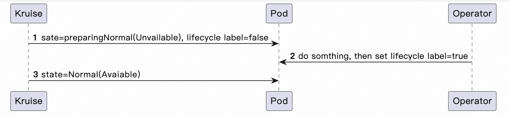
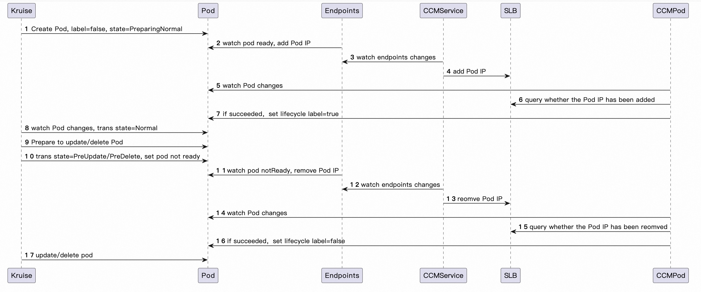
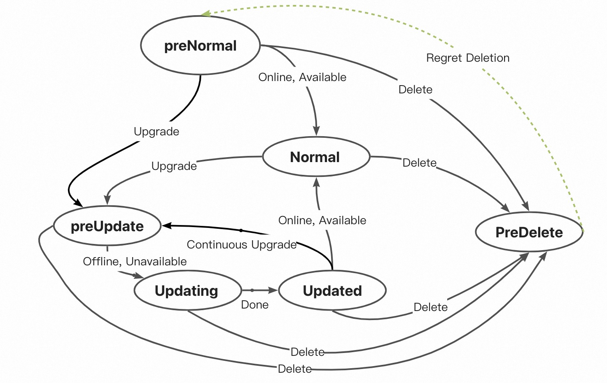

# PreNormal Hook

A Pod lifecycle hook allow user do something before Pod becomes available.

## Table of Contents

A table of contents is helpful for quickly jumping to sections of a proposal and for highlighting
any additional information provided beyond the standard proposal template.
[Tools for generating](https://github.com/ekalinin/github-markdown-toc) a table of contents from markdown are available.

- [PreNormal Hook](#prenormal-hook)
  - [Table of Contents](#table-of-contents)
  - [Motivation](#motivation)
  - [Proposal](#proposal)

## Motivation
In Kubernetes world, pod lifecycle state transformation controlled by Deployment/ReplicaSet is only synchronized with containers status, rather than others, such as traffic routing.
For example, when rolling update, the Pods will be treated as **Available** after it is `Ready`(assume that `minReadySeconds=0`), which means all its containers running, then the rolling update will be continued even though the Pod traffic routing has been not ready.
In extreme cases, application traffic may be completely lost.

`PreNormal` hook helps users to avoid such terrible disaster. `PreNormal` ho~~~~ok will hold pod lifecycle transformation from `PreparingNormal` to `Normal`(Available) util users "say yes".

## Proposal
To improve Kruise pod lifecycle state machine, we add a new lifecycle state called `PreparingNormal`, which means that the pod is still unavailable and wait some components to do something before it becomes `Normal` state.
Also, we add a new lifecycle hook, namely `PreNormalHook`, which will holds the transformation from `PreparingNormal` (Unavailable State) to `Normal` (Available State). For example:

```yaml
kind: CloneSet
spec:
  replicas: 3
  lifecycle:
    PreNormal:
      labelHandlers:
        example.com/traffic-online: "true"
  template:
    metadata:
      labels:
        example.com/traffic-online: "false"
  updateStrategy:
    type: ReCreate
    MaxSurge: 1
    MaxUnavailable: 0
```



When users update the CloneSet template, it will create one new-version Pod, and keep the 3 old-version Pod:
1. At first, the new-version Pod will be at `PreparingNormal` lifecycle state and has a `false` label of `PreNormalHook` when it is created by CloneSet.
2. Due to the `false` label of `PreNormalHook`, Kruise will not allow the pod enter `Normal` state.
3. CloneSet will treat the new-version Pod as **Unavailable** because of the `PreparingNormal` state, so any of the 3 old-version Pods will **not be** deleted.
4. When users' component observed the newly-created Pod, and make sure that the pod ip has been added to SLB (maybe others), and it is ready to accept connections and requests, then update the Pod label from `false` to `true`;
5. Pod lifecycle state will be transformed from `PreparingNormal` to `Normal`, and will be treated as `Available` by CloneSet.
6. Then the rolling update can be continued...

Assume that there is a Kubernetes Cloud Controller Manager (CCM) operator, whose Service controller is designed to sync with remote SLB service, and Pod controller is designed to manage Pod lifecycle and coordinate with Kruise, the whole Pod lifecycle will be as follows:


Furthermore, users can combine other lifecycle hook, *e.g.,* `InPlaceUpdateHook` and `PreDeleteHook`, to manage **full lifecycle** of Pods. With the `PreNormalHook`, the new lifecycle state machine will become:


