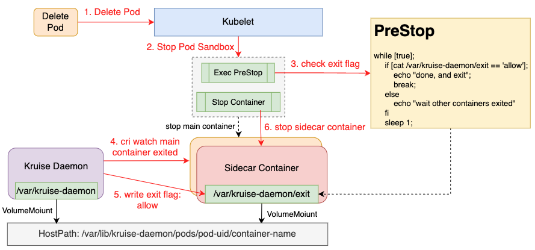

# SidecarExitPriority

## Table of Contents

A table of contents is helpful for quickly jumping to sections of a proposal and for highlighting
any additional information provided beyond the standard proposal template.
[Tools for generating](https://github.com/ekalinin/github-markdown-toc) a table of contents from markdown are available.

- [Title](#title)
- [Table of Contents](#table-of-contents)
- [Motivation](#motivation)
- [Proposal](#proposal)
- [API Definition](#api-definition)
- [Implementation](#implementation)
- [Relationship With TerminationGracePeriodSeconds](#relationship-with-terminationGracePeriodSeconds)
- [Other](#other)

## Motivation

Pods generally contain a variety of sidecar containers in addition to the main container that runs the main business logic, for example, logAgent, ServiceMesh Envoy, etc.
Based on the feature that the sidecar container is for the main container, there is a common expectation that the sidecar container can be started before the main container and exited after the main container.

However, in Kubernetes, there is no mechanism to do special handling of sidecar containers, especially when deleting pods, kubelet will stop all containers in pods in parallel,
which often leads to the situation that sidecar containers exit before main container, which in turn causes the risk of business main container abnormalities. Community related [PR](https://github.com/kubernetes/enhancements/pull/1980).

This paper aims to design a general mechanism to precisely control the exit order of sidecar containers.

## Proposal
This solution establishes a generic exit mechanism for sidecar containers. The kruise-daemon shares the /var/lib/kruise-daemon directory with sidecar containers,
and the preStop /var/lib/kruise-daemon/entrypoint script determines when sidecar is allowed to exit, thus achieving the effect of controlling the exit order of sidecar containers.

### API Definition
```yaml
apiVersion: v1
kind: Pod
metadata:
    name: echoserver
    annotations:
        # 1. sidecar containers exit priority definition
        # 2. The 'larger' the number, the 'later' the exit, the default is '0'. As follows, the containers exit order is main -> envoy -> log-agent.
        # 3. annotation with KRUISE_EXIT_PRIORITY environment variable are optional
        kruise.io/container-exit-priority: '{"log-agent":2, "envoy":1}'
        # whether kruise auto inject exit priority preStop
        container-exit-priority.kruise.io/auto-inject-prestop: 'true'
spec:
    // webhook auto-injection, volumes and volumeMounts configuration
    volumes:
    - name: kruise-container-exit-info
      hostPath:
        path: /var/lib/kruise-daemon/pods
        type: DirectoryOrCreate
    containers:
    - name: log-agent
      image: log-agent:latest
      env:
      - name: "KRUISE_EXIT_PRIORITY"
        value: "2"
      - name: POD_UID
        valueFrom:
          fieldRef:
            apiVersion: v1
            fieldPath: metadata.uid
      lifecycle:
        preStop:
          exec:
            command:
            - /var/lib/kruise-daemon/entrypoint
            - -wait-container-exit
            - -entrypoint
            - /bin/sh
            - --
            - -c
            - |
              /home/log-agent/bin/prestop.sh
    volumeMounts:
    - name: kruise-container-exit-info
      mountPath: /var/lib/kruise-daemon
      subPathExpr: $(POD_UID)/log-agent
    - name: envoy
      image: envoy:latest
      env:
      - name: "KRUISE_EXIT_PRIORITY"
        value: "1"
    lifecycle:
      preStop:
        exec:
          command:
          - /var/lib/kruise-daemon/entrypoint
          - -wait-container-exit
          - -entrypoint
          - /bin/sh
          - --
          - -c
          - |
            /usr/local/bin/pilot-agent exit
    volumeMounts:
    - name: kruise-container-exit-info
      mountPath: /var/lib/kruise-daemon
      subPathExpr: $(POD_UID)/envoy
    - name: main
      image: echoserver:latest
```

### Implementation



1. The preStop script first creates the 'exit' file and then loop determine if exit is allowed, as follows:
```go
func (e *EntryPointer) Go() error {
    // 1. wait container exit priority
    if e.waitContainerExit {
        if err := e.execWaitContainerExit(); err != nil {
            return err
        }
    }
    // 2. execute user definite command
    return e.runner.Run(e.ctx, e.command...)
}

func (e *EntryPointer) execWaitContainerExit() error {
    file := path.Join(containerexitpriority.KruiseDaemonShareRootVolume, containerexitpriority.KruiseContainerExitPriorityFile)
    os.Remove(file)
    f, err := os.Create(file)
    if err != nil {
        return err
    }
    f.Close()

    conditionFunc := func() (done bool, err error) {
        by, err := ioutil.ReadFile(file)
        if err != nil {
            return false, err
        }
        if string(by) != containerexitpriority.KruiseContainerAllowExitFlag {
            return false, nil
        }
        os.Remove(file)
        return true, nil
    }
    return wait.PollImmediateUntil(time.Second, conditionFunc, e.ctx.Done())
}
```
2. Kruise-daemon fsnotify /var/lib/kruise-daemon, discovery of 'exit' file creation, listening for exit of other containers through cri interface
3. When other high-priority containers have exited, kruise-daemon echo 'allow' > /var/lib/kruise-daemon/pods/{pod.uid}/{container.name}/exit
4. The preStop script will find that 'allowed exit' signal, and it first deletes the /var/lib/kruise-daemon/exit file，then exit with '0'
5. After the Lifecycle preStop is executed completely, the kubelet will start to stop the sidecar container.

## Relationship With TerminationGracePeriodSeconds

TerminationGracePeriodSeconds is the longest waiting time for containers to exit in pod, and the sidecar exit priority function above is also bound by this time.
If the sidecar container does not exit after the terminationGracePeriodSeconds time is reached (e.g., the preStop script does not return), the kubelet will directly execute the stop sidecar container operation.
In this case, the exit order of the sidecar container is not guaranteed, i.e., it may exit at the same time or before the main container. Two factors are common when this happens:
1. the terminationGracePeriodSeconds configuration is unreasonable, which needs to be adjusted by the business according to the actual scenario.
2. the main exit logic is abnormal, resulting in stopping the main container timeout, which requires business development to fix the exit logic of the main container by checking the log of the main container.

## Other
### Sidecar Container Exits Abnormally
In this scenario, the kubelet will not execute the preStop script, so the exit priority capability will not be executed

### Sidecar Container In-place Update

If the sidecar container is upgraded separately, kruise will distinguish it in this scenario, allowing preStop to end quickly
