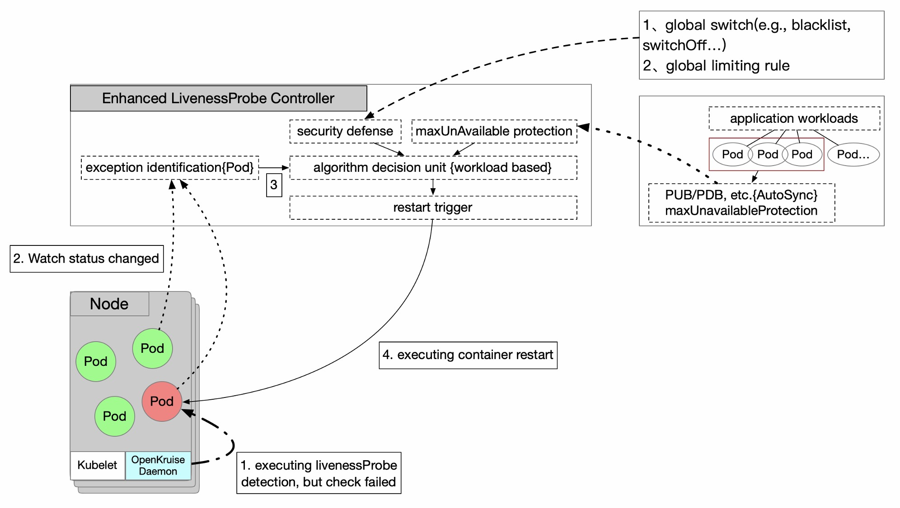
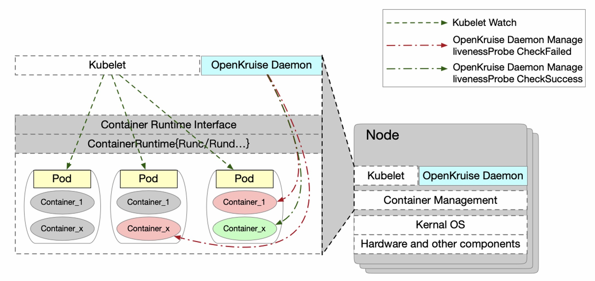
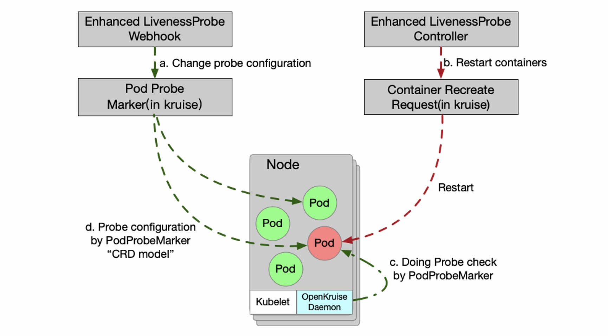

# Enhanced LivenessProbe Solution Feature

- An enhanced livenessProbe solution is developed in the OpenKruise suite, where is compatible with the standard livenessProbe desgin in the Kubernetes OpenSource community, which fully considers the service availability when the application containers are restarting. 

## Table of Contents

A table of contents is helpful for quickly jumping to sections of a proposal and for highlighting
any additional information provided beyond the standard proposal template. [Tools for generating](https://github.com/ekalinin/github-markdown-toc) a table of contents from markdown are available.


- [Title](#title)
  - [Table of Contents](#table-of-contents)
  - [Motivation](#motivation)
  - [Proposal](#proposal)
    - [Implementation](#Implementation)
    - [API Definition](#API-Definition)
    - [Functional Assessment](#Functional-Assessment)
    - [Other Notes](#Other-Notes)
    - [Release Plan](#Release-Plan)
  - [Implementation History](#implementation-history)

## Motivation
Some scenarios where the container is alive but the running application is not healthy, which is shown as the service process hang, developers manually restart systems to recover the service and rely on monitor metrics to alarm the abnormal events. It is inefficient to solve these related porblems with the manual recovery mechanism.

There is the standard livenessProbe feature in Kubernetes opensource community. For the applications configured with the liveness probe, the Kubernetes kubelet component will periodically check whether the liveness probe service is normal. If being negative, the kubelet component will directly trigger the restart of the service container.

However, this is a deadly operation or resilience protections for online applications, expecially for the incorrect probe configurations. For example, the configurations of liveness probes are often incorrect due to complicated configurations or contents. Once the probe takes effect, the full service container is triggered to restart, this condition casues service outage(or even triggering an avalanche of services during the restart). Secondly, there is no standard concept in the design idea of community method, which completely relies on the machine node detection and machine node restart mechanism. Furthermore, for a stability perspective, community-native solutions lack application-level global high availability and any resilience protection policies. Combined with the existing defects, it proposes to design and implement the enhanced livnessProbe application survival solution in the OpenKruise suite, and plans to open source release as the core capability in the future, so that the innovative technology can be used by more people.

## Proposal

The enhanced livenessProbe solution is composed of an enhancedLivenessProbeController as the service component and a livenessProbeDetector(using PodProbeMarker in kruise) as the node component in kruise daemon.

● **EnhancedLivenessProbeController**: it is developed in kruise-manager, which watchs the state change of the pod containing the livenessProbe configuration. Analyzing the status of application workload managing the livenessProbe failed Pods, this controller decide whether to restart containers or not. In calculating process, the resilience protection and application maxUnavailable protection policies are considered by the special algotithm comprehensively.

● **LivenessProbeDetector**: it is a single thread in kruise-daemon, which support to check the livenessProbe configuration as the same by the kubelet probe logic, using the Pod Probe Marker in kruise.


### Implementation
**EnhancedLivenessProbeController:** An EnhancedLivenessProbeController is developed in kruise-manager, the overall architecture is shown in Figure 1 as below. After EnhancedLivenessProbeController watch the state change of Pods which are configed the livenessProbe, this will decide immediately whether to perform the restart logic for the liveness failed Pods or not. In order to take into account the high availability of the application and service protection, the architecture design is coordinated with the PodUnavailableBudget function in Kruise suite and some anomaly detection algorithms, etc. These protect the availability of application services before executing the container restart effectively, so that there is no service available caused by batch application restarts. For example, all containers fail to be fully detected due to the unexpected reasons such as network or the error livenessProbe configuration.



In node component, this scheme eliminates the detection capability in native kubelet which checks the liveenessProbe configuration and reports the status periodically. Then, this scheme aviod the weakness to directly restart container after the native kubelet probes failures. The LivenessProbeDetector is developed in kruiseDaemon and implement the livenessProbe strategy independently(Responsible for executing the probe (EXEC, HTTP) and returning the results). The check status is reported in Pod.Annotations, the specific field defination is shown in the detailed design. Finally, the EnhancedLivenessProbeController decides to restart containers rather than kubelet. In order not to invade the modified kubelet native logic, the kruise container recreate request soluton which implements the container Runtime interface(container recreate request, crr in kurise). It can start or stop containers in bypass, etc. Therefore, the decision result will be feedback to the Pod.Annotation from EnhancedLivenessProbeController, and LivenessProbeDetector parse the command and make a response. The overall architecture design is shown in Figure 2.



---
**Q1: How to convert the standard livenessProbe configuration to this schema?**
+ a webhook can convert the standrad livenssProbe to the special field in pod annotations. The detail key is shown in Section Api Definition and in Figure3.a. At the same time, a standard pod probe marker resource is created for pod workload.

**Q2: How to takeover the probe detection, using the kruise daemon?**
+ disable the native kubelet probe detection, remove the native livenessProbe configuration.
  + for livenssProbe configured cases, one webhook will admit the pod resource to remove the native probe and to restore in pod annotations with this scheme.
  + for the latest, configuring the latest parameters on the pod annotations directly with this scheme.



**Q3: How to execute the liveness probe detection?**
+ a pod prober detection component in kruise-daemon, responsible for executing the probe (EXEC, HTTP) and returning the results status in Figure3.c

**Q4: How to restart the containers? what is the trigger?**
+ the EnhancedLivenessProbeController use the container recreate request(crr is the feature in kruise) to restart the failed liveness probe containers in pod in Figure3.b.
+ the killed container will be resrart by kubelet for the always pod restart policy as soon as possible.

**Q5: How to protect the application or service from restart encroachment thoroughly?**
+ an algorithm decision unit(workload based), including resilience protection(global switch, blacklist, global limiting rules, etc.), maxUnAvailable protection(PodDisruptionBudget iin native or PodUnavailableBudget in kruise),  is release in EnhancedLivenessProbeController.
+ a switch will be set in pods, which can close off the detection in emergency.

---

### API Definition

```yaml
apiVersion: v1
kind: Pod
metadata:
  annotations:
  ...
    // [user defined] using this enhanced livness probe, otherwise the native checking
    apps.kruise.io/using-enhanced-liveness: "true" // 
  ...
  labels:
  ...
  spec:
  ...
    livenessProbe:
      failureThreshold: 3
      httpGet:
        path: /health
        port: 7002
        scheme: HTTP
      initialDelaySeconds: 3000
      periodSeconds: 100
      successThreshold: 1
      timeoutSeconds: 5
...
```

### Functional Assessment
|  enhanced(this schema) | native | 
| -------- | -------- | 
| :white_check_mark:  special component detection  + global component decision in cluster    |   :white_check_mark:  single machine detection + single machine decision | 
| :white_check_mark:  kruiseDaemon/LivenessProbeDetector detection enabled in bypaas,  strong expansibility  |   :no_entry: no | 
| :white_check_mark: the global perspective of the application, the maxUnavailable protection policy and the capactiy building of the resilience protection system(Kruise-manager/EnhancedLivenessProbeController)    |   :no_entry:  no | 
| :white_check_mark: the architecture is easy to expand, without invasive modification of native components, easy to adapt to different scaenarios with strong scalability   |   :no_entry:  strong coupling, poor scalability | 

### Other Notes
+ Pod without OwnerReference, no enhancement ability this schema, degradation to community logic, restarting containers when in failure detection.
+ Pod workload need to use the PodUnavailableBudget in kruise, to enable the PubFeature.
+ Take precedence over the community logic, both the native livenessProbe configuration and this schema solution configuration exist


### Release Plan
+ Pod probe marker in kruise supports TCP, HTTPGET probe besides EXEC checking.
+ Webhook will be developed firstly to convert the standard livenessProbe configuration to pod porbe marker resource in cluster.
+ Controller will be developed to execute the pod containers restarting for failed liveness Probe checked.

## Implementation History
12/30/2022: Proposal submission