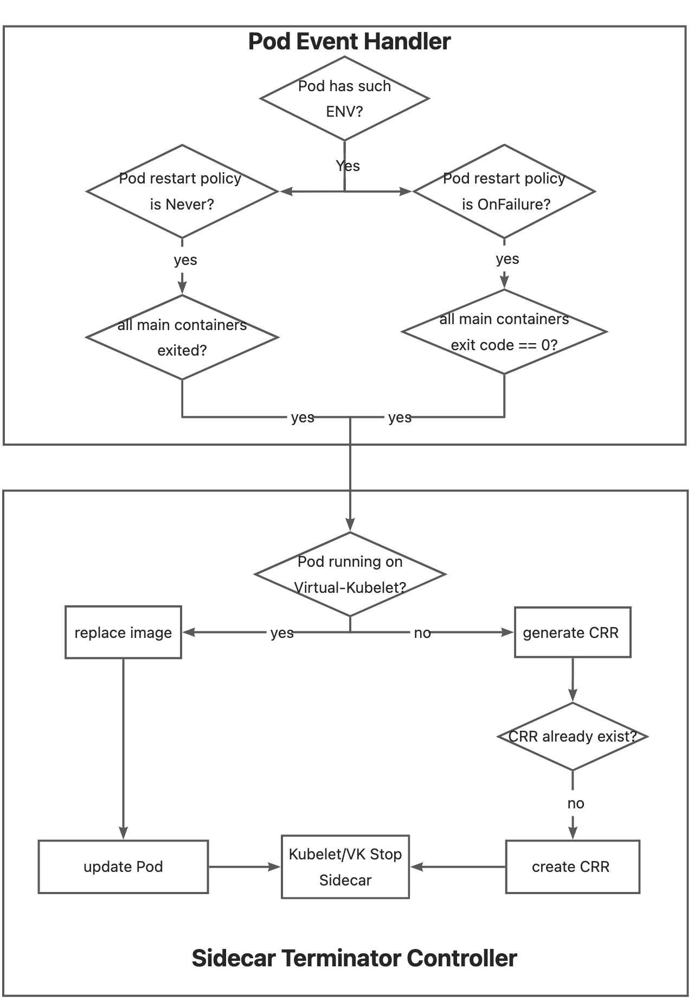

# Sidecar Terminator

## Table of Contents

A table of contents is helpful for quickly jumping to sections of a proposal and for highlighting
any additional information provided beyond the standard proposal template.
[Tools for generating](https://github.com/ekalinin/github-markdown-toc) a table of contents from markdown are available.

- [Sidecar Terminator](#sidecar-terminator)
  - [Motivation](#motivation)
  - [Proposal](#proposal)
    - [API: Define Sidecar](#api-define-sidecar)
    - [Controller: Watch &amp; Generate CRR](#controller-watch--generate-crr)
    - [Pod Running on Virtual-Kubelet](#pod-running-on-virtual-kubelet)
    - [Implementation](#implementation)

## Motivation
In the Kubernetes world, it is challenging to use long-running sidecar containers for short-term application orchestration because there is no straightforward way to terminate the sidecar containers when the main container exits. For instance, when the main container in a Pod finishes its task and exits, it is expected that accompanying sidecars, such as a log collection sidecar, will also exit actively, so the Job Controller can accurately determine the completion status of the Pod. However, many sidecar containers may lack an active exit mechanism, and therefore, an additional solution is required to address this issue.
## Proposal
OpenKruise has provided the ability to terminate a container via [ContainerRecreateRequest(CRR)](20210316-containerrecreaterequest.md), so we just need to consider the following two things:
1. How to judge a container is `Main` or `Sidecar` container?
2. When to terminate the sidecar container?

### API: Define Sidecar
For users, the only action required is to add the specified environment variable to the sidecar container. Containers without this environment variable will be considered main containers.

```yaml
spec:
  containers:
  - name: sidecar1
    env:
    - name: "KRUISE_TERMINATE_SIDECAR_WHEN_JOB_EXIT"
      value: "true"
```

### Controller: Watch & Generate CRR
A controller has been designed to monitor all Pods with containers that have the `KRUISE_TERMINATE_SIDECAR_WHEN_JOB_EXIT` environment variable. When all the containers in such a Pod that do not have this variable have exited, the controller will generate a CRR to terminate the marked sidecar containers. CRR operates within the kruise daemon, so users must ensure the kruise daemon running on the node is functioning correctly.

### Pod Running on Virtual-Kubelet
If a Pod is running on Virtual-Kubelet, CRR will not be able to terminate the containers as the kruise daemon cannot run on Virtual-Kubelet. To handle such Pods, a dedicated image must be built that is designed to exit as soon as it is pulled.

```yaml
spec:
  containers:
  - name: sidecar1
    env:
    - name: "KRUISE_TERMINATE_SIDECAR_WHEN_JOB_EXIT"
      value: "true"
    - name: "KRUISE_TERMINATE_SIDECAR_WHEN_JOB_EXIT_WITH_IMAGE"
      value: "example/exit-immediately:latest"
```

### Implementation
- **Pod Event Handler**: Watch the Pods that has `Never/OnFailure` restart policy, and enqueue when all main containers exited.
- **Sidecar Terminator Controller**: Different strategies are adopted to terminate the sidecar container according to different node types (VK or not).


