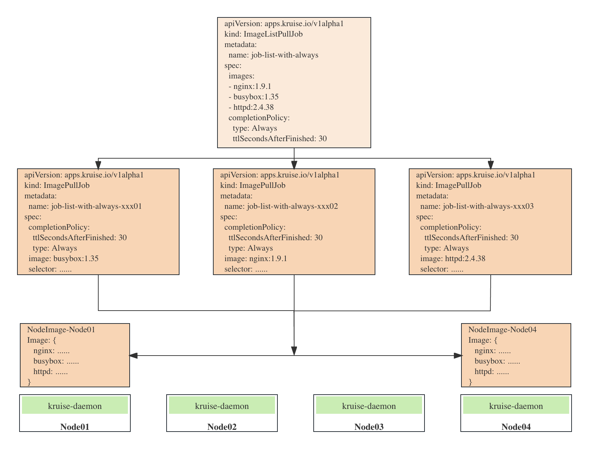

# ImageListPullJob

## Motivation

Current ImagePullJob can pre-download image to node, for example:

```yaml
apiVersion: apps.kruise.io/v1alpha1
kind: ImagePullJob
metadata:
  name: job-with-always
spec:
  image: nginx:1.9.1   # [required] image to pull
  selector:            # [optional] the names or label selector to assign Nodes (only one of them can be set)
    names:
    - node-1
    - node-2
    matchLabels:
      node-type: xxx
```

However, many users have the need for batch pre-download images, and the current approach has a relatively high threshold for use, We need to add a new CRD ImageListPullJob to batch pre-download images.

## Proposal



### API Changed

#### ImagePullJobSpec

```go
// ImagePullJobSpec defines the desired state of ImagePullJob
type ImagePullJobSpec struct {
	// Image is the image to be pulled by the job
	Image                string `json:"image"`
	ImagePullJobTemplate `json:",inline"`
}
```

#### ImageListPullJob API

```go
// ImageListPullJob is the Schema for the imagelistpulljobs API
type ImageListPullJob struct {
	metav1.TypeMeta   `json:",inline"`
	metav1.ObjectMeta `json:"metadata,omitempty"`

	Spec   ImageListPullJobSpec   `json:"spec,omitempty"`
	Status ImageListPullJobStatus `json:"status,omitempty"`
}
......
// ImageListPullJobSpec defines the desired state of ImageListPullJob
type ImageListPullJobSpec struct {
	// Images is the image list to be pulled by the job
	Images []string `json:"images"`

	ImagePullJobTemplate `json:",inline"`
}
```

#### ImagePullJobTemplate

```go
type ImagePullJobTemplate struct {

	// ImagePullSecrets is an optional list of references to secrets in the same namespace to use for pulling the image.
	// If specified, these secrets will be passed to individual puller implementations for them to use.  For example,
	// in the case of docker, only DockerConfig type secrets are honored.
	// +optional
	PullSecrets []string `json:"pullSecrets,omitempty"`

	// Selector is a query over nodes that should match the job.
	// nil to match all nodes.
	// +optional
	Selector *ImagePullJobNodeSelector `json:"selector,omitempty"`

	// PodSelector is a query over pods that should pull image on nodes of these pods.
	// Mutually exclusive with Selector.
	// +optional
	PodSelector *ImagePullJobPodSelector `json:"podSelector,omitempty"`

	// Parallelism is the requested parallelism, it can be set to any non-negative value. If it is unspecified,
	// it defaults to 1. If it is specified as 0, then the Job is effectively paused until it is increased.
	// +optional
	Parallelism *intstr.IntOrString `json:"parallelism,omitempty"`

	// PullPolicy is an optional field to set parameters of the pulling task. If not specified,
	// the system will use the default values.
	// +optional
	PullPolicy *PullPolicy `json:"pullPolicy,omitempty"`

	// CompletionPolicy indicates the completion policy of the job.
	// Default is Always CompletionPolicyType.
	CompletionPolicy CompletionPolicy `json:"completionPolicy"`

	// SandboxConfig support attach metadata in PullImage CRI interface during ImagePulljobs
	// +optional
	SandboxConfig *SandboxConfig `json:"sandboxConfig,omitempty"`
}
```

#### ImageListPullJobStatus

```go
// ImageListPullJobStatus defines the observed state of ImageListPullJob
type ImageListPullJobStatus struct {
	// Represents time when the job was acknowledged by the job controller.
	// It is not guaranteed to be set in happens-before order across separate operations.
	// It is represented in RFC3339 form and is in UTC.
	// +optional
	StartTime *metav1.Time `json:"startTime,omitempty"`

	// Represents time when the all the image pull job was completed. It is not guaranteed to
	// be set in happens-before order across separate operations.
	// It is represented in RFC3339 form and is in UTC.
	// +optional
	CompletionTime *metav1.Time `json:"completionTime,omitempty"`

	// The desired number of ImagePullJobs, this is typically equal to the number of len(spec.Images).
	Desired int32 `json:"desired"`

	// The number of running ImagePullJobs which are acknowledged by the imagepulljob controller.
	// +optional
	Active int32 `json:"active"`

	// The number of ImagePullJobs which are finished
	// +optional
	Completed int32 `json:"completed"`

	// The number of image pull job which are finished and status.Succeeded==status.Desired.
	// +optional
	Succeeded int32 `json:"succeeded"`

	// The status of ImagePullJob which has the failed nodes(status.Failed>0) .
	// +optional
	FailedImageStatuses []*FailedImageStatus `json:"failedImageStatuses,omitempty"`
}
```

#### FailedImagePullJobStatus

```go
// FailedImageStatus the state of ImagePullJob which has the failed nodes(status.Failed>0)
type FailedImageStatus struct {
	// The name of ImagePullJob which has the failed nodes(status.Failed>0)
	// +optional
	ImagePullJob string `json:"imagePullJob,omitempty"`

	// Name of the image
	// +optional
	Name string `json:"name,omitempty"`

	// The text prompt for job running status.
	// +optional
	Message string `json:"message,omitempty"`
}
```

### Webhook

Add webhooks for ImageListPullJob, validating-webhook and mutating-webhook.

### Controller

**ImageListPullJob Event Handler**:  Watch the `Add`, `Delete` and `Update` events

**ImagePullJob Event Handler**: Watch the `Update`  event.

**Reconcile:**

The `ImageListPullJob` will be deleted , when the condition is: `CompletionPolicy.Type=Always && CompletionPolicy.TTLSecondsAfterFinished>0`.

Calculate the latest status of the  `ImageListPullJob` from all `ImagePullJob`s which is owned by the `ImageListPullJob`.

1),Create an `ImagePullJob` based on `ImageListPullJob.Spec.Image`.

2),The `ImagePullJob` will be deleted if the `Spec.Image` not in `ImageListPullJob.Spec.Image[]`.

Then update `ImageListPullJob` to the latest status.

#### The example is as follows

`ImageListPullJob` yaml file:

```yaml
apiVersion: apps.kruise.io/v1alpha1
kind: ImageListPullJob
metadata:
  name: job-list-with-always
spec:
  images:
  - nginx:1.9.1
  - busybox:1.35
  - httpd:2.4.38
  completionPolicy:
    type: Always
    ttlSecondsAfterFinished: 30
```

The controller will generate `ImagePullJob` with the `Spec.Images[]`

```shell
MacBook-Pro kruise % kubectl get imagepulljob
NAME                         TOTAL   ACTIVE   SUCCEED   FAILED   AGE   MESSAGE
job-list-with-always-2t424   2       1        0         0        2s    job is running, progress 0.0%
job-list-with-always-8vxc7   2       1        0         0        2s    job is running, progress 0.0%
job-list-with-always-mhxzx   2       1        0         0        2s    job is running, progress 0.0%
```

The status of `ImageListPullJob` in command line

```shell
MacBook-Pro kruise % kubectl get imagelistpulljob
NAME                   TOTAL   SUCCEEDED   AGE
job-list-with-always   3       3           58s
```

The detail status of `ImageListPullJob`

   ```yaml
   status:
     active: 0
     completed: 3
     completionTime: "2023-03-31T09:40:59Z"
     desired: 3
     failedImageStatuses:
     - imagePullJob: job-list-with-always-hpwz7
       message: Please check for details which nodes failed by 'kubectl get ImagePullJob job-list-with-always-hpwz7'.
       name: nginx
     - imagePullJob: job-list-with-always-l5j55
       message: Please check for details which nodes failed by 'kubectl get ImagePullJob job-list-with-always-l5j55'.
       name: busybox:1.35
     - imagePullJob: job-list-with-always-gb59t
       message: Please check for details which nodes failed by 'kubectl get ImagePullJob job-list-with-always-gb59t'.
       name: httpd:2.4.38
     startTime: "2023-03-31T09:39:28Z"
     succeeded: 0
   ```
