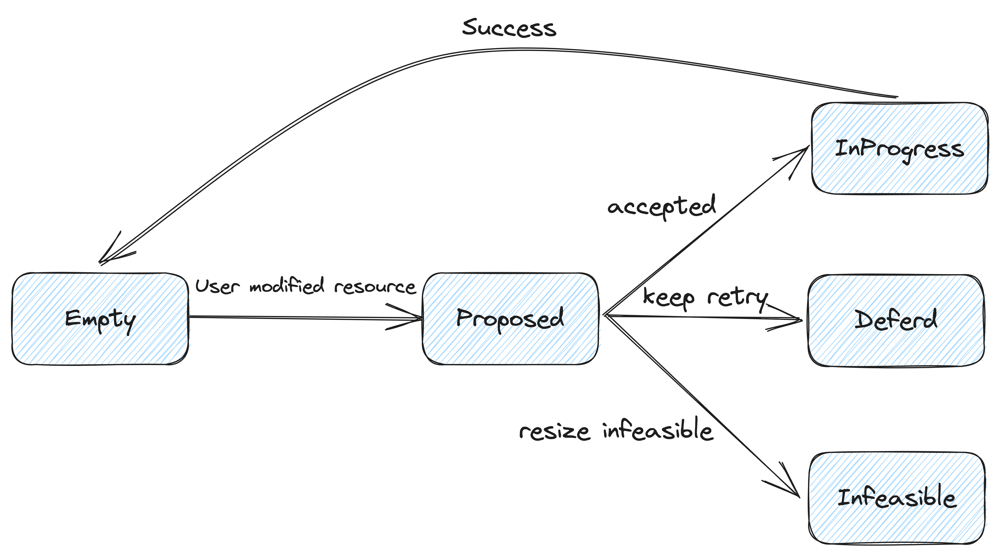
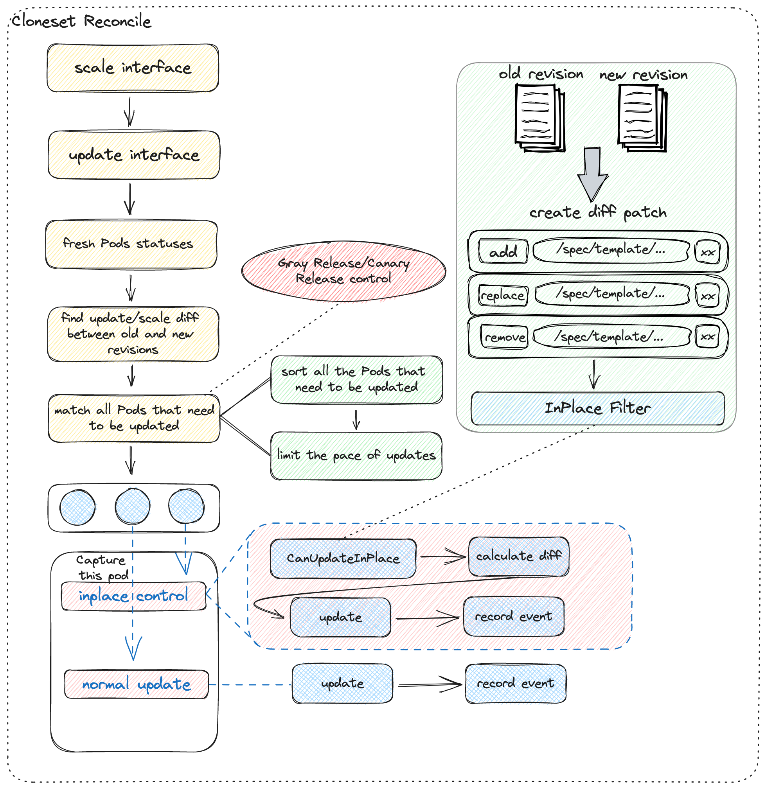
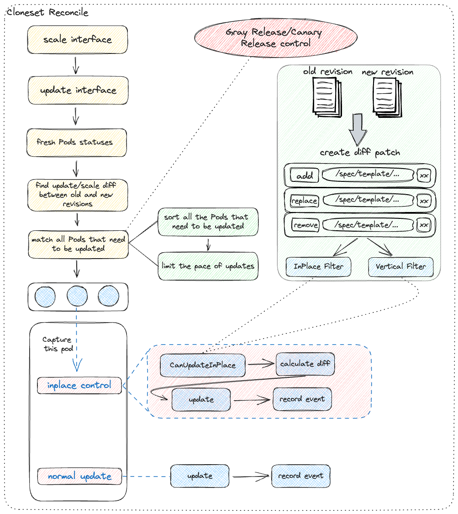

# In-place Workload Vertical Scaling

## Table of Contents

A table of contents is helpful for quickly jumping to sections of a proposal and for highlighting
any additional information provided beyond the standard proposal template.
[Tools for generating](https://github.com/ekalinin/github-markdown-toc) a table of contents from markdown are available.

- [In-place Workload Vertical Scaling](#in-place-workload-vertical-scaling)
  - [Table of Contents](#table-of-contents)
  - [Motivation](#motivation)
    - [Background](#background)
      - [Pod API](#pod-api)
      - [Scheduler](#scheduler)
      - [Core Implementation](#core-implementation)
      - [Kubelet](#kubelet)
    - [Goals](#goals)
    - [Non-Goals/Future Work](#non-goalsfuture-work)
  - [Proposal](#proposal)
    - [User Stories](#user-stories)
    - [Implementation Details/Notes/Constraints](#implementation-detailsnotesconstraints)
      - [Design Objectives](#design-objectives)
      - [Add Feature Gate](#add-feature-gate)
      - [Add vertical update controller](#add-vertical-update-controller)
      - [Add verticalupdate module](#add-verticalupdate-module)
      - [Lifecycle](#lifecycle)
      - [Strategy](#strategy)
      - [Flowchart](#flowchart)
      - [Dependencies](#dependencies)
    - [Risks and Mitigations](#risks-and-mitigations)
  - [Implementation History](#implementation-history)

## Motivation

In Kubernetes v1.27, In-place Pod Vertical Scaling has been upgraded to an alpha feature. In-place scaling of workloads on top of Pods is crucial in Kubernetes clusters that support this feature, as it provides significant benefits for production-level scenarios.

### Background

Refer to [In-place Update Pod Resources](https://github.com/kubernetes/enhancements/tree/master/keps/sig-node/1287-in-place-update-pod-resources)

#### Pod API

```
76962b0: In-place Pod Vertical Scaling - API changes
 1. Define ContainerResizePolicy and add it to Container struct.
 2. Add ResourcesAllocated and Resources fields to ContainerStatus struct.
 3. Define ResourcesResizeStatus and add it to PodStatus struct.
 4. Add InPlacePodVerticalScaling feature gate and drop disabled fields.
 5. ResizePolicy validation & defaulting and Resources mutability for CPU/Memory.
 6. Various fixes from code review feedback (originally committed on Apr 12, 2022)
KEP: /enhancements/keps/sig-node/1287-in-place-update-pod-resources
```

Changes:

- Pod.Spec.Containers[i].Resources becomes purely a declaration, denoting the **desired** state of Pod resources,
- Pod.Status.ContainerStatuses[i].AllocatedResources (new field, type v1.ResourceList) denotes the Node resources **allocated** to the Pod and its Containers,
- Pod.Status.ContainerStatuses[i].Resources (new field, type v1.ResourceRequirements) shows the **actual** resources held by the Pod and its Containers.
- Pod.Status.Resize (new field, type map[string]string) explains what is happening for a given resource on a given container.

The new `AllocatedResources` field represents in-flight resize operations and is driven by state kept in the node checkpoint. Schedulers should use the larger of `Spec.Containers[i].Resources` and `Status.ContainerStatuses[i].AllocatedResources` when considering available space on a node.

```go
diff --git a/pkg/apis/core/types.go b/pkg/apis/core/types.go
index 06b4f9e59da..112421181f8 100644
--- a/pkg/apis/core/types.go
+++ b/pkg/apis/core/types.go

+// ResourceResizePolicy specifies how Kubernetes should handle resource resize.
+type ResourceResizePolicy string
+
+// These are the valid resource resize policy values:
+const (
+       // RestartNotRequired tells Kubernetes to resize the container in-place
+       // without restarting it, if possible. Kubernetes may however choose to
+       // restart the container if it is unable to actuate resize without a
+       // restart. For e.g. the runtime doesn't support restart-free resizing.
+       RestartNotRequired ResourceResizePolicy = "RestartNotRequired"
+       // 'RestartRequired' tells Kubernetes to resize the container in-place
+       // by stopping and starting the container when new resources are applied.
+       // This is needed for legacy applications. For e.g. java apps using the
+       // -xmxN flag which are unable to use resized memory without restarting.
+       RestartRequired ResourceResizePolicy = "RestartRequired"
+)
+
+// ContainerResizePolicy represents resource resize policy for a single container.
+type ContainerResizePolicy struct {
+       // Name of the resource type to which this resource resize policy applies.
+       // Supported values: cpu, memory.
+       ResourceName ResourceName
+       // Resource resize policy applicable to the specified resource name.
+       // If not specified, it defaults to RestartNotRequired.
+       Policy ResourceResizePolicy
+}
+

@@ -2246,6 +2273,10 @@ type Container struct {
        // Compute resource requirements.
        // +optional
        Resources ResourceRequirements
+       // Resources resize policy for the container.
+       // +featureGate=InPlacePodVerticalScaling
+       // +optional
+       ResizePolicy []ContainerResizePolicy
        // +optional
        VolumeMounts []VolumeMount
        // volumeDevices is the list of block devices to be used by the container.
@@ -2430,6 +2461,17 @@ type ContainerStatus struct {
        // +optional
        ContainerID string
        Started     *bool
+       // ResourcesAllocated represents the compute resources allocated for this container by the
+       // node. Kubelet sets this value to Container.Resources.Requests upon successful pod admission
+       // and after successfully admitting desired pod resize.
+       // +featureGate=InPlacePodVerticalScaling
+       // +optional
+       ResourcesAllocated ResourceList
+       // Resources represents the compute resource requests and limits that have been successfully
+       // enacted on the running container after it has been started or has been successfully resized.
+       // +featureGate=InPlacePodVerticalScaling
+       // +optional
+       Resources *ResourceRequirements
 }

+// PodResizeStatus shows status of desired resize of a pod's containers.
+type PodResizeStatus string
+
+const (
+       // Pod resources resize has been requested and will be evaluated by node.
+       PodResizeStatusProposed PodResizeStatus = "Proposed"
+       // Pod resources resize has been accepted by node and is being actuated.
+       PodResizeStatusInProgress PodResizeStatus = "InProgress"
+       // Node cannot resize the pod at this time and will keep retrying.
+       PodResizeStatusDeferred PodResizeStatus = "Deferred"
+       // Requested pod resize is not feasible and will not be re-evaluated.
+       PodResizeStatusInfeasible PodResizeStatus = "Infeasible"
+)
+

@@ -3528,6 +3588,13 @@ type PodStatus struct {
        // Status for any ephemeral containers that have run in this pod.
        // +optional
        EphemeralContainerStatuses []ContainerStatus
+
+       // Status of resources resize desired for pod's containers.
+       // It is empty if no resources resize is pending.
+       // Any changes to container resources will automatically set this to "Proposed"
+       // +featureGate=InPlacePodVerticalScaling
+       // +optional
+       Resize PodResizeStatus
 }
```

I've drawn a state transition diagram here


For example:

```yaml
spec:
  containers:
  - image: nginx:latest
    imagePullPolicy: Always
    name: my-container
    resizePolicy:
    - resourceName: cpu
      restartPolicy: NotRequired
    - resourceName: memory
      restartPolicy: NotRequired
    resources:
      limits:
        cpu: "2"
        memory: 512Mi
      requests:
        cpu: 500m
        memory: 256Mi
```

```yaml
status:
  ...
  containerStatuses:
  - allocatedResources:
      cpu: 500m
      memory: 256Mi
    containerID: containerd://8b3a6658b54d513e1a642c76002b9f321696b57c29eb8834854c5bd9f7cda00f
    image: docker.io/library/nginx:latest
    imageID: docker.io/library/nginx@sha256:08bc36ad52474e528cc1ea3426b5e3f4bad8a130318e3140d6cfe29c8892c7ef
    lastState: {}
    name: my-container
    ready: true
    resources:
      limits:
        cpu: "2"
        memory: 512Mi
      requests:
        cpu: 500m
        memory: 256Mi
```

#### Scheduler

```
231849a: In-place Pod Vertical Scaling - Scheduler changes
```

Changes to the scheduler focus on resource collection.

```go
 // resourceRequest = max(sum(podSpec.Containers), podSpec.InitContainers) + overHead
 func calculateResource(pod *v1.Pod) (res Resource, non0CPU int64, non0Mem int64) {
+       inPlacePodVerticalScalingEnabled := utilfeature.DefaultFeatureGate.Enabled(features.InPlacePodVerticalScaling)
        resPtr := &res
        for _, c := range pod.Spec.Containers {
-               resPtr.Add(c.Resources.Requests)
-               non0CPUReq, non0MemReq := schedutil.GetNonzeroRequests(&c.Resources.Requests)
+               req := c.Resources.Requests
+               if inPlacePodVerticalScalingEnabled {
+                       cs, found := podutil.GetContainerStatus(pod.Status.ContainerStatuses, c.Name)
+                       if found {
+                               if pod.Status.Resize == v1.PodResizeStatusInfeasible {
+                                       req = cs.ResourcesAllocated
+                               } else {
+                                       req = quota.Max(c.Resources.Requests, cs.ResourcesAllocated)
+                               }
+                       }
+               }
+               resPtr.Add(req)
+               non0CPUReq, non0MemReq := schedutil.GetNonzeroRequests(&req)
                non0CPU += non0CPUReq
                non0Mem += non0MemReq
                // No non-zero resources for GPUs or opaque resources.
        }

+       // Note: In-place resize is not allowed for InitContainers, so no need to check for ResizeStatus value
        for _, ic := range pod.Spec.InitContainers {
                resPtr.SetMaxResource(ic.Resources.Requests)
                non0CPUReq, non0MemReq := schedutil.GetNonzeroRequests(&ic.Resources.Requests)
```

#### Core Implementation

```
f2bd94a: In-place Pod Vertical Scaling - core implementation
1. Core Kubelet changes to implement In-place Pod Vertical Scaling.
2. E2E tests for In-place Pod Vertical Scaling.
3. Refactor kubelet code and add missing tests (Derek's kubelet review)
4. Add a new hash over container fields without Resources field to allow feature gate toggling without restarting containers not using the feature.
5. Fix corner-case where resize A->B->A gets ignored
6. Add cgroup v2 support to pod resize E2E test.
KEP: /enhancements/keps/sig-node/1287-in-place-update-pod-resources

Co-authored-by: Chen Wang <Chen.Wang1@ibm.com>
```

```
   +-----------+                   +-----------+                  +-----------+
   |           |                   |           |                  |           |
   | apiserver |                   |  kubelet  |                  |  runtime  |
   |           |                   |           |                  |           |
   +-----+-----+                   +-----+-----+                  +-----+-----+
         |                               |                              |
         |       watch (pod update)      |                              |
         |------------------------------>|                              |
         |     [Containers.Resources]    |                              |
         |                               |                              |
         |                            (admit)                           |
         |                               |                              |
         |                               |  UpdateContainerResources()  |
         |                               |----------------------------->|
         |                               |                         (set limits)
         |                               |<- - - - - - - - - - - - - - -|
         |                               |                              |
         |                               |      ContainerStatus()       |
         |                               |----------------------------->|
         |                               |                              |
         |                               |     [ContainerResources]     |
         |                               |<- - - - - - - - - - - - - - -|
         |                               |                              |
         |      update (pod status)      |                              |
         |<------------------------------|                              |
         | [ContainerStatuses.Resources] |                              |
         |                               |                              |
```

#### Kubelet

The handlePodResourcesResize method is called before entering kuberuntime_manager's SyncPod.

```go
@@ -1826,6 +1832,16 @@ func (kl *Kubelet) syncPod(_ context.Context, updateType kubetypes.SyncPodType,
        // Ensure the pod is being probed
        kl.probeManager.AddPod(pod)

+       if utilfeature.DefaultFeatureGate.Enabled(features.InPlacePodVerticalScaling) {
+               // Handle pod resize here instead of doing it in HandlePodUpdates because
+               // this conveniently retries any Deferred resize requests
+               // TODO(vinaykul,InPlacePodVerticalScaling): Investigate doing this in HandlePodUpdates + periodic SyncLoop scan
+               //     See: https://github.com/kubernetes/kubernetes/pull/102884#discussion_r663160060
+               if kl.podWorkers.CouldHaveRunningContainers(pod.UID) && !kubetypes.IsStaticPod(pod) {
+                       kl.handlePodResourcesResize(pod)
+               }
+       }
+
        // Call the container runtime's SyncPod callback
        result := kl.containerRuntime.SyncPod(ctx, pod, podStatus, pullSecrets, kl.backOff)
        kl.reasonCache.Update(pod.UID, result)
```

This function checks whether each container needs to be resized. If a container has a resource request, and the container's current resource allocation is different from its resource request, kubelet will adjust the container's resources. This function also updates the resource allocation record of the Pod and saves the latest status of the Pod to checkpoint so that it can be restored after kubelet restarts. Note that when updating the Status of the pod, `pod.status.resize` is also updated to the corresponding field.

```go
+func (kl *Kubelet) handlePodResourcesResize(pod *v1.Pod) {
+       if pod.Status.Phase != v1.PodRunning {
+               return
+       }
+       podResized := false
+       for _, container := range pod.Spec.Containers {
+               if len(container.Resources.Requests) == 0 {
+                       continue
+               }
+               containerStatus, found := podutil.GetContainerStatus(pod.Status.ContainerStatuses, container.Name)
+               if !found {
+                       klog.V(5).InfoS("ContainerStatus not found", "pod", pod.Name, "container", container.Name)
+                       break
+               }
+               if len(containerStatus.ResourcesAllocated) != len(container.Resources.Requests) {
+                       klog.V(5).InfoS("ContainerStatus.ResourcesAllocated length mismatch", "pod", pod.Name, "container", container.Name)
+                       break
+               }
+               if len(diff.ObjectDiff(container.Resources.Requests, containerStatus.ResourcesAllocated)) > 0 {
+                       podResized = true
+                       break
+               }
+       }
+       if !podResized {
+               return
+       }
+
+       kl.podResizeMutex.Lock()
+       defer kl.podResizeMutex.Unlock()
+       fit, updatedPod, resizeStatus := kl.canResizePod(pod)
+       if fit {
+               // Update pod resource allocation checkpoint
+               if err := kl.statusManager.SetPodAllocation(updatedPod); err != nil {
+                       //TODO(vinaykul,InPlacePodVerticalScaling): Can we recover from this in some way? Investigate
+                       klog.ErrorS(err, "SetPodAllocation failed", "pod", klog.KObj(pod))
+               }
+               *pod = *updatedPod
+       }
+       if resizeStatus != "" {
+               // Save resize decision to checkpoint
+               if err := kl.statusManager.SetPodResizeStatus(pod.UID, resizeStatus); err != nil {
+                       //TODO(vinaykul,InPlacePodVerticalScaling): Can we recover from this in some way? Investigate
+                       klog.ErrorS(err, "SetPodResizeStatus failed", "pod", klog.KObj(pod))
+               }
+               pod.Status.Resize = resizeStatus
+       }
+       kl.podManager.UpdatePod(pod)
+       kl.statusManager.SetPodStatus(pod, pod.Status)
+       return
+}
+
```

Here is a helper function to determine if a Pod is in the InProgress phase, traversing each container in the Pod to check whether the container's resource limits and current allocation are the same. If it is different, kubelet will assume that the Pod is undergoing a resource adjustment and return true.

```go
+func isPodResizeInProgress(pod *v1.Pod, podStatus *v1.PodStatus) bool {
+       for _, c := range pod.Spec.Containers {
+               if cs, ok := podutil.GetContainerStatus(podStatus.ContainerStatuses, c.Name); ok {
+                       if cs.Resources == nil {
+                               continue
+                       }
+                       if diff.ObjectDiff(c.Resources.Limits, cs.Resources.Limits) != "" ||
+                               diff.ObjectDiff(cs.ResourcesAllocated, cs.Resources.Requests) != "" {
+                               return true
+                       }
+               }
+       }
+       return false
+}
```

This function is used to check whether a Pod can be resized. It first takes the available resources of the current node and calculates the Pod's CPU and memory resource requests. If the Pod request more than node resources available CPU or memory, `kubelet returns` false, and will adjust state is set to `v1.PodResizeStatusInfeasible`.
If a Pod's resource request does not exceed the node's available resources, the function continues to check whether other running Pods are affected by the adjustment. To do this, it takes all active Pods on the current node and treats those that need to be resized as Pods that need a new scheduling check. If kubelet find other Pod on the current node has been in use for all of the available resources, to adjust the size of the Pod can't be scheduled, kubelet returns `false`, and will adjust state is set to `v1.PodResizeStatusDeferred`.
If the Pod can be scheduled, the function allocates resource requests for the Pod and its container to the container and updates the status of the Pod to be resizing. Finally, the function returns `true`, the updated Pod objects, and adjust the state `v1.PodResizeStatusInProgress`. Note that the updated Pod object returned by the function is a deep copy of the Pod to ensure that the original Pod object is not affected when resized.

```go
+func (kl *Kubelet) canResizePod(pod *v1.Pod) (bool, *v1.Pod, v1.PodResizeStatus) {
+       var otherActivePods []*v1.Pod
+
+       node, err := kl.getNodeAnyWay()
+       if err != nil {
+               klog.ErrorS(err, "getNodeAnyway function failed")
+               return false, nil, ""
+       }
+       cpuAvailable := node.Status.Allocatable.Cpu().MilliValue()
+       memAvailable := node.Status.Allocatable.Memory().Value()
+       cpuRequests := resource.GetResourceRequest(pod, v1.ResourceCPU)
+       memRequests := resource.GetResourceRequest(pod, v1.ResourceMemory)
+       if cpuRequests > cpuAvailable || memRequests > memAvailable {
+               klog.V(3).InfoS("Resize is not feasible as request exceeds allocatable node resources", "Pod", pod.Name)
+               return false, nil, v1.PodResizeStatusInfeasible
+       }
+
+       // Treat the existing pod needing resize as a new pod with desired resources seeking admit.
+       // If desired resources don't fit, pod continues to run with currently allocated resources.
+       activePods := kl.GetActivePods()
+       for _, p := range activePods {
+               if p.UID != pod.UID {
+                       otherActivePods = append(otherActivePods, p)
+               }
+       }
+
+       if ok, failReason, failMessage := kl.canAdmitPod(otherActivePods, pod); !ok {
+               // Log reason and return. Let the next sync iteration retry the resize
+               klog.V(3).InfoS("Resize cannot be accommodated", "Pod", pod.Name, "Reason", failReason, "Message", failMessage)
+               return false, nil, v1.PodResizeStatusDeferred
+       }
+
+       podCopy := pod.DeepCopy()
+       for _, container := range podCopy.Spec.Containers {
+               idx, found := podutil.GetIndexOfContainerStatus(podCopy.Status.ContainerStatuses, container.Name)
+               if found {
+                       for rName, rQuantity := range container.Resources.Requests {
+                               podCopy.Status.ContainerStatuses[idx].ResourcesAllocated[rName] = rQuantity
+                       }
+               }
+       }
+       return true, podCopy, v1.PodResizeStatusInProgress
+}
+
```

```go
@@ -674,7 +978,8 @@ func (m *kubeGenericRuntimeManager) computePodActions(pod *v1.Pod, podStatus *ku
 //  4. Create sandbox if necessary.
 //  5. Create ephemeral containers.
 //  6. Create init containers.
-//  7. Create normal containers.
+//  7. Resize running containers (if InPlacePodVerticalScaling==true)
+//  8. Create normal containers.
 func (m *kubeGenericRuntimeManager) SyncPod(ctx context.Context, pod *v1.Pod, podStatus *kubecontainer.PodStatus, pullSecrets []v1.Secret, backOff *flowcontrol.Backoff) (result kubecontainer.PodSyncResult) {
        // Step 1: Compute sandbox and container changes.
        podContainerChanges := m.computePodActions(pod, podStatus)
@@ -903,7 +1208,14 @@ func (m *kubeGenericRuntimeManager) SyncPod(ctx context.Context, pod *v1.Pod, po
                klog.V(4).InfoS("Completed init container for pod", "containerName", container.Name, "pod", klog.KObj(pod))
        }

-       // Step 7: start containers in podContainerChanges.ContainersToStart.
+       // Step 7: For containers in podContainerChanges.ContainersToUpdate[CPU,Memory] list, invoke UpdateContainerResources
+       if utilfeature.DefaultFeatureGate.Enabled(features.InPlacePodVerticalScaling) {
+               if len(podContainerChanges.ContainersToUpdate) > 0 || podContainerChanges.UpdatePodResources {
+                       m.doPodResizeAction(pod, podStatus, podContainerChanges, result)
+               }
+       }
+
+       // Step 8: start containers in podContainerChanges.ContainersToStart.
        for _, idx := range podContainerChanges.ContainersToStart {
                start(ctx, "container", metrics.Container, containerStartSpec(&pod.Spec.Containers[idx]))
        }
@@ -1096,7 +1408,6 @@ func (m *kubeGenericRuntimeManager) GetPodStatus(ctx context.Context, uid kubety
        }

        m.logReduction.ClearID(podFullName)
-
        return &kubecontainer.PodStatus{
                ID:                uid,
                Name:              name,
```

In kubelet podAction, two fields have been added: the resource update information for each container and whether the resource needs to be updated.

```go
// podActions keeps information what to do for a pod.
 type podActions struct {
        // Stop all running (regular, init and ephemeral) containers and the sandbox for the pod.
@@ -471,6 +498,11 @@ type podActions struct {
        // EphemeralContainersToStart is a list of indexes for the ephemeral containers to start,
        // where the index is the index of the specific container in pod.Spec.EphemeralContainers.
        EphemeralContainersToStart []int
+       // ContainersToUpdate keeps a list of containers needing resource update.
+       // Container resource update is applicable only for CPU and memory.
+       ContainersToUpdate map[v1.ResourceName][]containerToUpdateInfo
+       // UpdatePodResources is true if container(s) need resource update with restart
+       UpdatePodResources bool
 }
```

The GetSet method has been added to CgroupManager to handle memory and cpu changes.

```go
diff --git a/pkg/kubelet/cm/types.go b/pkg/kubelet/cm/types.go
index f9ddc55ae2c..68ea1bef37b 100644
--- a/pkg/kubelet/cm/types.go
+++ b/pkg/kubelet/cm/types.go
@@ -84,6 +84,14 @@ type CgroupManager interface {
        ReduceCPULimits(cgroupName CgroupName) error
        // MemoryUsage returns current memory usage of the specified cgroup, as read from the cgroupfs.
        MemoryUsage(name CgroupName) (int64, error)
+       // GetCgroupMemoryConfig returns the memory limit of the specified cgroup as read from cgroup fs.
+       GetCgroupMemoryConfig(name CgroupName) (uint64, error)
+       // GetCgroupCpuConfig returns the cpu quota, cpu period, and cpu shares of the specified cgroup as read from cgroup fs.
+       GetCgroupCpuConfig(name CgroupName) (int64, uint64, uint64, error)
+       // SetCgroupMemoryConfig sets the memory limit of the specified cgroup.
+       SetCgroupMemoryConfig(name CgroupName, memoryLimit int64) error
+       // SetCgroupCpuConfig sets the cpu quota, cpu period, and cpu shares of the specified cgroup.
+       SetCgroupCpuConfig(name CgroupName, cpuQuota *int64, cpuPeriod, cpuShares *uint64) error
 }
```

The PodContainerManager has added methods to adjust the resource, which will finally call the CgroupManager above.

```go
@@ -119,4 +127,19 @@ type PodContainerManager interface {

        // IsPodCgroup returns true if the literal cgroupfs name corresponds to a pod
        IsPodCgroup(cgroupfs string) (bool, types.UID)
+
+       // Get value of memory.usage_in_bytes for the pod Cgroup
+       GetPodCgroupMemoryUsage(pod *v1.Pod) (uint64, error)
+
+       // Get value of memory.limit_in_bytes for the pod Cgroup
+       GetPodCgroupMemoryConfig(pod *v1.Pod) (uint64, error)
+
+       // Get values of cpu.cfs_quota_us, cpu.cfs_period_us, and cpu.shares for the pod Cgroup
+       GetPodCgroupCpuConfig(pod *v1.Pod) (int64, uint64, uint64, error)
+
+       // Set value of memory.limit_in_bytes for the pod Cgroup
+       SetPodCgroupMemoryConfig(pod *v1.Pod, memoryLimit int64) error
+
+       // Set values of cpu.cfs_quota_us, cpu.cfs_period_us, and cpu.shares for the pod Cgroup
+       SetPodCgroupCpuConfig(pod *v1.Pod, cpuQuota *int64, cpuPeriod, cpuShares *uint64) error
 }
```

A function that performs the resize action.

```go
func (m *kubeGenericRuntimeManager) doPodResizeAction(pod *v1.Pod, podStatus *kubecontainer.PodStatus, podContainerChanges podActions, result kubecontainer.PodSyncResult) {
    pcm := m.containerManager.NewPodContainerManager()
    //TODO(vinaykul,InPlacePodVerticalScaling): Figure out best way to get enforceMemoryQoS value (parameter #4 below) in platform-agnostic way
    podResources := cm.ResourceConfigForPod(pod, m.cpuCFSQuota, uint64((m.cpuCFSQuotaPeriod.Duration)/time.Microsecond), false)
	if podResources == nil {
		klog.ErrorS(nil, "Unable to get resource configuration", "pod", pod.Name)
		result.Fail(fmt.Errorf("Unable to get resource configuration processing resize for pod %s", pod.Name))
		return
	}
	setPodCgroupConfig := func(rName v1.ResourceName, setLimitValue bool) error {
		var err error
		switch rName {
		case v1.ResourceCPU:
			if setLimitValue == true {
				err = pcm.SetPodCgroupCpuConfig(pod, podResources.CpuQuota, podResources.CpuPeriod, nil)
			} else {
				err = pcm.SetPodCgroupCpuConfig(pod, nil, podResources.CpuPeriod, podResources.CpuShares)
			}
		case v1.ResourceMemory:
			err = pcm.SetPodCgroupMemoryConfig(pod, *podResources.Memory)
		}
		if err != nil {
			klog.ErrorS(err, "Failed to set cgroup config", "resource", rName, "pod", pod.Name)
		}
		return err
	}
	// Memory and CPU are updated separately because memory resizes may be ordered differently than CPU resizes.
	// If resize results in net pod resource increase, set pod cgroup config before resizing containers.
	// If resize results in net pod resource decrease, set pod cgroup config after resizing containers.
	// If an error occurs at any point, abort. Let future syncpod iterations retry the unfinished stuff.
	resizeContainers := func(rName v1.ResourceName, currPodCgLimValue, newPodCgLimValue, currPodCgReqValue, newPodCgReqValue int64) error {
		var err error
		if newPodCgLimValue > currPodCgLimValue {
			if err = setPodCgroupConfig(rName, true); err != nil {
				return err
			}
		}
		if newPodCgReqValue > currPodCgReqValue {
			if err = setPodCgroupConfig(rName, false); err != nil {
				return err
			}
		}
		if len(podContainerChanges.ContainersToUpdate[rName]) > 0 {
			if err = m.updatePodContainerResources(pod, rName, podContainerChanges.ContainersToUpdate[rName]); err != nil {
				klog.ErrorS(err, "updatePodContainerResources failed", "pod", format.Pod(pod), "resource", rName)
				return err
			}
		}
		if newPodCgLimValue < currPodCgLimValue {
			err = setPodCgroupConfig(rName, true)
		}
		if newPodCgReqValue < currPodCgReqValue {
			if err = setPodCgroupConfig(rName, false); err != nil {
				return err
			}
		}
		return err
	}
	if len(podContainerChanges.ContainersToUpdate[v1.ResourceMemory]) > 0 || podContainerChanges.UpdatePodResources {
		currentPodMemoryLimit, err := pcm.GetPodCgroupMemoryConfig(pod)
		if err != nil {
			klog.ErrorS(err, "GetPodCgroupMemoryConfig failed", "pod", pod.Name)
			result.Fail(err)
			return
		}
		currentPodMemoryUsage, err := pcm.GetPodCgroupMemoryUsage(pod)
		if err != nil {
			klog.ErrorS(err, "GetPodCgroupMemoryUsage failed", "pod", pod.Name)
			result.Fail(err)
			return
		}
		if currentPodMemoryUsage >= uint64(*podResources.Memory) {
			klog.ErrorS(nil, "Aborting attempt to set pod memory limit less than current memory usage", "pod", pod.Name)
			result.Fail(fmt.Errorf("Aborting attempt to set pod memory limit less than current memory usage for pod %s", pod.Name))
			return
		}
		if errResize := resizeContainers(v1.ResourceMemory, int64(currentPodMemoryLimit), *podResources.Memory, 0, 0); errResize != nil {
			result.Fail(errResize)
			return
		}
	}
	if len(podContainerChanges.ContainersToUpdate[v1.ResourceCPU]) > 0 || podContainerChanges.UpdatePodResources {
		currentPodCpuQuota, _, currentPodCPUShares, err := pcm.GetPodCgroupCpuConfig(pod)
		if err != nil {
			klog.ErrorS(err, "GetPodCgroupCpuConfig failed", "pod", pod.Name)
			result.Fail(err)
			return
		}
		if errResize := resizeContainers(v1.ResourceCPU, currentPodCpuQuota, *podResources.CpuQuota,
			int64(currentPodCPUShares), int64(*podResources.CpuShares)); errResize != nil {
			result.Fail(errResize)
			return
		}
	}
}
```

Other changes are similar to the one below, where the source of information related to kubelet's resource management statistics module is not listed (mainly because the field that actually displays the allocated resource has been changed to `ResourcesAllocated`).

```go
@@ -380,6 +382,11 @@ func (p *staticPolicy) guaranteedCPUs(pod *v1.Pod, container *v1.Container) int
                return 0
        }
        cpuQuantity := container.Resources.Requests[v1.ResourceCPU]
+       if utilfeature.DefaultFeatureGate.Enabled(features.InPlacePodVerticalScaling) {
+               if cs, ok := podutil.GetContainerStatus(pod.Status.ContainerStatuses, container.Name); ok {
+                       cpuQuantity = cs.ResourcesAllocated[v1.ResourceCPU]
+               }
+       }
        if cpuQuantity.Value()*1000 != cpuQuantity.MilliValue() {
                return 0
        }

@@ -151,6 +152,11 @@ func ResourceConfigForPod(pod *v1.Pod, enforceCPULimits bool, cpuPeriod uint64,
                        memoryLimitsDeclared = false
                }
                containerHugePageLimits := HugePageLimits(container.Resources.Requests)
+               if utilfeature.DefaultFeatureGate.Enabled(kubefeatures.InPlacePodVerticalScaling) {
+                       if cs, ok := podutil.GetContainerStatus(pod.Status.ContainerStatuses, container.Name); ok {
+                               containerHugePageLimits = HugePageLimits(cs.ResourcesAllocated)
+                       }
+               }

-func getRequestedResources(container *v1.Container) (map[v1.ResourceName]uint64, error) {
+func getRequestedResources(pod *v1.Pod, container *v1.Container) (map[v1.ResourceName]uint64, error) {
        requestedResources := map[v1.ResourceName]uint64{}
-       for resourceName, quantity := range container.Resources.Requests {
+       resources := container.Resources.Requests
+       if utilfeature.DefaultFeatureGate.Enabled(features.InPlacePodVerticalScaling) {
+               if cs, ok := podutil.GetContainerStatus(pod.Status.ContainerStatuses, container.Name); ok {
+                       resources = cs.ResourcesAllocated
+               }
+       }
+       for resourceName, quantity := range resources {
                if resourceName != v1.ResourceMemory && !corehelper.IsHugePageResourceName(resourceName) {
                        continue
                }
```

Added an interface to refresh the pod cache in pleg, once the resize state is InProgress (Pod resource changes can take effect at any time), At the end of each syncPod round, the UpdateCache method calls getSandboxIDByPodUID at kuberuntime to get the latest pod information.

```go
@@ -1842,6 +1858,15 @@ func (kl *Kubelet) syncPod(_ context.Context, updateType kubetypes.SyncPodType,
                return false, nil
        }

+       if utilfeature.DefaultFeatureGate.Enabled(features.InPlacePodVerticalScaling) && isPodResizeInProgress(pod, &apiPodStatus) {
+               // While resize is in progress, periodically call PLEG to update pod cache
+               runningPod := kubecontainer.ConvertPodStatusToRunningPod(kl.getRuntime().Type(), podStatus)
+               if err := kl.pleg.UpdateCache(&runningPod, pod.UID); err != nil {
+                       klog.ErrorS(err, "Failed to update pod cache", "pod", klog.KObj(pod))
+                       return false, err
+               }
+       }
+
        return false, nil
 }
```

The corresponding changes to validation are not expanded here.

### Goals

- Users only need to modify template in workload to achieve vertical scaling for all managed Pods
- Simple and clear configuration strategy, support grayscale capabilities
- Provides the rollback function, and attempts to return to the previous state when the capacity expansion and shrinkage fails. If the rollback still fails, no further action is required

### Non-Goals/Future Work

- Implement VPA (This proposal only addresses scaling triggered by users modifying workload spec template)

## Proposal

### User Stories

In Background section, we introduced the proposal for vertical scaling of Pods, which has been implemented in Kubernetes v1.27. However, in cloud scenarios, most companies do not directly operate Pods. Instead, they manage Pods through higher-level workloads. Therefore, enabling vertical scaling for workloads is a very reasonable requirement.

### Implementation Details/Notes/Constraints

#### Design Objectives

- Make vertical scaling a public module to facilitate adaptation for multiple workloads in Kruise.
- Treat vertical scaling as a special "update" action instead of creating a new action (in previous designs, we found that creating a new action would bring a lot of complexity in exception handling and the code would not be elegant)

#### Add Feature Gate

Considering the stability of Kruise, we will introduce a new feature gate called 'InPlaceWorkloadVerticalScaling'. Without enabling this feature gate, the original workload logic will not be affected. If the feature gate is enabled, only the operations related to modifying resources will enter the vertical scaling process.

| Feature | Default | Stage | Since | Until |
| --- | --- | --- | --- | --- |
| InPlaceWorkloadVerticalScaling | false | Alpha | 1.5 | - |

#### Add vertical update controller

In Kruise, each workload has a realControl to execute the actual control logic. To ensure consistency in the vertical scaling logic for all workloads, we need to add a shared vertical scaling controller in the realControl and initialize it using the `verticalupdate.New(c, clonesetutils.RevisionAdapterImpl)` method. Note that regardless of whether the feature gate is enabled or not, we will initialize this controller.

```go
type realControl struct {
        verticalControl  verticalupdate.Interface
}
```

#### Add verticalupdate module

When designing this module, we referred to the inplaceupdate module. As a special 'update' action, vertical scaling has many similarities with in-place updates. To improve the code's aesthetics, we based the design of verticalupdate on the code structure of inplaceupdate and provided a consistent calling method to each workload.

Below are some key data structures that have been designed to be consistent with inplaceupdate module.

```go
type UpdateResult struct {
	VerticalUpdate     bool
	UpdateErr          error
	DelayDuration      time.Duration
	NewResourceVersion string
}

type UpdateOptions struct {
	AdditionalFuncs []func(*v1.Pod)

	CalculateSpec  func(oldRevision, newRevision *apps.ControllerRevision, opts *UpdateOptions) *UpdateSpec
	PatchSpecToPod func(pod *v1.Pod, spec *UpdateSpec, state *appspub.VerticalUpdateState) (*v1.Pod, error)
        CheckPodUpdateCompleted        func(pod *v1.Pod) error
	CheckContainersUpdateCompleted func(pod *v1.Pod, state *appspub.VerticalUpdateState) error
	GetRevision    func(rev *apps.ControllerRevision) string
}

type Interface interface {
	CanVerticalUpdate(oldRevision, newRevision *apps.ControllerRevision, opts *UpdateOptions) bool
	Update(pod *v1.Pod, oldRevision, newRevision *apps.ControllerRevision, opts *UpdateOptions) UpdateResult
}

// UpdateSpec records the resources of containers which need to vertical update.
type UpdateSpec struct {
	Revision           string                             `json:"revision"`
	ContainerResources map[string]v1.ResourceRequirements `json:"containerResources,omitempty"`

	OldTemplate *v1.PodTemplateSpec `json:"oldTemplate,omitempty"`
	NewTemplate *v1.PodTemplateSpec `json:"newTemplate,omitempty"`
}

type realControl struct {
	podAdapter      podadapter.Adapter
	revisionAdapter revisionadapter.Interface
}
```

#### Lifecycle

In the inplaceupdate module, lifecycle hooks are placed at multiple update time points. For vertical updates, we also need to implement these hooks.

#### Strategy

Since vertical scaling does not cause Pods to become unavailable, the original MaxUnavailable and MaxSurge cannot control the pace of updates, which is a problem that must be addressed. My preliminary idea is as follows:

- option 1: Controlling the pace of updates without adding new fields by using MaxSurge for control.
- option 2: Adding a new field for vertical update strategy.

There are also some points for discussion regarding the rollback strategy. When a Pod may be identified as an infeasible state, it indicates that the Pod cannot complete the vertical scaling operation assigned to it. In production environments, users may need two options:

- option 1: Users need to roll back the Workload directly, which means that all successful expansions need to be contracted again, and all successful contractions need to be expanded again (there may be a risk of rollback failure).
- option 2: Users want to solve the problem of insufficient resources themselves, and the Workload can simply report the failure of vertical scaling and do nothing.

Given these features, it seems necessary to define a new field to control rollback behavior.

#### Flowchart

Next, I will take the cloneset as an example. The following diagram shows the original update logic of the cloneset.



As you can see, in the old logic, the inplaceControl module takes over the update behavior of Pods under certain conditions, which is consistent with the effect that vertical scaling needs to achieve. Moreover, before inplaceControl takes over, the Pods that need to be updated (which is related to the gray release mechanism) have already been filtered out. This makes it possible for us to directly add new logic without having to re-implement a gray release mechanism.

The following diagram shows the update logic of the cloneset after the verticalupdate module is added.



In the design above, we combine vertical updates with in-place updates to keep the code more consistent and maintainable.

#### Dependencies

The vertical scaling feature of Kubernetes Pods in v1.27 extends the fields of Pods, and some fields related to vertical scaling status (such as Resize) depend on the new version. In other words, fine-grained control of vertical scaling for workloads depends on the k8s API in version 1.27 (currently, Kruise depends on library version 1.22).

To address this issue, we can either wait for Kruise to upgrade to a newer version or directly parse the new fields from the native byte array (which has not been tested yet). This requires further discussion within the community.

### Risks and Mitigations

- From technical perspective, as long as the vertical scaling feature of Kubernetes Pods is stable enough, elevating it to the workload level will not bring any uncontrollable risks.

## Implementation History

- [ ] MM/DD/YYYY: Proposed idea in an issue or [community meeting]
- [ ] MM/DD/YYYY: Compile a Google Doc following the CAEP template (link here)
- [ ] MM/DD/YYYY: First round of feedback from community
- [ ] MM/DD/YYYY: Present proposal at a [community meeting]
- [ ] MM/DD/YYYY: Open proposal PR
