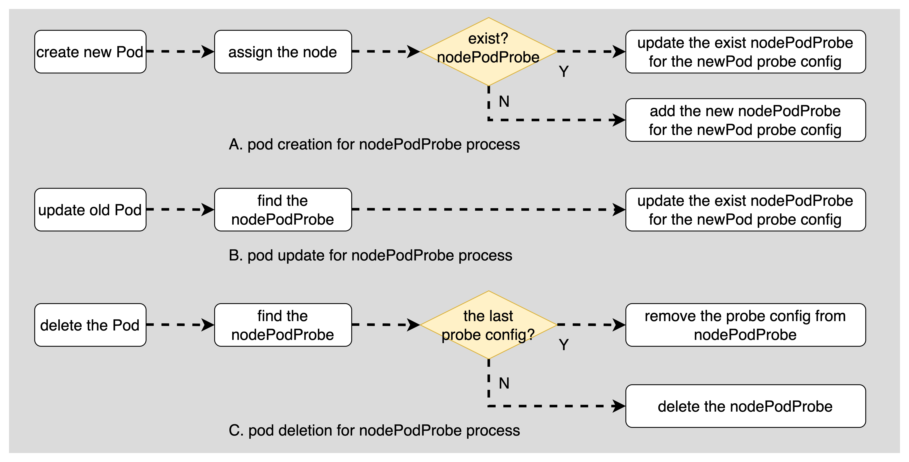
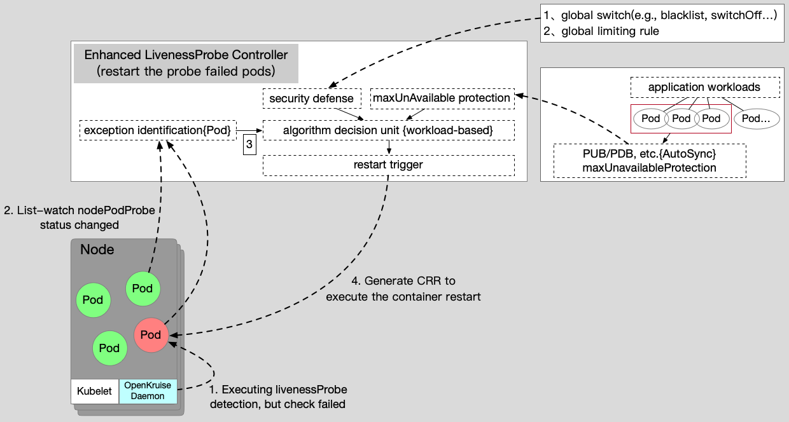
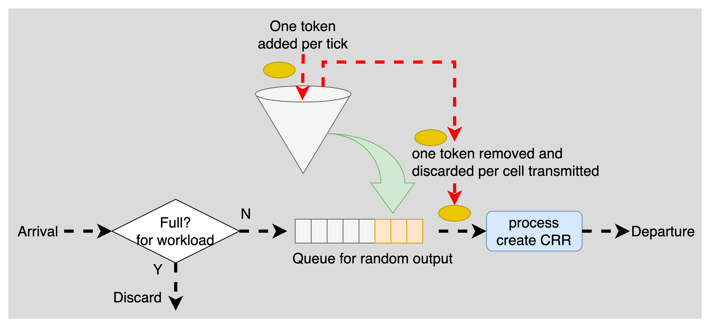
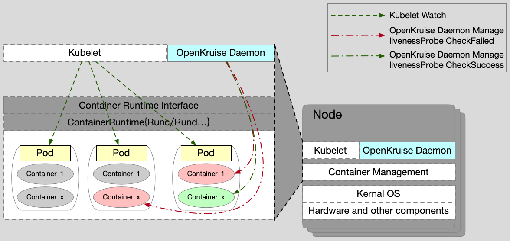
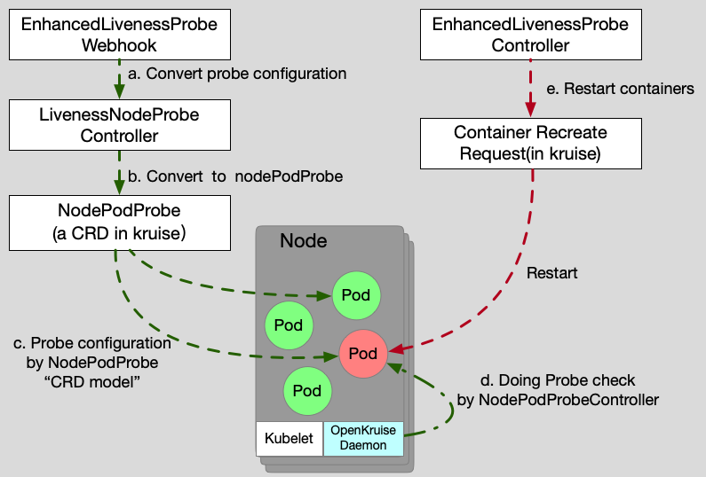

# Enhanced LivenessProbe Solution Feature

An enhanced livenessProbe solution is developed in the OpenKruise suite,
where is compatible with the standard livenessProbe design in the Kubernetes OpenSource community,
which fully considers the service availability when the application containers are triggered to restart service.

## Table of Contents

A table of contents is helpful for quickly jumping to sections of a proposal and for highlighting
any additional information provided beyond the standard proposal template. [Tools for generating](https://github.com/ekalinin/github-markdown-toc) a table of contents from markdown are available.

- [Title](#title)
  - [Motivation](#motivation)
    - [Proposal](#proposal)
      - [Implementation](#Implementation)
        - [API Definition](#API-Definition)
    - [Implementation History](#implementation-history)

## Motivation

Some scenarios where the container is alive but the running application is not healthy, which is shown as the service process hang, developers manually restart systems to recover the service and rely on monitor metrics to alarm the abnormal events.
It is inefficient to solve these related problems with the manual recovery mechanism.

There is the standard livenessProbe feature in Kubernetes opensource community.
For the applications configured with the liveness probe, the Kubernetes kubelet component will periodically check whether the liveness probe service is normal.
If being negative, the kubelet component will directly trigger the restart of the service container.

However, this is a deadly operation or resilience protections for online applications,
specially for the incorrect probe configurations.
For example, the liveness probe configuration are often incorrect due to complicated configurations or contents.
Once the probe takes effect, all of service containers are triggered to restart service,
this condition catastrophically causes service outage(or even triggering an avalanche of services during the restart).
Secondly, there is no standard concept in the design idea of community method,
which completely relies on the machine node detection and machine node restart mechanism.
Furthermore, for a stability perspective, community-native solutions lack application-level global high availability and any resilience protection policies.
Combined with the existing defects, it proposes to design and implement the enhanced livenessProbe application survival solution in the OpenKruise suite,
and plans to open source release as the core capability in the future, so that the innovative technology can be used by more people.

## Proposal

The enhanced livenessProbe solution are composed of two controllers、one webhook and a node probe detection component,
there are an enhanced livenessProbe webhook, an enhanced livenessProbe map nodePodProbe resource controller,
an enhanced livenessProbe controller and a node detection component.

● **EnhancedLivenessProbeWebhook**: A webhook works in Kruise-manager.
The native livenessProbe is converted to the specific string configuration field in pod annotations as soon as the pod is created.

● **LivenessNodeProbeController**: It is a service component controller which is developed in Kruise-manager.
The specific string configuration known as the livenessProbe is converted to the nodePodProbe(a custom resource in Kruise suite) resource immediately.

● **EnhancedLivenessProbeController**: It is a service component controller which is developed in Kruise-manager.
It watches the state change of the nodePodProbe resource and analyzes the application workload status with the failed livenessProbe pods.
This controller decide whether to restart containers or not(using the container recreate request, a custom resource in Kruise).
In calculating process, the resilience protection and application maxUnavailable protection policies are considered by the special algorithm and detection method comprehensively.

● **LivenessProbeDetector**: It is just a single controller in Kruise-daemon,
which support to check the nodePodProbe(e.g., tcp/http/exec checking) as the same by the kubelet probe logic, using the node pod probe resource in Kruise.

### Implementation

**EnhancedLivenessProbeWebhook**
> When a pod created with livenessProbe config with `Annotations: apps.kruise.io/using-enhanced-liveness: true` feature gate,
the webhook will admit the pod resource to remove the native livenessProbe and patch the configuration to the pod annotations `apps.kruise.io/container-probe-context: '{...json format for liveness probe with specified containers in pod...}''`.

**LivenessNodeProbeController**
> For using the nodPodProbe controller processing,
> the livenessProbe config filed in the pod annotations should be converted to the nodePodProbe custom defined resource in Kruise suite.
> This controller can create and update the nodePodProbe resource.
> In Figure 1, the controller reconcile illustrates the nodePodProbe process for the pod different action(creation/update/deletion event).
> For example with the pod creation, if there is not the nodePodProbe resource related with the pod assigned, the new resource will be created by the controller.
> As similar process for pod deletion, if there is no other probe config in nodePodProbe, it can be deleted by controller.


**EnhancedLivenessProbeController**
> The overall architecture is shown in Figure 2 as below.
> After the enhanced livenessProbe controller watches the state change of node pod probe configured the failed livenessProbe pods,
> this decides immediately whether to perform the restart logic using the CRR(container recreate request) or not.

> In order to take into account the high availability of the application and service protection,
> the architecture design is coordinated with the PodUnavailableBudget function in Kruise suite and some anomaly detection algorithms(global switch, black list, global limiting rule, etc.).
> These protect the availability of application services before executing the container restart effectively,
> so that there is no service available caused by batch application restarts.
> For creating the CRRs, the PodUnavailableBudget controller takes into consideration the maxUnavailable protection policy that parts of pods may be not ready because of the CRR processing.
> Therefore, the PodUnavailableBudget webhook can reject the CRR creation when the request violates the maxUnavailable protection policy.
> For example, all containers fail to be fully detected due to the unexpected reasons such as network or the error probe configuration.

> For an example, the livenessProbe config field in the pod annotation is converted to the nodePodProbe resource, as below yaml.
> The nodePodProbe is released by the enhanced livenessProbe map node pod probe controller.
> Meanwhile, the CRR resource is created by the enhanced livesssProbe controller satisfied with the protection strategy.
```yaml
apiVersion: v1
kind: Pod
metadata:
  annotations:
    apps.kruise.io/container-probe-context: '[{"name":"app","livenessProbe":{"exec":{"command":["/bin/sh","-c","/healthy.sh"]},"initialDelaySeconds":1000,"timeoutSeconds":5,"periodSeconds":100,"successThreshold":1,"failureThreshold":3}}]'
  generateName: clone-foo-crflxhk4hn-
  name: clone-foo-crflxhk4hn-khlxd
  namespace: enhanced-livenessprobe-map-nodeprobe-klt8j
  ownerReferences:
  - apiVersion: apps.kruise.io/v1alpha1
    blockOwnerDeletion: true
    controller: true
    kind: CloneSet
    name: clone-foo-crflxhk4hn
    uid: a2057688-5f1e-4489-99f3-02a18e2d5442
  uid: 1ad8e5b3-0b0c-4367-a64b-1b3c97bf1686
spec:
  containers:
  - command:
    - /bin/sh
    - -c
    - sleep 1000
    image: nginx:1.14.2
    imagePullPolicy: IfNotPresent
    name: app
    terminationMessagePath: /dev/termination-log
    terminationMessagePolicy: File
  dnsPolicy: ClusterFirst
  enableServiceLinks: true
  nodeName: node-test-worker
  preemptionPolicy: PreemptLowerPriority
  priority: 0
  restartPolicy: Always
  schedulerName: default-scheduler
  securityContext: {}
  serviceAccount: default
  serviceAccountName: default
  terminationGracePeriodSeconds: 30
```

```yaml
apiVersion: apps.kruise.io/v1alpha1
kind: NodePodProbe
metadata:
  name: node-test-worker
  uid: 973b5257-a8f7-4247-996b-f8e0fb9492db
spec:
  podProbes:
  - name: clone-foo-crflxhk4hn-khlxd
    namespace: enhanced-livenessprobe-map-nodeprobe-klt8j
    probes:
    - containerName: app
      name: clone-foo-crflxhk4hn-khlxd-app
      probe:
        exec:
          command:
          - /bin/sh
          - -c
          - /healthy.sh
        failureThreshold: 3
        initialDelaySeconds: 1000
        periodSeconds: 100
        successThreshold: 1
        timeoutSeconds: 5
    uid: 1ad8e5b3-0b0c-4367-a64b-1b3c97bf1686
```

```yaml
apiVersion: apps.kruise.io/v1alpha1
kind: ContainerRecreateRequest
metadata:
  labels:
    crr.apps.kruise.io/node-name: pod-node-name
    crr.apps.kruise.io/pod-name: clone-foo-crflxhk4hn-khlxd
    crr.apps.kruise.io/pod-uid: 1ad8e5b3-0b0c-4367-a64b-1b3c97bf1686
  name: clone-foo-crflxhk4hn-khlxd-b1e8901771bc
  namespace: enhanced-livenessprobe-map-nodeprobe-klt8j
spec:
  containers:
  - name: app
    statusContext:
      containerID: docker://e92a39jhg9ddk8k6f8321and45723daf1ac5fe
      restartCount: 1
  podName: clone-foo-crflxhk4hn-khlxd
  strategy:
    failurePolicy: Fail
    terminationGracePeriodSeconds: 1
```

> In enhanced livenessProbe controller, the global flow control logic is implemented in Figure 3 as below.
> A basic token bucket algorithm framework is released to control the restart frequency of the application with failed livenessProbe pods.
> When the token is allowed usefully, the algorithm processes the element(nodePodResource in queue) to create a CRR object for restarting the
> failed livenessProbe pods. In this scenario, the algorithm ensures that the controller just create a CRR object for each failed livenessProbe pod.
> In other words, when there are multiple failed livenessProbe containers in the same pod,
> the algorithm would sequentially create a CRR object for one container in the pod.
> For this consideration, the strategy ensures that the failed nodePodProbes don't be processed simultaneously.
> For the garbage collection mechanism of CRRs created by this controller,
> the enhanced livenessprobe controller would periodically check the mapping relationship between existing CRRs and the related nodePodProbe.
> The controller deletes the CRR resource with the completed\succeed\failed status.


**LivenessProbeDetector**
> In node component, the probe detector is a NodePodProbe controller(supporting TCP/HTTP/EXEC/RPC) in Kruise daemon.
> This scheme eliminates the detection capability in native kubelet which checks the custom nodePodProbe resource configuration and reports the status periodically.
> Then, this scheme avoid the weakness to directly restart container after the native kubelet probes failures.
> The NodePodProbe controller is developed in kruise-Daemon and implements the livenessProbe strategy independently(responsible for executing the probe (EXEC\HTTP\TCP\RPC) and returning the results).
> The check status is reported in Pod.Annotations, the specific field definition is shown in the detailed design.
> Finally, the EnhancedLivenessProbeController decides to restart containers by CRRs rather than kubelet.
> In order not to invade the modified kubelet native logic,
> the kruise container recreate request solution which implements the container Runtime interface(container recreate request, CRR in kruise).
> It can start or stop containers in bypass, etc.
> Therefore, the decision result will be feedback to the Pod.Annotation from EnhancedLivenessProbeController,
> and LivenessProbeDetector parse the command and make a response. The overall architecture design is shown in Figure 4.


---
**Q1: How to convert the standard livenessProbe configuration to this solution?**
+ A webhook can convert the standard liveness probe to the special field in pod annotation. The detail key is shown in Section Api Definition and in Figure3.a.
+ At the same time, the NodePodProbe custom resource is created by the enhanced liveness probe map node pod probe controller in Figure3.b.

**Q2: How to takeover the probe detection, using the kruise daemon?**
+  Since the native liveness probe configuration is removed, the kubelet probe detection does not take effect.
  ++ For the configured probe cases, one webhook admits the pod to remove the native probe and restore in pod annotation with this solution.
  ++ For others, the pod annotation can be configured directly with this solutions.


**Q3: How to execute the liveness probe detection?**
+ A nodePodProbe detection controller in kruise-daemon component, responsible for executing the probe (EXEC\HTTP\TCP\RPC) and returning the results status in Figure3.d

**Q4: How to restart the probe failed containers? what is the trigger?**
+ the EnhancedLivenessProbeController use the container recreate request(CRR is the feature in kruise) to restart the failed liveness probe containers in pod in Figure3.e.
+ the killed container will be restarted by kubelet for the Always pod restart policy as soon as possible.

**Q5: How to protect the application or service from restart encroachment thoroughly?**
+ An algorithm decision unit(workload based), including resilience protection(global switch, blacklist, global limiting rules, etc.), maxUnAvailable protection(PodDisruptionBudget in native or PodUnavailableBudget in kruise), is release in EnhancedLivenessProbeController.
+ A switch will be set in pods, which can close off the detection in emergency.

### API Definition
```yaml
apiVersion: v1
kind: Pod
metadata:
  annotations:
  ...
    // [user defined] using this enhanced livnessProbe, otherwise the native checking
    apps.kruise.io/using-enhanced-liveness: "true"
  ...

  labels:
  ...
  ...
  spec:
  ...
    livenessProbe:
      failureThreshold: 3
      httpGet:
        path: /health
        port: 7002
        scheme: HTTP
      initialDelaySeconds: 3000
      periodSeconds: 100
      successThreshold: 1
      timeoutSeconds: 5
...
```

### Functional Assessment
| enhanced(this solution)                                                                                                                                                                         | native                            |
|-------------------------------------------------------------------------------------------------------------------------------------------------------------------------------------------------|-----------------------------------|
| ● specified component detection(nodePodProbe controller in kruise-daemonset)  + global component decision(enhancedLivenessProbeController in kruise-manager) in cluster                         | ● single machine detection + single machine decision(all in kubelet) |
| ● kruiseDaemon/ProbeDetector detection enabled in bypaas,  strong expansibility                                                                                                                 | ● no                              |
| ● the global perspective of the application, the maxUnavailable protection policy and the capactiy building of the resilience protection system(Kruise-manager/EnhancedLivenessProbeController) | ● no                              |
| ● the architecture is easy to expand, without invasive modification of native components, adapt easily to different scaenarios with strong scalability                                          | ● strong coupling, poor scalability |

### Other Notes
● Since the probe detection is implemented by the nodePodProbe controller in Kruise-daemonset, for the pod without ownerreference, this solution can also take effect on the enhancement ability for restarting containers when in failure livenessProbe status.

● Override the community logic, both the native livenessProbe configuration and this solution configuration exist in the process.

### Implementation plan
● NodePodProbe controller in kruise-daemonset supports TCP/HTTPGET/RPC probe besides EXEC checking.

● EnhancedLivenessProbeWebhook is developed firstly to convert the standard livenessProbe configuration in the special field in pod annotations.

● LivenessNodeProbeController is developed to convert the probe config to the nodePodProbe custom resource in kruise.

● EnhancedLivenessProbeController executes the pod containers restarting for failed nodePodProbe status. This controller makes the decision with the global decision unit(workload based), including resilience protection and maxUnavailable protection, etc.

## Implementation History
03/28/2023: Proposal submission