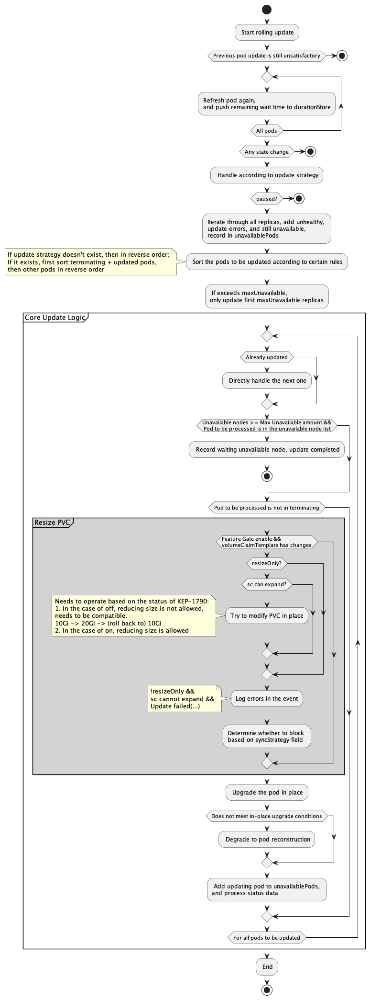

# Advanced StatefulSet 支持卷变配

## 目录
* [Advanced StatefulSet 支持卷变配](#advanced-statefulset-支持卷变配)
    * [目录](#目录)
    * [Motivation](#motivation)
        * [用户场景](#用户场景)
        * [用户失败恢复场景](#用户失败恢复场景)
        * [本质问题](#本质问题)
        * [目标](#目标)
        * [非目标](#非目标)
    * [Proposal](#proposal)
        * [API 修改](#api-修改)
        * [增加 webhook 校验](#增加-webhook-校验)
        * [PVC 调谐过程修改](#pvc-调谐过程修改)
        * [原地变配 pvc 更新失败后怎么办？](#原地变配-pvc-更新失败后怎么办)
            * [如何认定更新失败](#如何认定更新失败)
            * [失败后处理流程](#失败后处理流程)
                * [方案A](#方案a)
                * [方案B](#方案b)
        * [Implementation](#implementation)
        * [为什么选择延续 KEP-661 的思路不追踪 vct 的历史版本?](#为什么选择延续-kep-661-的思路不追踪-vct-的历史版本)
        * [为什么需要增加 VolumeClaimUpdateStrategy 字段，而不是完全参照 KEP-661？](#为什么需要增加-volumeclaimupdatestrategy-字段而不是完全参照-kep-661)

## Motivation

目前已经支持了 CloneSet Volume Claim Templates 变动时触发 pod 重建，使 pvc 重新 reconcile 达成变配。

但是对于有状态应用这样的策略过于激进，需要完善 advanced Stateful Set 对于 Volume Claim Templates 变动的更新策略。

asts 现在对 Volume Claim Templates 变动完全不关注，只对新的 pod 进行 reconcile。

### 用户场景

1. **[H]** 对可支持变配的 StorageClass 的场景, 可以直接 edit pvc storage 字段增加规格大小（不支持减少）
2. 对不支持变配的 StorageClass 的场景，需要确保已有 pvc 内容不再需要后可（手动/自动）删除 pvc 和 pod，新 reconcile 出来的 pvc 和 pod 就可以使用最新的配置 （完善用户场景， 该场景理论上是需要）
   a. 部分消费类场景，使用一段时间后磁盘会有一部分碎片，有时候会在消费完成后 recreate 以提高性能 （sts删除后重建是不是也可以）
3. 对需要更改 StorageClass 的场景，操作和场景 2 类似
   a. 更改 ssd -> essd / 迁移上云等

### 用户失败恢复场景

在场景 1 的操作过程中可能遇到一些意外情况，如修改 Volume Claim Templates 因为各种情况在某个 pod 操作失败了。此时用户会有这几种恢复期望：
1. 完全回滚到配置修改之前，如同时修改镜像和卷规格，但新镜像有问题，想完全回滚（KEP-661不解决）
2. **[H]** 部分回滚到配置修改之前，如同时修改镜像和卷规格，但新镜像有问题，想回滚到旧镜像，但使用新的卷规格 （KEP-661解决）
3. 不回滚配置，解决异常 pod 的失败问题
   a. 如变配符合预期但在某个节点存储 quota 不足，与管理员沟通后增加 quota
   b. 如变配符合预期但在某个节点底层资源存储不足，希望漂移到资源充足的节点上
4. 重新修改配置，如修改卷规格10G -> 100G，因为存储 quota 不足，希望改成 10G -> 20G: （假设10个更新到第5个实例失败）前4个 pod 需要 100G -> 20G, 后6个需要10G -> 20G （KEP-1790）

### 本质问题

1. 如何识别不能原地变配的场景 ？

2. 有没有可能设计一种机制来识别pvc已无数据安全问题，从而让删除 pvc 的过程自动化，进而将自动化 pvc 重建的过程（KEP 4650 定义的机制更侧重将错误处理交由上层用户/平台）

   1. 如果有这样一种机制，和 delete pvc 的区别在哪？
      - delete pvc 是一个和 api 做交互的接口，有权限要求；这种机制可以是某个组件识别到 pvc 状态/pod 内存储状态后打标，是一个实况上报的功能，权限要求较低
      - sts 控制器可以结合并发度和调谐进度来做 delete pvc 的实际决策
   2. 这样的一个机制是否可以和 volumeSnapShot 的流程结合起来考虑？

3. 用户想要的迁移 PVC 的机制究竟是什么样的？一个灵活的机制（KEP-4650）还是受限但通用的解决方案？

### 目标

1. 希望在 sc 支持容量扩展的前提下扩展 Volume Claim Templates 规格可以自动化操作
2. 确保用户可以知道 pvc 的变配是否完成或发生错误
3. 不阻碍用户尝试从异常情况下进行恢复
4. 在打开 RecoverVolumeExpansionFailure feature gate 的集群中，允许用户达成恢复期望4
5. 【Nice to have】不支持容量扩展的 storage class，由用户确保原有云盘内数据不需要后调整 Volume Claim Templates 配置 + 显式指定 pvc 更新方式，可自动删除重建
    - 如何区分是因为更新导致的重建，而不是异常场景驱逐后的重建 -- 参考 clone set 在delete pod 里处理
    - 替代方案：既然用户知道，理论上可以等待手动删除后重建（即 OnDelete）

### 非目标

1. 不实现 kep 1790
2. 不实现 volume claim 的版本管理和跟踪，详细影响[为什么选择延续 KEP-661 的思路不追踪 vct 的历史版本?](#为什么选择延续-kep-661-的思路不追踪-vct-的历史版本)
   1. 不实现只改动 volume claim 的修改，此需求可以用运维手段来实现。
3. 不实现和标识 pvc 可删除联动的调谐机制
4. 不实现结合 VolumeSnapshot 做备份迁移的机制


## Proposal

### API 修改

1.  在StatefulSet spec中引入一个新字段：`volumeClaimUpdateStrategy`
    来指定何时协调PVC和Pod的更新。可能的值有：
    - `OnDelete`：默认值，仅在旧PVC被删除时更新PVC。
    - `OnPodRollingUpdate`: 在滚动更新 Pod 时更新 PVC

> 详细可见 [为什么需要增加 VolumeClaimUpdateStrategy 字段，而不是完全参照 KEP-661？](#为什么需要增加-volumeclaimupdatestrategy-字段而不是完全参照-kep-661)
2. **在 StatefulSet `status`** 引入一个数组字段 `volumeClaimTemplates`:
   - **`status.volumeClaimTemplates[x].templateName`**: 显示追踪的 `spec.volumeClaimTemplates` 的 pvc （template）name，这个在 vcts 一定唯一，方便用户排查问题
      - **Note**: indexId 不直观且 vcts 允许删减，难以追踪。
   - **`status.volumeClaimTemplates[x].compatibleReplicas`**:  是当前 vct 已兼容/已更新的副本数
   - **`status.volumeClaimTemplates[x].compatibleReadyReplicas`**:  是当前 vct 已兼容/已成功更新的副本数
   
当识别到 status.observedGeneration == spec.generation，且每一个 volumeClaimTemplates 数组中 compatibleReadyReplicas == compatibleReplicas 时则认为已经更新完成。


```yaml
spec:
  volumeClaimUpdateStrategy: OnDelete # new field
    # OnDelete：默认值，仅在旧PVC被删除时更新PVC
    # OnPodRollingUpdate：在滚动更新 Pod 时更新 PVC
   
status:
  availableReplicas: 3
  collisionCount: 0
  currentReplicas: 3
  currentRevision: ex1-54c5bd476c
  observedGeneration: 3
  readyReplicas: 3
  replicas: 3
  updateRevision: ex1-54c5bd476c
  updatedReplicas: 3
  volumeClaimTemplates: # new field
    - compatibleReplicas: 2        # 下发 resize 的副本数
      compatibleReadyReplicas: 1  # resize 状态成功的副本数
      templateName: vol1
    - compatibleReplicas: 3
      compatibleReadyReplicas: 3
      templateName: vol2
```


### 增加 webhook 校验
通过 storage class 中 `allowVolumeExpansion` 字段判断是否支持扩展 pvc，但这个字段不一定真实反应 CSI 实际可扩展能力，需要由管理员自行保证，此处尽可能拦截非法请求。

1. Update Strategy为 `OnRollingUpdate` 时，如果对应 sc 支持扩展且 volumeClaimTemplates 不变或只是大小扩展，则通过。否则拒绝。
   - Q：如果先改成 OnDelete 的同时改 volumeClaimTemplates，后面再改成 OnRollingUpdate？ 
   - A：会在滚动更新过程中卡住，走异常更新流程即可
   
2. Update Strategy为 OnDelete 时，直接放过


### PVC 调谐过程修改

1. 监听 pvc 的 update: 但不根据 owner reference（已经被用来实现 pvc 自动删除），而是在 annotation 上记录 sts 对象
   - Q：现有 pvc 没有 annotation 怎么监听？
   - A：只监听（新版本）更新过的 pvc 用于在 pvc 更新时触发新的调谐。
2. update status 中增加对 pvc 的检验/版本管理
3. rolling update 里在更新 pod 之前更新 pvc
   1. pvc 不 ready 时，也将该 pod 加入 unavailablePods
   2. expand 的时候更新 pvc
   3. 识别 expand 回滚的情况
      - 1790 不开的时候不卡
      - 1790 开启的时候下发 resize
   4. 更新完 pvc 后需要验证 pvc 是否 ready/处于 FileSystemResizePending 状态，如不满足则阻断


### 原地变配 pvc 更新失败后怎么办？

#### 如何认定更新失败
1. 明确的更新错误
2. 不明确的可能重试成功的错误，等待一个 maxWaitTime （全局设置，默认值 60s），超时后认为更新失败

识别到失败后会在 sts 资源上打印错误 event

#### 失败后处理流程
理论上 `OnPodRollingUpdate` 失败后需要用户进行介入，此时一般是需要重建 pvc （同时也意味着 pod 一定要重建）。

以三副本场景举例，在原地变配 pvc2 失败后，
0. 识别到失败后会在 sts 资源上打印错误 event

失败处理流程有两种方案：
##### 方案A 

1. 删除 pod2， 同时给 pvc2 打上标签
2. 识别到 pvc2 上的标签时不会进行新 pod2 的创建
3. 等待 pvc2 兼容 且标签消除（可在识别到 pvc 兼容后自动去除）
   1. 此时用户介入预期会有几种情况
      - pvc2 数据不需要，delete pvc2
      - 下发一个新 job 挂载 pvc2，进行备份/快照，成功后 delete pvc2
      - 支持快照的 storage class 可以下发 `VolumeSnapShot` 资源，并在合适的时间还原
4. （3.5）此时如果删除 pod0，会触发 pod0的重建，不会因为 pvc0 不兼容而卡住
5. 兼容后再次创建 pod2，等待 pod2 ready 后更新下一个序号


适用于明确不能更新的 pvc 场景，比如下发 patch 被拒绝等

但基于超时方案的失败识别可能会造成 pod 过早删除，导致只支持在线更新的 CSI 的 pvc 一直没法变配成功

##### 方案B

1. controller 在 patch pvc 后等待 pvc 变更完成
2. 会一直等待 pvc 变更完成，一直卡住
3. 此时用户识别到错误 event 进行介入
   1. 人工处理 pvc 变更完成
   2. 原 pvc 内数据不再需要，删除原 pvc（需要同时删除 pod 和 pvc），controller 自动创建出新 pvc
   3. 对原 pvc 内数据进行了备份/快照后，执行2
   4. 判断暂时没法处理，更改 `OnPodRollingUpdate` 为 `OnDelete`, 不再变动 pvc

一切都由上层用户判断，任何场景都适用

综合两种方案，方案1目前不能解决所有场景的边界问题，优先选择实现方案2，积累用户案例后可优化方案1。

### Implementation
主体修改位于 `rollingUpdateStatefulsetPods` 函数



### 为什么选择延续 KEP-661 的思路不追踪 vct 的历史版本?
现在 asts/cloneset 不在 controller revision 追踪 volumeClaimTemplates 的历史信息，只关注当前值，延续当前行为的主要原因：
1. 将 vct 的信息加入 controller revision，意味着**如果只存在 vct 的改动也会触发 asts 的版本变动**
    1. 目前没有收集到相关的需求
    2. 对现有控制器流程影响比较大，涉及改动多，风险比较大
    3. 该需求可通过运行脚本来批量 patch 或通过下发一个 job 来解决

2. 直接回滚的操作可以通过上层重新下发配置解决，预想中的大部分场景是可以不回滚pvc配置（或不紧急）
    - 相较 expand pvc 的需求优先级较低，如有必要，可以后续演进

3. 加入历史版本跟踪，可以在尚未更新到某 pvc 时，即使 pvc 被删除也会被拉起到历史版本, 而非最新版本
    - pvc 数据还是没法恢复的，此时用户 delete 某个 pvc 的目的是为了拉起旧版本的 pvc 配置吗？ 貌似没啥区别

在上述三个场景没有进一步反馈的情况下，考虑到复杂度，逐步演进暂不实现。

### 为什么需要增加 VolumeClaimUpdateStrategy 字段，而不是完全参照 KEP-661？
1. sts 之前不允许修改 vct 任何字段，661 实现的是功能增强
2. asts 之前允许修改 vct 任何字段，如只允许修改 size，无法保证以前的用户场景兼容。通过增加 VolumeClaimUpdateStrategy 字段来兼容之前的行为
3. 可用于统一 cloneset 目前的 recreate 行为，便于理解
4. 可用于未来可能的集合 VolumeSnapshot 的功能。
