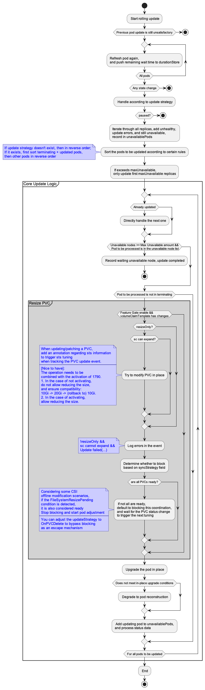

# Advanced StatefulSet Volume Resize

## Table of Contents

A table of contents is helpful for quickly jumping to sections of a proposal and for highlighting
any additional information provided beyond the standard proposal template.
[Tools for generating](https://github.com/ekalinin/github-markdown-toc) a table of contents from markdown are available.

* [Advanced StatefulSet Volume Resize](#advanced-statefulset-volume-resize)
    * [Table of Contents](#table-of-contents)
    * [Motivation](#motivation)
        * [User Story](#user-story)
        * [Failure Recovery User Story](#failure-recovery-user-story)
        * [Fundamental Issues](#fundamental-issues)
        * [Goal](#goal)
        * [None Goal](#none-goal)
    * [Proposal](#proposal)
        * [API Definition](#api-definition)
        * [Adding Webhook Validation](#adding-webhook-validation)
        * [Updating PVC Process](#updating-pvc-process)
        * [Handling In-place PVC Update Failures](#handling-in-place-pvc-update-failures)
        * [What to Do After a PVC Update Fails In-Place?](#what-to-do-after-a-pvc-update-fails-in-place)
            * [How to Determine Update Failure](#how-to-determine-update-failure)
            * [Post-Failure Process](#post-failure-process)
                * [Scheme A](#scheme-a)
                * [Scheme B](#scheme-b)
        * [Implementation](#implementation)
        * [Reasons for Not Tracking Historical Versions of VolumeClaimTemplates per KEP-661](#reasons-for-not-tracking-historical-versions-of-volumeclaimtemplates-per-kep-661)
        * [Reasons for adding the VolumeClaimUpdateStrategy Field](#reasons-for-adding-the-volumeclaimupdatestrategy-field)

<!-- Created by https://github.com/ekalinin/github-markdown-toc -->
➜  kruise git:(opt_proposal_about_pvc_resize) ✗ gh-md-toc docs/proposals/20240626-asts-volume-resize.md

Table of Contents
=================

* [Motivation](#motivation)
    * [User Story](#user-story)
    * [Failure Recovery User Story](#failure-recovery-user-story)
    * [Fundamental Issues](#fundamental-issues)
    * [Goal](#goal)
    * [None Goal](#none-goal)
* [Proposal](#proposal)
    * [API Definition](#api-definition)
    * [Adding Webhook Validation](#adding-webhook-validation)
    * [Updating PVC Process](#updating-pvc-process)
    * [Handling In-place PVC Update Failures](#handling-in-place-pvc-update-failures)
        * [How to Determine Update Failure](#how-to-determine-update-failure)
        * [Post-Failure Process](#post-failure-process)
            * [Scheme A](#scheme-a)
            * [Scheme B](#scheme-b)
    * [Implementation](#implementation)
    * [Reasons for Not Tracking Historical Versions of VolumeClaimTemplates](#reasons-for-not-tracking-historical-versions-of-volumeclaimtemplates)
    * [Reasons for adding the VolumeClaimUpdateStrategy Field](#reasons-for-adding-the-volumeclaimupdatestrategy-field)

## Motivation

We have recently implemented a feature that triggers pod reconstruction when there are changes to
the `VolumeClaimTemplates` in `CloneSet`. This leads to the reconciliation of Persistent Volume Claims (PVCs) and the
implementation of reconfiguration. However, this approach may be too aggressive for stateful applications. Therefore, it
is essential to refine the update strategy for `AdvancedStatefulSet` in response to changes in `VolumeClaimTemplates`.

### User Story

The current behavior of `AdvancedStatefulSet` is to disregard changes in `VolumeClaimTemplates`, reconciling only for
the creation of new pods. Users may encounter situations such as:

1. **[H]** In cases where StorageClasses support expansion, users can directly edit the PVC's storage capacity to
   increase it (decreasing is not supported).
   - Concurrently update pod fields and PVCs.
   - Modify only the PVC.
2. For StorageClasses that do not support expansion, users must ensure that the contents of existing PVCs are no longer
   needed before manually or automatically deleting the PVC and associated pods. New PVCs and pods will then be
   reconciled with the latest configuration. (This scenario requires refinement as it is theoretically necessary.)
    - In some use cases, disk fragmentation may occur over time, prompting users to recreate resources to enhance
      performance. (Would deleting and recreating the StatefulSet be beneficial here?)
3. For scenarios requiring a change in StorageClass, the process is similar to scenario 2:
    - Examples include transitioning from SSD to ESSD or migrating to cloud storage.

### Failure Recovery User Story

In scenario 1, unexpected issues may arise, such as a failure in modifying `VolumeClaimTemplates` for a specific pod.
Users may expect the following recovery options:

1. Complete rollback to the previous configuration, for instance, when both the image and volume specifications are
   altered, and the new image is defective, users desire a full rollback (not covered by KEP-661).
2. **[H]** Partial rollback to the previous configuration, for example, when both the image and volume specifications
   are changed, but users wish to revert to the old image while retaining the new volume specifications (addressed by
   KEP-661).
3. Configuration should not be rolled back, but the issue with the failed pod should be resolved:
    - When reconfiguration is expected but the storage quota on a specific node is insufficient. After consultation with
      the administrator, the quota is increased.
    - When reconfiguration is anticipated but the underlying resources on a specific node are inadequate. The pod should
      be relocated to a node with sufficient resources.
4. Reconfigure the settings again, such as adjusting volume specifications from 10G to 100G, but due to storage quota
   constraints, change to 10G to 20G. (Assuming an update of 10 instances fails at the 5th instance) The first 4 pods
   need to revert from 100G to 20G, and the next 6 need to adjust from 10G to 20G (as per KEP-1790).

### Fundamental Issues

1. How can we identify situations where patching pvc is impractical? (KEP-661)
2. Can we develop a mechanism to automatically and safely delete PVCs, thereby streamlining the PVC deletion process? (
   KEP-4650 focuses more on delegating error handling to higher-level users or platforms)
    - If such a mechanism exists, how does it differ from manual PVC deletion?
        - `delete PVC` is an API interface that requires specific permissions.
        - This mechanism could involve a component that identifies and marks PVC or pod storage states, acting as a
          real-time monitoring tool.
        - The `StatefulSet` controller could then make actual deletion decisions based on concurrency and progress
          tuning.
3. What kind of PVC migration mechanism do users truly require? A flexible approach as proposed in KEP-4650 or a more
   standardized yet broadly applicable solution?

### Goal

1. **Automated Expansion**: Enable automated expansion of `VolumeClaimTemplates` specifications, provided the
   StorageClass supports capacity expansion.
2. **Completion and Error Awareness**: Ensure users can know whether the PVC expansion is complete or if any errors have
   occurred.
3. **Unobstructed Recovery Attempts**: Do not obstruct users from attempting recovery in abnormal situations.
4. **Recovery Expectation in Certain Clusters**: In clusters where the `RecoverVolumeExpansionFailure` feature gate is
   enabled, allow users to achieve recovery expectation 4.
5. **Better Handling for Non-Supportive StorageClasses**: When the StorageClass does not support capacity expansion and
   the user has ensured that existing disk data does not need to be preserved, allow automatic deletion and recreation
   of PVCs by adjusting `VolumeClaimTemplates` configuration and explicitly specifying the update method.
    - Since users are aware of this, they can theoretically wait for manual deletion and reconstruction (OnDelete).
    - Q: How to distinguish between reconstructions due to updates and those due to evictions in abnormal scenarios? A:
      Refer to CloneSet handling in delete pod

### None Goal

1. **Do Not Implement KEP-1790**.
2. **No Version Management**: Do not implement version management and tracking for volume claims. For detailed impact, see Why choose to continue with the KEP-661 approach without tracking the historical versions of VCT?
3. Do not implement a tuning mechanism for identifying and deleting linked PVCs.
4. Do not implement a backup and migration mechanism combined with VolumeSnapshot.
## Proposal

### API Definition

1. **Introduction of `volumeClaimUpdateStrategy` in StatefulSet `spec`**. The possible values include:
   - `OnDelete`: The default value. PVCs are updated only when the old PVC is deleted.
   - `InPlace`: Updates the PVC in place, encompassing the behavior of `OnDelete`.
   - `ReCreate`: This may integrate the current behavior of PVCs in `CloneSet`.

2. **Introduction of `volumeClaimSyncStrategy` in StatefulSet `spec.updateStrategy.rollingUpdate`**. The possible values include:
   - `Async`: The default value. Maintains the current behavior and is only configurable when `volumeClaimUpdateStrategy` is set to `OnDelete`.
   - `LockStep`: PVCs are updated first, followed by the Pods. Further details are provided below.

3. **Introduction of `volumeClaimTemplates` in StatefulSet `status`**:
   - **`status.volumeClaimTemplates[x].templateName`**: Displays the name of the `spec.volumeClaimTemplates` PVC (template) being tracked. This name must be unique within `volumeClaimTemplates`, facilitating easier troubleshooting for users.
      - **Note**: IndexId is not used because it's less intuitive, and since `volumeClaimTemplates` allows for deletion and reduction, tracking with IndexId could be complex.
   - **`status.volumeClaimTemplates[x].compatibleReplicas`**: Indicates the number of replicas for the current `volumeClaimTemplate` that have been compatible or updated.
   - **`status.volumeClaimTemplates[x].compatibleReadyReplicas`**: Indicates the number of replicas for the current `volumeClaimTemplate` that have been compatible or successfully updated.
   - **`status.volumeClaimTemplates[x].finishedReconciliationGeneration`**: Shows the generation number when the PVC reconciliation was completed. For example, for the two `volumeClaimTemplates` mentioned:
      - The first one, because not all replicas are ready, remains at generation 2.
      - The second one, with all replicas ready, is synchronized with the current generation of the `StatefulSet`.

```yaml
spec:
  volumeClaimUpdateStrategy: OnDelete
    # OnDelete：Default value. PVCs are updated only when the old PVC is deleted.
    # InPlace：Updates the PVC in place. Also includes the behavior of OnDelete.
    # ReCreate (May integrate the current behavior of PVCs in CloneSet)

  updateStrategy:
    rollingUpdate:
      volumeClaimSyncStrategy: Async
        # Async：Default value. Maintains current behavior. Only configurable when volumeClaimUpdateStrategy is set to OnDelete.
      # LockStep：PVCs are updated first, followed by Pods. More details provided below.

status:
  availableReplicas: 3
  collisionCount: 0
  currentReplicas: 3
  currentRevision: ex1-54c5bd476c
  observedGeneration: 3
  readyReplicas: 3
  replicas: 3
  updateRevision: ex1-54c5bd476c
  updatedReplicas: 3
  volumeClaimTemplates: # new field
    - finishedReconciliationGeneration: 2
      updatedReadyReplics: 1  # resize 状态成功的副本数
      updatedReplicas: 2        # 下发 resize 的副本数
      templateName: vol1
      # 当 updatedReadyReplics == spec.replicas时，
      # 调整 finishedReconciliationGeneration 为 sts 的 generation
    - finishedReconciliationGeneration: 3
      updatedReadyReplics: 3
      updatedReplicas: 3
      templateName: vol2
```

> Q: Why do we need to introduction these two fields in spec?
>
>A: The modification of VolumeClaimTemplates in Advanced StatefulSet has always been overlooked. If we completely follow
> KEP-661, it could reduce API flexibility and make some current user scenarios unusable. To achieve forward
> compatibility, there are two approaches: "adding these two fields to increase the flexibility of VolumeClaimTemplates
> tuning" and "using a feature gate for global management of webhook interception and tuning steps".
>
> Tentatively, the approach of "adding these two fields to increase the flexibility of VolumeClaimTemplates tuning" is
> selected.

### Adding Webhook Validation

Webhook validation can be implemented using the `allowVolumeExpansion` field in the `StorageClass` to ascertain whether PVC expansion is supported. However, this field may not always reflect the true capabilities of the CSI.

1. **Update Strategy set to InPlace**:
    - If the associated `StorageClass` permits expansion and the `VolumeClaimTemplates` are unchanged or only increase in size, the update is permitted. In other cases, it is denied.
        - **Question**: What happens if we switch to `OnDelete`, alter the `VolumeClaimTemplates`, and then revert to `InPlace`?
        - **Answer**: The rolling update process may become stuck, initiating an abnormal update sequence.

2. **Update Strategy set to OnDelete**:
    - Updates are directly permitted without additional checks.

### Updating PVC Process

1. **Monitor PVC Changes**:
    - Changes to PVCs are monitored using annotations instead of owner references, which are already utilized for automatic PVC deletion. This method records associated `StatefulSet` objects.

2. **Update Status**:
    - Introduce validation and version management for PVCs in the update status to ensure accurate tracking.

3. **Update PVC before Pod in Rolling Update**:
    - During an expansion, the PVC should be updated first.
    - Implement strategies to manage rollback scenarios for expansions:
        - If KEP-1790 is not enabled, prevent the process from getting stuck.
        - If KEP-1790 is enabled, allow for resizing to proceed.

### Handling In-place PVC Update Failures

#### How to Determine Update Failure
1. Clear update errors
2. Unclear errors that might succeed upon retry, waiting for a maxWaitTime (global setting, default value 60 seconds), considering it as a failure after timeout

After recognizing the failure, an error event will be printed on the sts resource.

#### Post-Failure Process
Theoretically, after `OnPodRollingUpdate` fails, user intervention is required, which generally involves rebuilding the pvc (and also implies that the pod must be rebuilt).

Taking a three-replica scenario as an example, after the in-place variation of pvc2 fails:
0. After recognizing the failure, an error event will be printed on the sts resource.

There are two schemes for failure handling:
##### Scheme A

1. Delete pod2 and tag pvc2
2. Upon recognizing the tag on pvc2, no new pod2 will be created
3. Wait for pvc2 to be compatible and the tag to be removed (can be automatically removed after recognizing pvc compatibility)
    1. At this point, user intervention is expected in several scenarios:
        - No need for pvc2 data, delete pvc2
        - Issue a new job to mount pvc2 for backup/snapshot, delete pvc2 after success
        - If the storage class supports snapshots, issue a `VolumeSnapshot` resource and restore at an appropriate time
4. (3.5) At this time, if pod0 is deleted, it will trigger the reconstruction of pod0, and it will not be stuck due to the incompatibility of pvc0
5. After compatibility, create pod2 again, and update the next sequence number after pod2 is ready

Suitable for scenarios where pvc updates are clearly not possible, such as patches being rejected, etc.

However, failure recognition based on timeout may cause pods to be deleted too early, resulting in pvc that only supports online updates to always fail to vary.

##### Scheme B

1. The controller waits for the pvc change to complete after patching pvc
2. It will keep waiting for the pvc change to complete, being stuck
3. At this time, the user recognizes the error event and intervenes
    1. Manually handle the completion of pvc change
    2. The data in the original pvc is no longer needed, delete the original pvc (need to delete both pod and pvc), and the controller automatically creates a new pvc
    3. After backing up/snapshotting the data in the original pvc, perform step 2
    4. If it is judged that it cannot be handled temporarily, change `OnPodRollingUpdate` to `OnDelete`, and no longer change pvc

In this design, Everything is judged by user, suitable for any scenario.

Considering both schemes, Scheme 1 currently cannot solve the boundary issues of all scenarios, and Scheme 2 is preferred for implementation, which can be optimized after accumulating user cases.

### Implementation
Main modification is in the `rollingUpdateStatefulsetPods` Function.


### Reasons for Not Tracking Historical Versions of `VolumeClaimTemplates`
Currently, asts/cloneset does not track the historical information of volumeClaimTemplates in controller revisions, focusing only on the current value. The main reasons for continuing the current behavior are:

1. Direct rollback operations can be resolved by re-issuing configurations from the upper layer, and most scenarios envisioned do not require rolling back PVC configurations (or are not urgent).
   - Compared to the demand for expanding PVCs, the priority is lower, and if necessary, it can be evolved later.

2. With historical version tracking, even if a pvc is deleted before being updated to a certain version, it will be pulled up to the historical version, not the latest version.
   - The pvc data is still not recoverable. Is the user's purpose for deleting a certain pvc to pull up the old version of the pvc configuration? It seems to make no difference.

In the absence of further feedback on these two scenarios, considering the complexity, gradual evolution is chosen, and implementation is not pursued for the time being.

### Reasons for adding the VolumeClaimUpdateStrategy Field
1. Previously, sts did not allow modifying any fields of vct, and 661 implements feature enhancement.
2. Previously, asts allowed modifying any fields of vct. If only the size is allowed to be modified, it cannot ensure compatibility with previous user scenarios. Adding the VolumeClaimUpdateStrategy field to maintain previous behavior.
3. It can be used to unify the current recreate behavior of CloneSet, making it easier to understand.
4. It can be used for potential future integration with VolumeSnapshot features.
