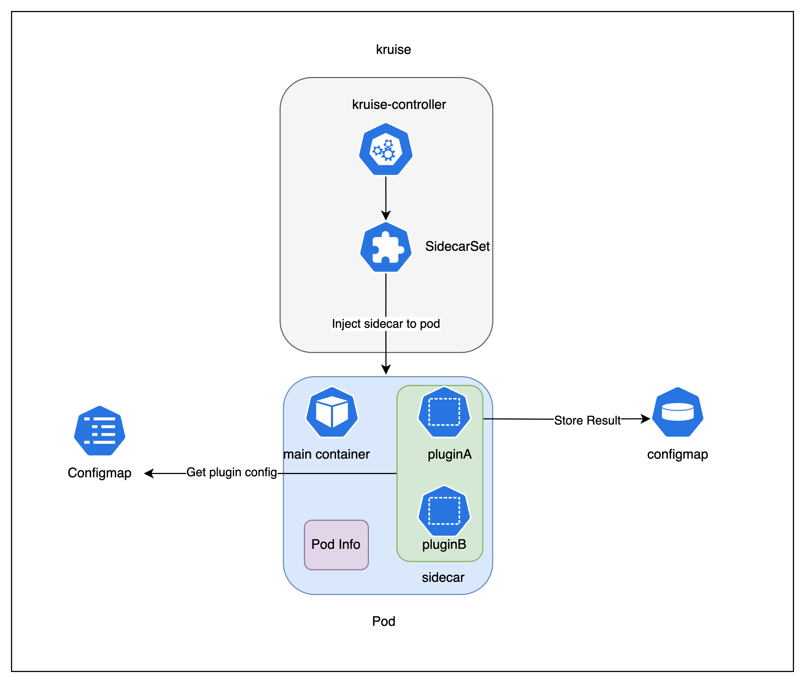
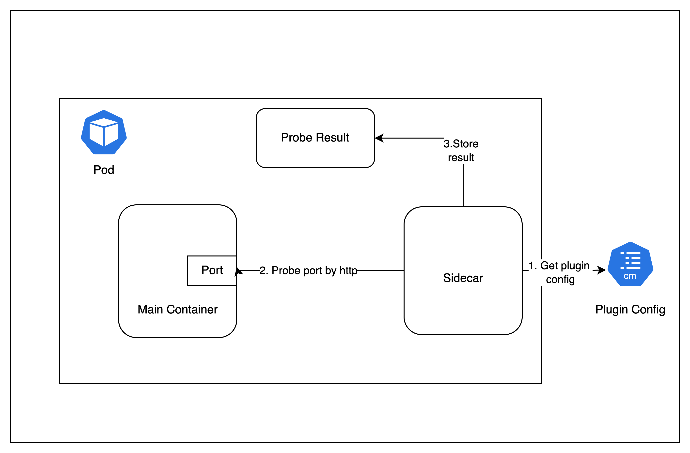
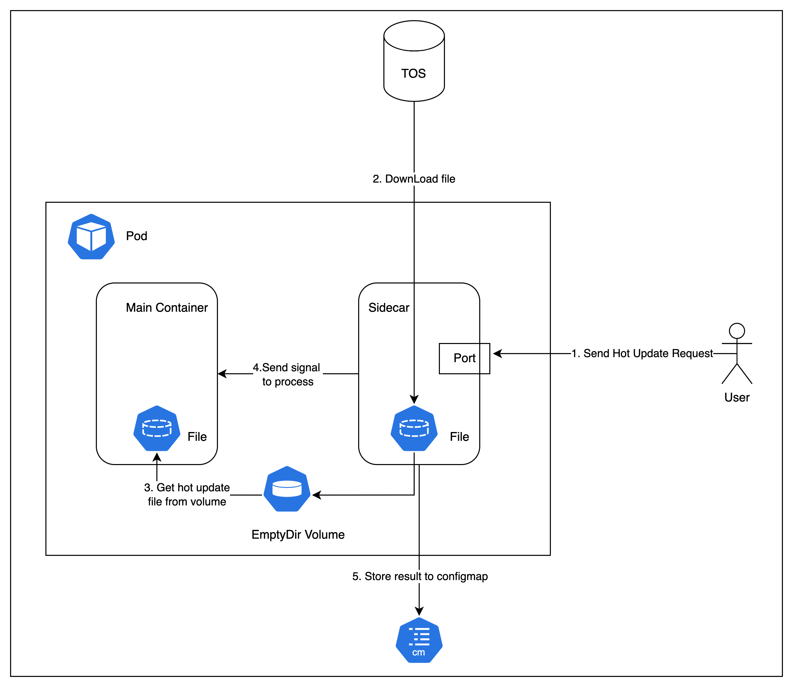

# 增加sidecar解决serverless场景下服务质量探测和热更新
## 目录

- [增加sidecar解决serverless场景下服务质量探测和热更新](#增加sidecar解决serverless场景下服务质量探测和热更新)
    - [目录](#目录)
    - [摘要](#摘要)
    - [动机](#动机)
        - [目标](#目标)
        - [非目标](#非目标)
    - [提案](#提案)
        - [用户故事](#用户故事)
        - [注意事项/约束/警告](#注意事项约束警告)
        - [风险和缓解措施](#风险和缓解措施)
    - [sidecar设计](#sidecar设计)
        - [sidecar架构](#sidecar架构)
        - [sidecar接口](#sidecar接口)
        - [sidecar注入](#sidecar注入)
    - [plugin设计](#plugin设计)
        - [服务质量探测](#服务质量探测)
          - [实现过程](#实现过程)
          - [讨论点](#讨论点)
        - [热更新：](#热更新)
          - [实现过程](#实现过程)
          - [讨论点](#讨论点)
    - [毕业标准](#毕业标准)


---

## 摘要

针对kruise的部分能力无法在serverless场景下使用的问题，此 KEP 提议在 Kruise 增加一个sidecar，解决serverless场景下的服务质量探测和热更新问题。另外通过plugin机制，使得可以将其他serverless场景下的问题都方便的集成到该sidecar中解决。对于其他类似场景，只需要按照该sidecar中提供的通用接口实现不同功能plugin即可。

## 动机
目前kruise提供了服务质量探测和热更新能力，但是这些能力都是在kruise-daemon中实现的，而在serverless场景下，kruise-daemon无法正常使用。因此本KEP希望通过sidecar能力，解决此类问题。


### 目标

- 通过sidecar能力，实现两种plugin，解决serverless场景下服务质量探测和热更新问题
- 提供一套通用的、可扩展的plugin管理机制，使得可以方便的增加plugin解决同类问题

### 非目标

- serverless场景下，kruise已经支持的能力集成到该sidecar

## 提案

### 用户故事

- **故事 1**：我希望能使用kruise提供的自定义服务质量能力，解决serverless场景下，游戏服务中根据玩家数量的自动扩缩容能力。
- **故事 2**：我希望能在serverless场景下，在pod持续运行时重载/更新某些配置/资源，并且保证pod不重启。

### 注意事项/约束/警告

- 此sidecar必须确保与kruise-daemon中提供的服务质量探测和热更新能力不冲突。
- 对sidecar中plugin中的rbac权限做严格限制，防止其有过大权限，影响pod安全。

### 风险和缓解措施

- **风险**：sidecar具有过大的权限，可能对用户的主容器造成风险
- **缓解措施**：对sidecar中的rbac权限进行限制

## sidecar设计

###  sidecar架构

1. 通过kruise提供的sidecarset，将sidecar注入到选定的pod中；
2. 创建一个configmap，用于保存sidecar中各个plugin需要的配置。每个plugin可以自定义自己需要的配置，将其存放到该configmap即可；
```yaml
apiVersion: v1
data:
  config.yaml: |
    plugins:
        - name: hot_update
          config:
            bootOrder: 1
            fileDir: /app/downloads
            loadPatchType: signal
            signal:
                processName: 'nginx: master process nginx'
                signalName: SIGHUP
            storageConfig:
                inKube:
                    annotationKey: sidecar.vke.volcengine.com/hot-update-result
                type: InKube
        - name: http_probe
          config:
            startDelaySeconds: 60
            endpoints:
              - url: "http://localhost:8080"               # 目标 URL
                method: "GET"                           # HTTP 方法
                # headers:                               # 请求头
                #   Content-Type: "application/json"
                #   Authorization: "Bearer your_token"
                timeout: 30                             # 超时时间（秒）
                expectedStatusCode: 200                 # 预期的 HTTP 状态码
                storageConfig:                          # 存储配置
                  type: InKube
                  inKube:
                  annotationKey: http_probe
                   target:
                       group:  game.kruise.io
                       version: v1alpha1
                       resource: gameservers
                       name: ${SELF:POD_NAME}
                       namespace: ${SELF:POD_NAMESPACE}
                   jsonPath: /spec/opsState
                    markerPolices:
                      - state: idle
                        labels:
                          gameserver-idle: 'true'
                        annotations:
                          controller.kubernetes.io/pod-deletion-cost: '-10'
                      - state: allocated
                        labels:
                          gameserver-idle: 'false'
                        annotations:
                          controller.kubernetes.io/pod-deletion-cost: '10'
                      - state: unknown
                        labels:
                          gameserver-idle: 'false'
                        annotations:
                          controller.kubernetes.io/pod-deletion-cost: '5'
                bootorder: 0
    restartpolicy: Always
    resources:
        CPU: 100m
        Memory: 128Mi
    sidecarstartorder: Before
kind: ConfigMap
metadata:
  name: sidecar-config
  namespace: kube-system

```
3. sidecar会根据configmap配置的plugin，依次启动并且运行各个plugin
4. plugin运行后，可以将结果进行持久化。sidecar中预设了一些结果保存机制，可以将结果保存到pod的anno/label中，或者自定义CRD的指定位置；
在configmap中plugin配置的storageConfig中设置即可；另外，plugin开发人员也可以自己实现结果持久化，将plugin结果保存到预期为止。
```yaml 
apiVersion: v1
kind: ConfigMap
metadata:
  name: sidecar-config
  namespace: kube-system
data:
  config.yaml: |
    plugins:
        - name: plugin-a
          config:
            '''
            storageConfig: ## 通过storageConfig可以声明将结果保存到哪个位置
                inKube:
                    annotationKey: xxx ## 将结果设置到pod的指定anno中
                type: InKube
        - name: plugin-b
          config:
            '''
            storageConfig: 
              type: InKube
              inKube:
               target: # 将结果保存到指定CR的指定位置
                   group:  game.kruise.io
                   version: v1alpha1
                   resource: gameservers
                   name: ${SELF:POD_NAME}
                   namespace: ${SELF:POD_NAMESPACE}
               jsonPath: /spec/opsState
    

```

### sidecar接口
sidecar中提供一系列接口，对plugin进行统一管理

| 接口名称                                                  | 作用                                                         |
|-------------------------------------------------------|--------------------------------------------------------------|
| `AddPlugin(plugin Plugin) error  `                     | - 添加指定plugin<br>- 获取plugin需要的配置<br>- 对plugin进行初始化 |
| `RemovePlugin(pluginName string) error`                | - 移除指定plugin                                             |
| `GetVersion() string`                                  | - 获取版本号                                                 |
| `PluginStatus(pluginName string) (*PluginStatus, error)` | - 获取指定plugin状态                                   |
| `Start(ctx context.Context) error`                     | - 开启所有plugin                                           |
| `Stop(ctx context.Context) error`                      | - 停止所有plugin                                           |
| `SetupWithManager(mgr SidecarManager) error`           | - 启动manager                                      |
| `LoadConfig(path string) error`                        | - 加载配置                                                 |
| `StoreData(factory StorageFactory, data string) error`  | - 存储plugin结果                             |


对于plugin的实现，也设计了一套接口，新增的plugin实现该套接口即可；

| 接口名称 | 作用                |
|---------|-------------------|
| `Name()` | - 获取plugin名称      |
| `Init()` | - 初始化plugin       |
| `Start()` | - 运行plugin，实现具体逻辑 |
| `Stop()` | - 停止plugin        |
| `Version()` | - 获取plugin版本      |
| `Status()` | - 获取plugin状态      |
| `GetConfigType()` | - 获取plugin配置类型    |

### sidecar注入
由于该sidecarset只支持注入容器，不支持注入其他pod info， 但是在实现热更新和服务质量探测时， 需要注入serviceAccount，shareProcessNamespace到pod。目前已经提了另一个 KEP(https://github.com/openkruise/kruise/pull/1820)增强该功能，该KEP已经被接受；

## plugin设计
### 服务质量探测
OpenKruise通过PodProbeMarker提供了自定义Probe的能力，并将结果返回到Pod Status中，用户可以根据该结果决定后续的行为。但是在serverless场景下，该能力无法使用。
本KEP设计一个PodProbe的plugin，通过sidecar中实现Probe，解决serverless场景问题。


#### 实现过程

- 通过配置的configmap，设置podProbe plugin需要的配置；podProbe plugin的配置主要包括如下几个部分：
  - url：探测地址，当前支持HTTP接口探测
  - method：HTTP请求方法
  - timeout: HTTP请求超时时间
  - expectedStatusCode: 预期HTTP状态码
  - storageConfig: 探测结果存储配置，支持将结果保存到pod label/anno/condition中；
- plugin 根据配置，通过http循环探测指定端口，并保存结果；
```yaml
apiVersion: v1
kind: ConfigMap
metadata:
  name: sidecar-config
  namespace: kube-system
data:
  config.yaml: |
    plugins:
        - name: http_probe
          config:
            startDelaySeconds: 60
            endpoints:
              - url: "http://localhost:8080"             # 目标 URL
                method: "GET"                            # HTTP 方法
                # headers:                               # 请求头
                #   Content-Type: "application/json"
                #   Authorization: "Bearer your_token"
                timeout: 30                             # 超时时间（秒）
                expectedStatusCode: 200                 # 预期的 HTTP 状态码
                storageConfig:                          # 存储配置
                  type: InKube
                  inKube:
                  annotationKey: http_probe
                   target:
                       group:  game.kruise.io
                       version: v1alpha1
                       resource: gameservers
                       name: ${SELF:POD_NAME}
                       namespace: ${SELF:POD_NAMESPACE}
                   jsonPath: /spec/opsState
                    markerPolices:
                      - state: idle
                        labels:
                          gameserver-idle: 'true'
                        annotations:
                          controller.kubernetes.io/pod-deletion-cost: '-10'
                      - state: allocated
                        labels:
                          gameserver-idle: 'false'
                        annotations:
                          controller.kubernetes.io/pod-deletion-cost: '10'
                      - state: unknown
                        labels:
                          gameserver-idle: 'false'
                        annotations:
                          controller.kubernetes.io/pod-deletion-cost: '5'
                bootorder: 0
    restartpolicy: Always
    resources:
        CPU: 100m
        Memory: 128Mi
    sidecarstartorder: Before
```

#### 讨论点
- sidecar中pod probe plugin的探测与openKruise提供的原生podProbeMarker是否冲突
    - 不冲突，注入sidecar时，会选择需要的pod，与使用kruise的PodProbeMarker的pod分开即可。
- sidecar中pod probe plugin结果保存
    - 方案一：将结果保存到pod上（label/anno/condition），需要sidecar具备pod的patch权限；
    - 方案二：将结果保存到一个新的CR上，每个pod对应一个CR，这种方法不需要具备pod的patch权限，但是需要管理一个单独的CR，成本较大，
   而且与现有的PodProbeMarker结果保存方式不同，用户难以跟PodProbeMarker结合起来使用；


### 热更新
在pod运行过程中，可能需要对pod中的资源/配置文件进行更新，并且要保证pod不重启，达到热更新的效果。本sidecar中实现了一个热更新的plugin。
#### 实现过程

- 当前plugin热更新支持通过信号量的方式触发热更新。
- 热更新plugin的配置如下所示：
  - 在配置中声明主容器的进程名称，以及需要发送的信号量名称。在热更新时，sidecar会向该进程发送指定信号，触发主容器重新读取配置/资源文件
    - sidecar只负责向主容器的进程发送信号量，主容器重新加载配置，则需要主容器自己实现。
- 需要热更新时，用户通过http请求该pod中sidecar的端口，通过指定热更新的文件路径以及版本，触发热更新。
- sidecar根据用户请求中的热更新文件路径，到远端下载文件，保存到sidecar的指定目录，该目录通过emptyDir挂载出来，主容器也挂载该volume。这样
主容器可以获取到新的热更新文件，然后能被触发重载该文件。
- 热更新结束后，sidecar将热更新结果保存到pod的anno/label中。并且持久化到指定的configmap(sidecar-result)中；
  - 该configmap保存了所有pod的热更新结果，最新版本，最新版本配置的文件地址。这样在pod重启/扩容后，仍然可以获取到最新的配置。
```yaml
apiVersion: v1
kind: ConfigMap
metadata:
  name: sidecar-config
  namespace: kube-system
data:
  config.yaml: |
    plugins:
        - name: hot_update
          config:
            fileDir: /app/downloads # sidecar中热更新文件存放目录
            loadPatchType: signal # 热更新方式
            signal:
                processName: 'nginx: master process nginx' # 需要发送信号量的主容器进程名称
                signalName: SIGHUP # 信号量
            storageConfig: # 结果保存配置
                inKube:
                    annotationKey: sidecar.vke.volcengine.com/hot-update-result
                type: InKube
    restartpolicy: Always
    resources:
        CPU: 100m
        Memory: 128Mi
    sidecarstartorder: Before
```
#### 讨论点
- 热更新的触发方式
  - 当前是通过用户向指定pod的sidecar端口发送http请求触发，http请求中会带上热更新配置文件的地址，以及版本号
  - 也可以考虑通过其他方式触发热更新，通过configmapSet，将新的配置文件地址写入，并且对每个版本的配置信息都生产一个configmap，sidecar通过监听该configmap的变化来触发热更新

## 毕业标准
+ Alpha：sidecar可以正常管理plugin，热更新/服务质量探测的plugin正常运行。对sidecar使用的文档完善；
+ Beta：稳定性改进和扩展的验证测试。
+ 稳定：全面的用户反馈已纳入，功能准备好供一般使用。
