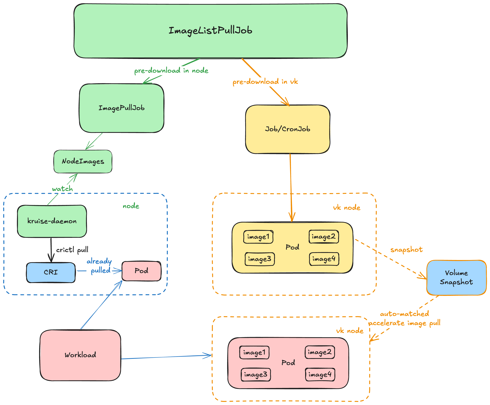

# 镜像预热支持预热vk

## Table of Contents
* [镜像预热支持预热vk](#镜像预热支持预热vk)
   * [Table of Contents](#table-of-contents)
   * [Summary](#summary)
   * [Motivation](#motivation)
      * [Goals](#goals)
      * [Non-Goals/Future Work](#non-goalsfuture-work)
   * [Proposal](#proposal)
      * [User Stories](#user-stories)
         * [Serverless 场景](#serverless-场景)
         * [混合部署弹性场景](#混合部署弹性场景)
      * [Implementation Details/Notes/Constraints](#implementation-detailsnotesconstraints)
         * [如何指定调度到 vk](#如何指定调度到-vk)
         * [指定预热镜像后，如何进行预热](#指定预热镜像后如何进行预热)
         * [如何通过预热已有的 pod 来实现弹性池的预热呢？](#如何通过预热已有的-pod-来实现弹性池的预热呢)
   * [Additional Details](#additional-details)
      * [Test Plan [optional]](#test-plan-optional)
   * [Implementation History](#implementation-history)

## Summary

镜像拉取作为加速pod启动的重要一环，我们之前已经支持了基于 kruise-daemon 调用 CRI 接口进行镜像预热的方案。但这种方案无法实现 virtual kubelet 场景下的镜像预热。
我们注意到如 ACK 平台上 ECI 上已经支持了部分[预热的方案](https://help.aliyun.com/zh/eci/user-guide/overview-of-image-caches-2)，即对预热镜像的容器数据盘进行打快照来实现镜像加速。该提案旨在利用该机制实现 vk 场景下的镜像预热，并尽可能复用已有的 CR。

## Motivation

弹性节点或者 serverless 作为使用云的最大优势之一，其最大的优势在于弹性，如果能够将预热镜像的机制与弹性池的机制结合起来，将能够显著提升弹性池的弹性。

### Goals

- 尽可能复用已有 CR 的情况下支持预热vk
- 支持用户自行指定预热镜像
- 支持从已有pod上进行预热

### Non-Goals/Future Work

- 如果 vk本身不支持预热，本提案不负责实现
- 本提案目前对混合部署弹性场景的镜像预热问题不进行优化，如idc内部弹性到 ecs / vk 等

## Proposal
对于用户在 ImageListPullJob 指定的镜像，我们根据指定的镜像创建一个临时pod，并从该pod上进行预热。

1. 增加一个字段标识是否需要在 vk 上进行预热
计划在已有的 ImageListPullJob CR 上增加一个字段 `spec.predownloadInVK`，用于标识是否需要在 vk 上进行预热

2. 默认使用 `type = virtual-kubelet` 去指定预热的 VK
对于默认标签不满足的情况，我们可以在 [如何满足在不同的弹性实现中的特异化要求](#如何满足在不同的弹性实现中的特异化要求) 中进行指定。

```yaml
apiVersion: apps.kruise.io/v1alpha1
kind: ImageListPullJob
metadata:
  name: job-with-always
spec:
  images:
  - nginx:1.9.1   # [required] image to pull
  - busybox:1.29.2
  - ...
  predownloadInVK: true # new field
  parallelism: 10      # [optional] the maximal number of Nodes that pull this image at the same time, defaults to 1
  selector:            # [optional] the names or label selector to assign Nodes (only one of them can be set)
    names:
    - node-1
    - node-2
    matchLabels:
      node-type: xxx
  completionPolicy:
    type: Always                  # [optional] defaults to Always
    activeDeadlineSeconds: 1200   # [optional] no default, only work for Always type
    ttlSecondsAfterFinished: 300  # [optional] no default, only work for Always type
  pullPolicy:                     # [optional] defaults to backoffLimit=3, timeoutSeconds=600
    backoffLimit: 3
    timeoutSeconds: 300
```

### User Stories

#### Serverless 场景

用户可以在部署应用前预热镜像。虽然需要提前规划可能使用的镜像组合，但可以显著提升应用的启动速度。

#### 混合部署弹性场景

用户在常规资源池中运行应用，通过标记可能需要弹性扩容到 VK 的应用，Kruise 可以自动获取这些应用当前使用的镜像组合并进行预热。
> 本提案暂不包含自动化获取的目标。


### Implementation Details/Notes/Constraints

在 ImageListPullJob 中定义了 vk 镜像预热的信息后，我们会根据是否需要预热 vk 场景，从而生成一个 job 指定调度到 vk 进行启动。
#### 如何指定调度到 vk
一般来说用户可以通过选择 `type = virtual-kubelet` 这个 label 来指定调度到 vk 上，但考虑到不同的云厂商实现，或者多个 vk 源的场景，我们可以增加一个字段让用户在特定场景下指定。

#### 指定预热镜像后，如何进行预热
参考阿里云 ECI 的预热方案，只要包含所有镜像的 pod 第一次所有容器启动（无论成功与否），即可认为预热成功。
但要考虑一个问题，不同的镜像的启动命令如何设置，会不会出现不能成功启动导致预热不成功？或者我们该如何判断这个 pod 是成功运行的？

讨论点：
1. 直接使用镜像的默认命令
  这种方式简单直接，但是对于直接运行业务的命令可能对于业务本身而言是有风险的，极端场景甚至可能影响到线上的业务
2. 使用一个尽可能通用的无风险命令来执行
  这种方式相对安全，但是可能需要考虑不同的镜像可能不存在一个共有的命令。但考虑到即使运行的命令不存在也不会影响镜像的预热，评估下来可以接受。
3. 让用户来指定
  虽然这种方式貌似很通用，但是多个镜像的可能共有的命令很难指定；且相对于方式二来说，需要用户额外指定一个参数，增加了实用的成本。目前还没有想到适合的场景。

初步看起来方式二即可满足，只需要判断`.status.containerStatus[x].running/terminated` 中是否不为nil即可判断预热成功。

#### 如何满足在不同的弹性实现中的特异化要求
在不同的 vk 实现中可能会存在一些字段 / label / annotation 来指定预热的参数，如在阿里云 ACS 中资源核数和网络带宽挂钩，或存在着某些参数来指定 pod 网络带宽。
如何满足不同场景下的特异化需求的同时减小用户配置的复杂度？

1. 增加一个 patch 字段，允许用户自由指定最终应用到预热 pod 上
2. 增加一个 kruise_manager 的配置项/confimap，该配置项可以作为镜像预热的模版/公共参数，最终会被应用到预热 pod 上
3. 增加一个 CRD 来作为模版 （类比 pvc 和 storageclass，可以指定默认值）

以上三种方案的区别主要是用户在同一个集群中会不会很多种特异化配置
- 这些配置如果理解成每一个镜像预热任务的话，其数量就会很多，此时第一种方案更合适（1:1）
- 这些配置如果理解成固化云厂商实现的配置的话，其数量可能只有一种或有限的几种，可以考虑使用第二种方案（1:n）
- 方案二和三最显著的差异是：
  - 方案二假定的是一个不会或很少需要运行时变化的模版；
  - 方案三则在修改的便捷性/动态加载方面更为灵活，与此同时管理的复杂性也会更高一点，比较适合存在多种云厂商实现的弹性场景 （m:n）

首先，作为模版的话首先排除方案一，如果是每一个预热任务都不一样的特异化的需求，如存在合适的场景需评估支持方式

方案二和方案三需要讨论：
- 存不存在一种场景：在同一个云厂商的 vk 实现下，不同的业务期望使用不同的预热配置（大带宽）？
- 但貌似并不是强需求，为此维护一套新的 CRD 的代价是否可以接受？

本文以下先按 configmap 方式来指定

```yaml

apiVersion: v1
kind: ConfigMap
metadata:
  name: kruise-configuration
  namespace: kruise-system
data:
  "WorkloadSpread_Watch_Custom_Workload_WhiteList": |
    {
      //...
    },
  "ImageListPullJob_VKPredownload_default_config_patch": |
    {
      "enable-predownload-in-vk": true,
      "patch": {
        "metadata": {
          "annotations": {
            "xxxxx/image-cache-size": "90Gi" // 不同实现的指定方式可能不同
          }
        },
        "spec": {
          "containers": [
            {
              "name": "main",
              "resources":{
                "limits": {
                  "cpu": "2", // 实例规格和网络带宽有关联
                  "memory": "2Gi",
                  "ephemeral-storage": "60Gi" // 当镜像过大时，按需调整
                }
              } 
            }
          ]
        }
      }
    }
```

#### Future Work: 如何通过自动获取混合部署场景下的镜像组合来实现弹性池的预热呢？
本质上其实就是如何识别出需要进行预热的镜像组合
1. 在 workload 上打需要预热的标记
kruise 只会监听固定的几种 workload，对 CR 没法监听；如果只是支持 kruise 的集中 workload 的话是可行的，但本身该支持也是 case by case 的，作为 workoload 的增强特性是可以的，但扩展性不会很好。

2. 在 pod 上打需要预热的标记
该方案理论上可行，但需要考虑到同一个版本的 pod 其实只希望进行一次预热，且不同版本可能也会对应着一组相同的镜像组合。如何针对已预热的镜像组合进行区分呢？

## Additional Details

### Test Plan [optional]

## Implementation History

- [ ] MM/DD/YYYY: Proposed idea in an issue or [community meeting]
- [ ] MM/DD/YYYY: Compile a Google Doc following the CAEP template (link here)
- [ ] MM/DD/YYYY: First round of feedback from community
- [ ] MM/DD/YYYY: Present proposal at a [community meeting]
- [ ] MM/DD/YYYY: Open proposal PR

