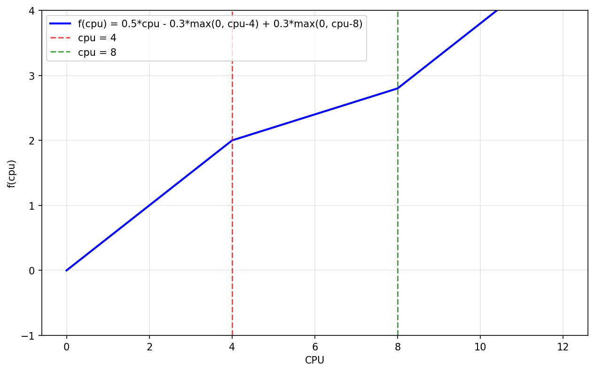

# SidecarSet supports setting up sidecar resources based on pod specification during pod creation

## Table of Contents

- [SidecarSet supports setting up sidecar resources based on pod specification during pod creation](#sidecarset-supports-setting-up-sidecar-resources-based-on-pod-specification-during-pod-creation)
  - [Table of Contents](#table-of-contents)
  - [Summary](#summary)
  - [Motivation](#motivation)
    - [Goals](#goals)
    - [Non-Goals/Future Work](#non-goalsfuture-work)
  - [Proposal](#proposal)
    - [API Definition](#api-definition)
    - [User Stories](#user-stories)
      - [Story 1 - By specific container name](#story-1---by-specific-container-name)
      - [Story 2 - By sum of container resources](#story-2---by-sum-of-container-resources)
      - [Story 3 - By max of container resources](#story-3---by-max-of-container-resources)
      - [Story 4 - By unlimited of container resources](#story-4---by-unlimited-of-container-resources)
      - [Story 5 - By linear function that use sum mode and max of container resources](#story-5---by-linear-function-that-use-sum-mode-and-max-of-container-resources)
      - [Story 6 - Init-container (Native Sidecar) dynamic resource policy injection](#story-6---init-container-native-sidecar-dynamic-resource-policy-injection)
    - [Requirements (Optional)](#requirements-optional)
    - [Implementation Details/Notes/Constraints](#implementation-detailsnotesconstraints)
    - [Risks and Mitigations](#risks-and-mitigations)
  - [Design Details](#design-details)
    - [ResourceExpr Calculator](#resourceexpr-calculator)
    - [Test Plan \[optional\]](#test-plan-optional)
      - [Unit Test](#unit-test)
      - [E2E Test](#e2e-test)
  - [Implementation History](#implementation-history)

## Summary

This proposal describes how the resource values of containers injected by SidecarSet can be dynamically configured based on Pod specification information during the Pod creation process. This allows Sidecar containers (injected only by Kruise SidecarSet) to adjust their resources in response to the specifications of designated containers, addressing the need for dynamic resource configuration in proxy service scenarios like Istio.

## Motivation
[issue#2123](https://github.com/openkruise/kruise/issues/2123)
SidecarSet provides the capability to inject containers into a specified batch of Pods, but previously, the resource values of Sidecar containers could only be fixed values. As SidecarSet is increasingly used in proxy scenarios, the traffic of proxy services is positively correlated with the specifications of the main containers. Therefore, we need the resources of SidecarSet containers to dynamically adjust based on the specifications of the injected Pods.

### Goals

- Provide configuration rules for SidecarSet container resources in the form of extending the CR API
- Support dynamic resource configuration for SidecarSet containers during pod creation

### Non-Goals/Future Work

- Non-creation scenarios: dynamic adjustment of sidecar container resources during Pod in-place updates
- Dependencies on the resources of other Sidecar containers

## Proposal

Overall, we expect the resources of Sidecar containers to be dynamically configured during creation based on the resource specifications of multiple containers within the Pod. To achieve this, we will introduce a new field `sidecarSet.spec.containers[].resourcesPolicy` to define this configuration.

**Note**: ResourcesPolicy is **only supported for `spec.containers`**, not for `spec.initContainers`. InitContainers are typically short-lived initialization tasks and do not require dynamic resource adjustment based on application containers.

### API Definition
The complete API expression is as follows.
```yaml
apiVersion: apps.kruise.io/v1alpha1
kind: SidecarSet
spec:
   containers:
    - name: sidecar1
      image: centos:6.7
      resourcesPolicy: <optional, default: nil> Validation webhook will reject pod creation request if both resourcesPolicy and resources are configured.
        targetContainerMode: sum|max # <required, enum, validated by CRD>
        targetContainersNameRegex: ^large-engine-v.*$ # <optional,default=.*, validated by webhook>. If no container names match this regex, the pod creation request will be rejected by the webhook. Target containers include native sidecar containers and plain containers, excluding Kruise sidecar containers.
        resourceExpr: # <Required, validated by webhook, should not contain scalar resources, only support cpu and memory>, If calculate result is negative, this pod creating request will be rejected by webhook.
          limits: # If one of matched containers don't have resources.limits configured, this field will be treated as unlimited. If the expression result is unlimited, sidecar container resources.limits won't be configured, meaning it's unlimited.
            cpu: max(cpu*50%, 50m) # <optional, default: "", mean unlimited>, support `+,-,*,/,max,min,(,)` and variable `cpu`. Variable `cpu` represents the sum or max of resources.limits.cpu of all matched containers by `targetContainersNameRegex` and `targetContainerMode`.
            memory: max(memory*50%, 100Mi) # <optional, default: "", mean unlimited>, support `+,-,*,/,max,min,(,)` and variable `memory`. Variable `memory` represents the sum or max of resources.limits.memory of all matched containers by `targetContainersNameRegex` and `targetContainerMode`.
          requests: # If matched containers don't have resources.requests configured, the corresponding resource value will be treated as 0.
            cpu: max(cpu*50%, 50m) # <optional, default: "", mean 0>, support `+,-,*,/,max,min,(,)` and variable `cpu`. Variable `cpu` represents the sum or max of resources.limits.cpu of all matched containers by `targetContainersNameRegex` and `targetContainerMode`.  
            memory: 100Mi # <optional, default: "", mean 0>, support `+,-,*,/,max,min,(,)` and variable `memory`. Variable `memory` represents the sum or max of resources.limits.memory of all matched containers by `targetContainersNameRegex` and `targetContainerMode`.
```
### User Stories
#### Story 1 - By specific container name 
```yaml
apiVersion: apps.kruise.io/v1alpha1
kind: SidecarSet
spec:
   containers:
    - name: sidecar1
      image: centos:6.7
      resourcesPolicy:
        targetContainerMode: sum
        targetContainersNameRegex: ^large-engine-v4$ # only apply to container large-engine-v4
        resourceExpr:
          limits:
            cpu: max(cpu*50%, 50m)
            memory: 200Mi
          requests:
            cpu: max(cpu*50%, 50m)
            memory: 100Mi
---
apiVersion: v1
kind: Pod
spec:
  containers:
  - name: large-engine-v4
    image: nginx:1.14.2
    resources:
      limits:
        cpu: 200m
        memory: 200Mi
      requests:
        cpu: 50m
        memory: 100Mi
  - name: large-engine-v8
    image: nginx:1.14.2
    resources:
      limits:
        cpu: 200m
        memory: 200Mi
      requests:
        cpu: 50m
        memory: 100Mi
```
In this case, the sidecar container resources will be:
```yaml
limits:
  cpu: max(sum(200m) * 50%, 50m ) = 100m
  memory: 200Mi
requests:
  cpu: max(sum(50m) * 50%, 50m ) = 50m
  memory: 100Mi
```
#### Story 2 - By sum of container resources
```yaml
apiVersion: apps.kruise.io/v1alpha1
kind: SidecarSet
spec:
   containers:
    - name: sidecar1
      image: centos:6.7
      resourcesPolicy:
        targetContainerMode: sum
        targetContainersNameRegex: ^large-engine-v.*$
        resourceExpr:
          limits:
            cpu: max(cpu*50%, 50m)
            memory: 200Mi
          requests:
            cpu: max(cpu*50%, 50m)
            memory: 100Mi
---
apiVersion: v1
kind: Pod
spec:
  containers:
  - name: large-engine-v4
    image: nginx:1.14.2
    resources:
      limits:
        cpu: 200m
        memory: 200Mi
      requests:
        cpu: 50m
        memory: 100Mi
  - name: large-engine-v8
    image: nginx:1.14.2
    resources:
      limits:
        cpu: 400m
        memory: 400Mi
      requests:
        cpu: 100m
        memory: 200Mi
```
In this case, the sidecar container resources will be:
```yaml
limits:
  cpu: max((200m + 400m) * 50%, 50m ) = 300m
  memory: 200Mi
requests:
  cpu: max((50m + 100m) * 50%, 50m ) = 75m
  memory: 100Mi
```

#### Story 3 - By max of container resources
```yaml
apiVersion: apps.kruise.io/v1alpha1
kind: SidecarSet
spec:
   containers:
    - name: sidecar1
      image: centos:6.7
      resourcesPolicy:
        targetContainerMode: max
        targetContainersNameRegex: ^large-engine-v.*$
        resourceExpr:
          limits:
            cpu: max(cpu*50%, 50m)
            memory: 200Mi
          requests:
            cpu: max(cpu*50%, 50m)
            memory: 100Mi
---
apiVersion: v1
kind: Pod
spec:
  containers:
  - name: large-engine-v4
    image: nginx:1.14.2
    resources:
      limits:
        cpu: 200m
        memory: 200Mi
      requests:
        cpu: 50m
        memory: 100Mi
  - name: large-engine-v8
    image: nginx:1.14.2
    resources:
      limits:
        cpu: 400m
        memory: 400Mi
      requests:
        cpu: 100m
        memory: 200Mi
```
In this case, the sidecar container resources will be:
```yaml
limits:
  cpu: max(max(200m, 400m) * 50%, 50m ) = 200m
  memory: 200Mi
requests:
  cpu: max(max(50m, 100m) * 50%, 50m ) = 50m
  memory: 100Mi
```

#### Story 4 - By unlimited of container resources
```yaml
apiVersion: apps.kruise.io/v1alpha1
kind: SidecarSet
spec:
   containers:
    - name: sidecar1
      image: centos:6.7
      resourcesPolicy:
        targetContainerMode: max
        targetContainersNameRegex: ^large-engine-v.*$
        resourceExpr:
          limits:
            cpu: max(cpu*50%, 50m)
            memory: 200Mi
          requests:
            cpu: max(cpu*50%, 50m)
            memory: 100Mi
---
apiVersion: v1
kind: Pod
spec:
  containers:
  - name: large-engine-v4
    image: nginx:1.14.2
    resources:
      limits:
        cpu: 200m
        memory: 200Mi
      requests:
        cpu: 50m
        memory: 100Mi
  - name: large-engine-v8
    image: nginx:1.14.2
    resources:
      limits:
        memory: 400Mi
      requests:
        cpu: 100m
        memory: 200Mi
```
In this case, the sidecar container resources will be:
```yaml
limits:
  cpu: max(max(200m, unlimited) * 50%, 50m ) = unlimited
  memory: 200Mi
requests:
  cpu: max(max(50m, 100m) * 50%, 50m ) = 50m
  memory: 100Mi
---
Final result:
limits:
  memory: 200Mi
requests:
  cpu: 50m
  memory: 100Mi
```

#### Story 5 - By linear function that use sum mode and max of container resources
User can define cpu expr as `0.5*cpu - 0.3*max(0, cpu-4) + 0.3*max(0, cpu-8)`, this is a linear function that use sum mode and max of container resources. In this case, the sidecar container cpu resources will be:


#### Story 6 - Init-container (Native Sidecar) dynamic resource policy injection
```yaml
apiVersion: apps.kruise.io/v1alpha1
kind: SidecarSet
spec:
   initContainers:
    - name: init-sidecar
      image: busybox:latest
      restartPolicy: Always  # Native sidecar container
      resourcesPolicy:
        targetContainerMode: sum
        targetContainersNameRegex: ^app.*$
        resourceExpr:
          limits:
            cpu: max(cpu*30%, 50m)
            memory: max(memory*25%, 100Mi)
          requests:
            cpu: cpu*20%
            memory: memory*15%
---
apiVersion: v1
kind: Pod
spec:
  containers:
  - name: app1
    image: nginx:1.14.2
    resources:
      limits:
        cpu: 400m
        memory: 800Mi
      requests:
        cpu: 200m
        memory: 400Mi
  - name: app2
    image: nginx:1.14.2
    resources:
      limits:
        cpu: 600m
        memory: 1200Mi
      requests:
        cpu: 300m
        memory: 600Mi
```
In this case, the init-sidecar container resources will be:
```yaml
limits:
  cpu: max((400m + 600m) * 30%, 50m) = 300m
  memory: max((800Mi + 1200Mi) * 25%, 100Mi) = 500Mi
requests:
  cpu: (200m + 300m) * 20% = 100m
  memory: (400Mi + 600Mi) * 15% = 150Mi
```
**Note**: ResourcesPolicy is only supported for init-containers with `restartPolicy: Always` (native sidecar containers). Regular init-containers that run once during pod initialization do not support dynamic resource policy.


### Requirements (Optional)

- FeatureGate: PodWebhook=true

### Implementation Details/Notes/Constraints

- The main modification will be in the `/pkg/webhook/pod/mutating/sidecarset.go::buildSidecars` function.
- The expression evaluation engine will use `goyacc` to generate the parser and include fuzz testing.
- ResourcesPolicy is **only applied to `spec.containers`**, not `spec.initContainers`:
  - InitContainers are short-lived initialization tasks
  - They typically have fixed resource requirements
  - Dynamic resource adjustment is not necessary for init containers
  - Validation webhook will reject SidecarSet with initContainers that have ResourcesPolicy configured

### Risks and Mitigations

- Any processes unrelated to pod creation must remain consistent with the original behavior.
- InitContainers with ResourcesPolicy will be rejected by validating webhook to prevent misuse.

## Design Details
### ResourceExpr Calculator
- Calculator: +, -, *, /, max(), min()
- Number: int, float, percent
- Unconfigued limits resources will be treated as unlimited.  
- Unconfigued requests resources will be treated as 0.
- If the calculation result is negative, the pod creation request will be rejected by the webhook.

### Test Plan [optional]
#### Unit Test
#### E2E Test

## Implementation History

- [ ] 09/15/2025: Proposal review
- [ ] 09/22/2025: Mathematical expression evaluation engine
- [ ] 10/13/2025: All supported features and tests
- [ ] 10/20/2025: Code review, Documentation
- [ ] 10/27/2025: Open proposal PR
