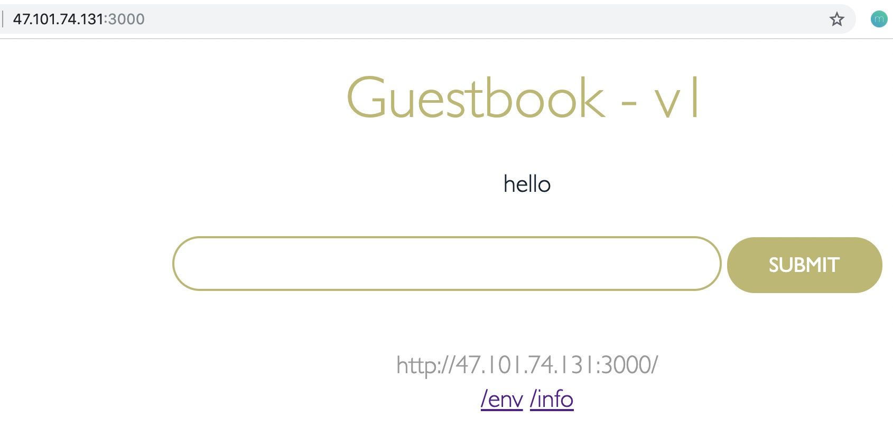

# Deploy Guestbook using CloneSet

This tutorial walks you through an example to install a guestbook application using CloneSet.
The guestbook app used is from this [repo](https://github.com/IBM/guestbook/tree/master/v1).

## Installing the Guestbook application

```bash
# install Redis by CloneSet
$ kubectl apply -f https://raw.githubusercontent.com/kruiseio/kruise/master/docs/tutorial/v1/cloneset-redis.yaml
service/redis-master created
service/redis-slave created
cloneset.apps.kruise.io/redis-master created
cloneset.apps.kruise.io/redis-slave created

# install Guestbook by CloneSet
$ kubectl apply -f https://raw.githubusercontent.com/kruiseio/kruise/master/docs/tutorial/v1/cloneset-guestbook.yaml
service/guestbook-clone-svc created
cloneset.apps.kruise.io/guestbook-clone created
```

## Verify Guestbook Started

Check the guestbook are started. `cloneset.apps.kruise.io` or shortname `clone` is the resource kind.

```bash
$ kubectl get clone
NAME              DESIRED   UPDATED   UPDATED_READY   READY   TOTAL   AGE
guestbook-clone   20        20        20              20      20      11m
redis-master      1         1         1               1       1       11m
redis-slave       2         2         2               2       2       11m
```

## View the Guestbook

You can now view the Guestbook on browser.

To view the guestbook on a remote host, locate the external IP of the application in the **IP** column of the `kubectl get services` output.

```bash
$ kubectl get svc guestbook-clone-svc
NAME                  TYPE           CLUSTER-IP      EXTERNAL-IP    PORT(S)                         AGE
guestbook-clone-svc   LoadBalancer   172.27.11.131   47.114.8.230   3000:32185/TCP,4000:30664/TCP   11m
```

`47.114.8.230` is the external IP.
Visit `http://47.114.8.230:3000` for the guestbook UI.


## Scale app

### Scale out

```bash
$ kubectl scale --replicas=25 clone guestbook-clone
cloneset.apps.kruise.io/guestbook-clone scaled
```

### Scale in with specified Pods

Use `kubectl edit clone guestbook-clone`, modify `replicas` and `podsToDelete`

```yaml
spec:
  replicas: 22
  scaleStrategy:
    podsToDelete:
    - guestbook-clone-k9796
    - guestbook-clone-nkn52
    - guestbook-clone-w9qgl
```

## Update Pods

Currently Pods:

```bash
$ kubectl get pod -l app.kubernetes.io/name=guestbook-clone -L controller-revision-hash
NAME                    READY   STATUS    RESTARTS   AGE    CONTROLLER-REVISION-HASH
guestbook-clone-4b8mj   1/1     Running   0          108s   guestbook-clone-64598d67b
guestbook-clone-4pwvg   1/1     Running   0          108s   guestbook-clone-64598d67b
guestbook-clone-5rsvj   1/1     Running   0          108s   guestbook-clone-64598d67b
guestbook-clone-64xzp   1/1     Running   0          108s   guestbook-clone-64598d67b
guestbook-clone-bk2fc   1/1     Running   0          108s   guestbook-clone-64598d67b
guestbook-clone-djlpq   1/1     Running   0          108s   guestbook-clone-64598d67b
guestbook-clone-hvcxp   1/1     Running   0          108s   guestbook-clone-64598d67b
guestbook-clone-jkvgs   1/1     Running   0          108s   guestbook-clone-64598d67b
guestbook-clone-jnmjq   1/1     Running   0          108s   guestbook-clone-64598d67b
guestbook-clone-jrj5p   1/1     Running   0          108s   guestbook-clone-64598d67b
guestbook-clone-lfwdf   1/1     Running   0          108s   guestbook-clone-64598d67b
guestbook-clone-lg58s   1/1     Running   0          108s   guestbook-clone-64598d67b
guestbook-clone-lrvhl   1/1     Running   0          108s   guestbook-clone-64598d67b
guestbook-clone-mg5gk   1/1     Running   0          108s   guestbook-clone-64598d67b
guestbook-clone-n79kz   1/1     Running   0          108s   guestbook-clone-64598d67b
guestbook-clone-n99zj   1/1     Running   0          108s   guestbook-clone-64598d67b
guestbook-clone-prtlk   1/1     Running   0          108s   guestbook-clone-64598d67b
guestbook-clone-psfdn   1/1     Running   0          108s   guestbook-clone-64598d67b
guestbook-clone-qs4cp   1/1     Running   0          108s   guestbook-clone-64598d67b
guestbook-clone-r7ms9   1/1     Running   0          108s   guestbook-clone-64598d67b
guestbook-clone-rtfvb   1/1     Running   0          108s   guestbook-clone-64598d67b
guestbook-clone-wtm9k   1/1     Running   0          108s   guestbook-clone-64598d67b
```

Edit the CloneSet, set image to `openkruise/guestbook:v2` and `partition=15`:

```yaml
spec:
  # ...
  template:
    spec:
      containers:
      - name: guestbook
        image: openkruise/guestbook:v2
      # ...
  updateStrategy:
    partition: 15
```

Because of the default value of `maxUnavailable` is `20%` and currently `replicas` is `22`, so the maximum number of not-ready pods during updating is `5`.

Controller will update 7 Pods to v2 image:

```bash
$ kubectl get clone guestbook-clone
NAME              DESIRED   UPDATED   UPDATED_READY   READY   TOTAL   AGE
guestbook-clone   22        7         7               22      22      52m

$ kubectl get pod -l app.kubernetes.io/name=guestbook-clone -L controller-revision-hash
NAME                    READY   STATUS    RESTARTS   AGE     CONTROLLER-REVISION-HASH
guestbook-clone-4b8mj   1/1     Running   0          2m39s   guestbook-clone-64598d67b
guestbook-clone-4pwvg   1/1     Running   0          2m39s   guestbook-clone-64598d67b
guestbook-clone-5rsvj   1/1     Running   0          2m39s   guestbook-clone-64598d67b
guestbook-clone-64xzp   1/1     Running   0          2m39s   guestbook-clone-64598d67b
guestbook-clone-bk2fc   1/1     Running   0          2m39s   guestbook-clone-64598d67b
guestbook-clone-djlpq   1/1     Running   0          2m39s   guestbook-clone-64598d67b
guestbook-clone-hvcxp   1/1     Running   0          2m39s   guestbook-clone-64598d67b
guestbook-clone-jkvgs   1/1     Running   0          2m39s   guestbook-clone-64598d67b
guestbook-clone-jnmjq   1/1     Running   0          2m39s   guestbook-clone-64598d67b
guestbook-clone-jrj5p   1/1     Running   1          2m39s   guestbook-clone-56dfcdfff9
guestbook-clone-lfwdf   1/1     Running   1          2m39s   guestbook-clone-56dfcdfff9
guestbook-clone-lg58s   1/1     Running   0          2m39s   guestbook-clone-64598d67b
guestbook-clone-lrvhl   1/1     Running   1          2m39s   guestbook-clone-56dfcdfff9
guestbook-clone-mg5gk   1/1     Running   1          2m39s   guestbook-clone-56dfcdfff9
guestbook-clone-n79kz   1/1     Running   1          2m39s   guestbook-clone-56dfcdfff9
guestbook-clone-n99zj   1/1     Running   0          2m39s   guestbook-clone-64598d67b
guestbook-clone-prtlk   1/1     Running   0          2m39s   guestbook-clone-64598d67b
guestbook-clone-psfdn   1/1     Running   0          2m39s   guestbook-clone-64598d67b
guestbook-clone-qs4cp   1/1     Running   0          2m39s   guestbook-clone-64598d67b
guestbook-clone-r7ms9   1/1     Running   1          2m39s   guestbook-clone-56dfcdfff9
guestbook-clone-rtfvb   1/1     Running   0          2m39s   guestbook-clone-64598d67b
guestbook-clone-wtm9k   1/1     Running   1          2m39s   guestbook-clone-56dfcdfff9

# we can also use the `cloneset.status.updateRevision` to list latest Pods
$ kubectl get pod -l app.kubernetes.io/name=guestbook-clone,controller-revision-hash=guestbook-clone-56dfcdfff9
NAME                    READY   STATUS    RESTARTS   AGE
guestbook-clone-jrj5p   1/1     Running   1          5m29s
guestbook-clone-lfwdf   1/1     Running   1          5m29s
guestbook-clone-lrvhl   1/1     Running   1          5m29s
guestbook-clone-mg5gk   1/1     Running   1          5m29s
guestbook-clone-n79kz   1/1     Running   1          5m29s
guestbook-clone-r7ms9   1/1     Running   1          5m29s
guestbook-clone-wtm9k   1/1     Running   1          5m29s
```

Then we update `partition` to `0`, which means we expect all Pods to be updated.
Also, we set `maxUnavailable` to `10`, which helps us put on speed for updating.

```yaml
spec:
  updateStrategy:
    partition: 0
    maxUnavailable: 10
```

Finally, all Pods have been updated to `guestbook-clone-56dfcdfff9`:

```bash
$ kubectl get clone guestbook-clone
NAME              DESIRED   UPDATED   UPDATED_READY   READY   TOTAL   AGE
guestbook-clone   22        22        22              22      22      59m

$ kubectl get pod -l app.kubernetes.io/name=guestbook-clone,controller-revision-hash=guestbook-clone-56dfcdfff9
NAME                    READY   STATUS    RESTARTS   AGE
guestbook-clone-4b8mj   1/1     Running   1          9m53s
guestbook-clone-4pwvg   1/1     Running   1          9m53s
guestbook-clone-5rsvj   1/1     Running   1          9m53s
guestbook-clone-64xzp   1/1     Running   1          9m53s
guestbook-clone-bk2fc   1/1     Running   1          9m53s
guestbook-clone-djlpq   1/1     Running   1          9m53s
guestbook-clone-hvcxp   1/1     Running   1          9m53s
guestbook-clone-jkvgs   1/1     Running   1          9m53s
guestbook-clone-jnmjq   1/1     Running   1          9m53s
guestbook-clone-jrj5p   1/1     Running   1          9m53s
guestbook-clone-lfwdf   1/1     Running   1          9m53s
guestbook-clone-lg58s   1/1     Running   1          9m53s
guestbook-clone-lrvhl   1/1     Running   1          9m53s
guestbook-clone-mg5gk   1/1     Running   1          9m53s
guestbook-clone-n79kz   1/1     Running   1          9m53s
guestbook-clone-n99zj   1/1     Running   1          9m53s
guestbook-clone-prtlk   1/1     Running   1          9m53s
guestbook-clone-psfdn   1/1     Running   1          9m53s
guestbook-clone-qs4cp   1/1     Running   1          9m53s
guestbook-clone-r7ms9   1/1     Running   1          9m53s
guestbook-clone-rtfvb   1/1     Running   1          9m53s
guestbook-clone-wtm9k   1/1     Running   1          9m53s
```

## Uninstall

```bash
$ kubectl delete -f https://raw.githubusercontent.com/kruiseio/kruise/master/docs/tutorial/v1/cloneset-guestbook.yaml
service "guestbook-clone-svc" deleted
cloneset.apps.kruise.io "guestbook-clone" deleted

$ kubectl delete -f https://raw.githubusercontent.com/kruiseio/kruise/master/docs/tutorial/v1/cloneset-redis.yaml
service "redis-master" deleted
service "redis-slave" deleted
cloneset.apps.kruise.io "redis-master" deleted
cloneset.apps.kruise.io "redis-slave" deleted
```
