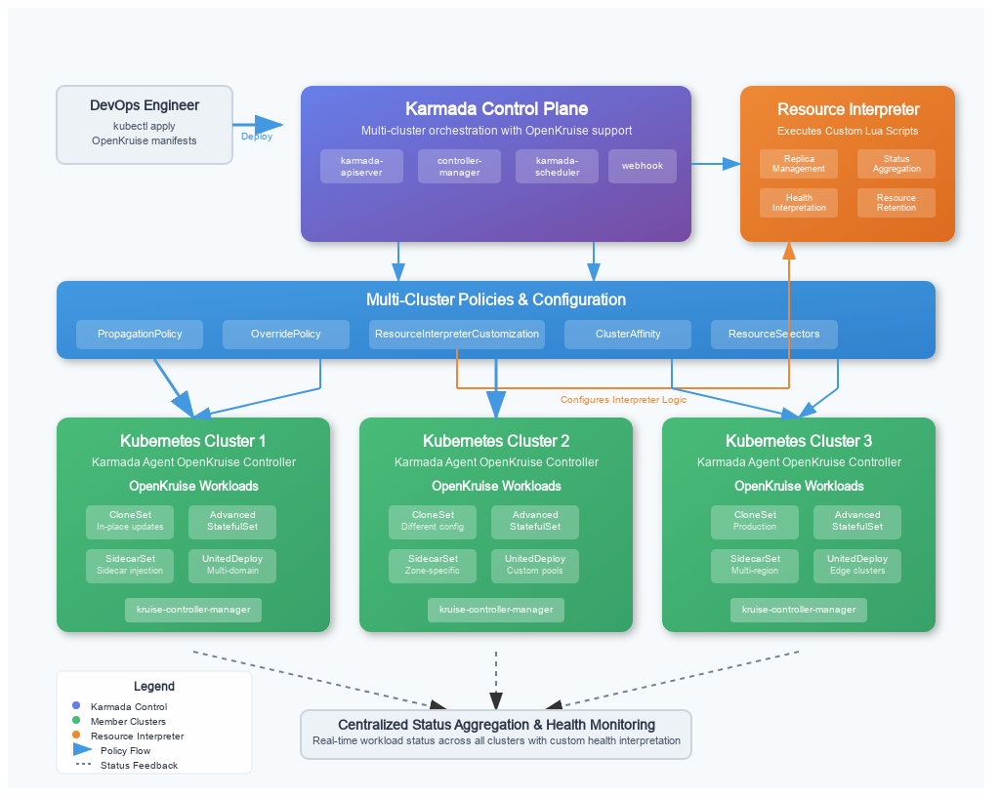
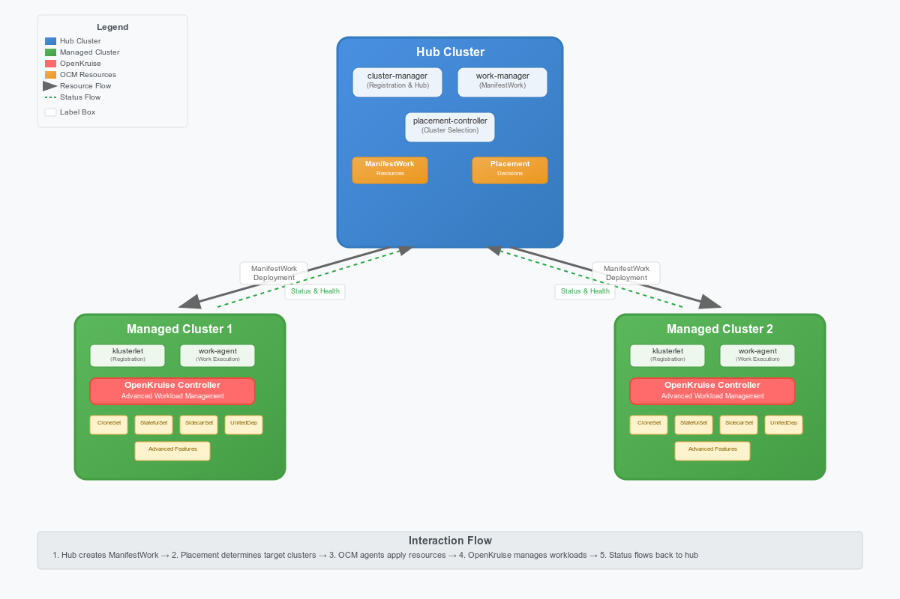

# Best Practices for OpenKruise Multi-Cluster Orchestration (Karmada/OCM)

---

## Table of Contents
- [Introduction](#introduction)
- [Multi-Cluster Orchestration Overview](#multi-cluster-orchestration-overview)
- [OpenKruise Workloads Overview](#openkruise-workloads-overview)
- [Karmada Integration](#karmada-integration)
  - [Karmada Architecture Overview](#karmada-architecture-overview)
  - [Karmada Installation and Setup](#karmada-installation-and-setup)
    - [Prerequisites](#prerequisites)
    - [Installing Karmada Control Plane](#installing-karmada-control-plane)
    - [Installing OpenKruise](#installing-openkruise)
    - [Verification](#verification)
    - [Registering Member Clusters](#registering-member-clusters)
    - [Advanced: Automating OpenKruise Deployment](#advanced-automating-openkruise-deployment)
  - [Resource Interpreter Framework](#resource-interpreter-framework)
  - [OpenKruise Workload Integration with Karmada](#openkruise-workload-integration-with-karmada)
    - [CloneSet Integration](#cloneset-integration)
    - [Advanced StatefulSet Integration](#advanced-statefulset-integration)
    - [SidecarSet Integration](#sidecarset-integration)
    - [UnitedDeployment Integration](#uniteddeployment-integration)
  - [Deployment Examples](#deployment-examples)
    - [Deploying CloneSet](#deploying-cloneset)
    - [Deploying Advanced StatefulSet](#deploying-advanced-statefulset)
    - [Deploying SidecarSet](#deploying-sidecarset)
    - [Deploying UnitedDeployment](#deploying-uniteddeployment)
    - [Apply the Resources](#apply-the-resources)
    - [Verify the Status](#verify-the-status)
    - [Testing & Verification](#testing--verification)
  - [Best Practices for Karmada Integration](#best-practices-for-karmada-integration)
    - [Supported Workloads Status](#supported-workloads-status)
    - [General Best Practices](#general-best-practices)
    - [Workload-Specific Best Practices](#workload-specific-best-practices)
    - [Advanced Patterns and Techniques](#advanced-patterns-and-techniques)
- [Open Cluster Management (OCM) Integration](#open-cluster-management-ocm-integration)
  - [OCM Architecture Overview](#ocm-architecture-overview)
  - [OCM Installation and Setup](#ocm-installation-and-setup)
    - [OCM Prerequisites](#ocm-prerequisites)
  - [ManifestWork for OpenKruise Workloads](#manifestwork-for-openkruise-workloads)
    - [CloneSet with ManifestWork](#cloneset-with-manifestwork)
    - [Advanced StatefulSet with ManifestWork](#advanced-statefulset-with-manifestwork)
    - [SidecarSet with ManifestWork](#sidecarset-with-manifestwork)
    - [UnitedDeployment with ManifestWork](#uniteddeployment-with-manifestwork)
  - [Placement and PlacementDecision](#placement-and-placementdecision)
  - [Deployment Examples](#deployment-examples-1)
    - [Deploying CloneSet with OCM](#deploying-cloneset-with-ocm)
    - [Deploying Advanced StatefulSet with OCM](#deploying-advanced-statefulset-with-ocm)
    - [Deploying SidecarSet with OCM](#deploying-sidecarset-with-ocm)
    - [Deploying UnitedDeployment with OCM](#deploying-uniteddeployment-with-ocm)
  - [Best Practices for OCM Integration](#best-practices-for-ocm-integration)
    - [Supported Workloads Status](#supported-workloads-status-ocm)
    - [General Best Practices](#general-best-practices-ocm)
    - [Workload-Specific Best Practices](#workload-specific-best-practices-ocm)
    - [Advanced ManifestWork Patterns](#advanced-manifestwork-patterns)
    - [Operational Best Practices](#operational-best-practices)
- [Comparison and Decision Guide](#comparison-and-decision-guide)
  - [Karmada vs OCM Comparison](#karmada-vs-ocm-comparison)
  - [When to Use Karmada](#when-to-use-karmada)
  - [When to Use OCM](#when-to-use-ocm)
  - [Migration Strategies](#migration-strategies)
- [Troubleshooting Guide](#troubleshooting-guide)
  - [Common Issues and Solutions](#common-issues-and-solutions)
  - [Debugging Techniques](#debugging-techniques)
  - [Performance Optimization](#performance-optimization)
- [Troubleshooting and Limitations](#troubleshooting-and-limitations)
- [FAQ](#faq)
- [References](#references)

---

## Introduction

This guide provides practical best practices for deploying and managing OpenKruise workloads across multiple Kubernetes clusters using Karmada or Open Cluster Management (OCM). It is intended for platform engineers, SREs, and DevOps teams who want to achieve reliable, scalable, and maintainable multi-cluster application delivery.

Multi-cluster orchestration is crucial for achieving high availability, robust disaster recovery, geographic proximity for lower latency, and optimizing costs through efficient resource utilization. This document details how OpenKruise, an advanced workload management suite, integrates seamlessly with multi-cluster control planes to deliver these benefits.

**What you'll learn:**
- How to set up and integrate OpenKruise with Karmada/OCM
- How to deploy and manage advanced workloads (CloneSet, Advanced StatefulSet, SidecarSet, UnitedDeployment)
- How to validate, monitor, and troubleshoot your multi-cluster deployments
- Key best practices for production environments

---

## Multi-Cluster Orchestration Overview

This guide covers two main approaches for multi-cluster orchestration with OpenKruise:

### Karmada Approach
- **Architecture:** Control plane with member clusters
- **Resource Management:** Policy-based propagation (PropagationPolicy, OverridePolicy)
- **Custom Resources:** Requires ResourceInterpreterCustomization for OpenKruise workloads
- **Best For:** Fine-grained control, custom interpreters, policy-based management

### Open Cluster Management (OCM) Approach  
- **Architecture:** Hub-spoke with managed clusters
- **Resource Management:** Direct deployment via ManifestWork
- **Custom Resources:** Native support for OpenKruise workloads
- **Best For:** Enterprise features, direct resource management, simpler workflows

Both approaches enable you to deploy and manage OpenKruise workloads (CloneSet, Advanced StatefulSet, SidecarSet, UnitedDeployment) across multiple Kubernetes clusters with different trade-offs in complexity, flexibility, and enterprise features.

---

### Goals
- Successfully deploy and manage OpenKruise workloads with Karmada/OCM
- Understand how to write and use custom interpreters
- Implement robust multi-cluster scaling and management strategies
- Validate, monitor, and troubleshoot multi-cluster deployments

---

## OpenKruise Workloads Overview

- **CloneSet:** Advanced deployment with in-place updates and rolling strategies.
- **Advanced StatefulSet:** Stateful workloads with enhanced features.
- **SidecarSet:** Dynamic sidecar injection and management.
- **UnitedDeployment:** Multi-domain workload management for fine-grained control.

---

## Karmada Integration

Karmada is a Kubernetes Federation system that provides multi-cluster orchestration capabilities. It uses a control plane architecture where the Karmada control plane manages multiple member clusters through policy-based resource propagation.

### Karmada Architecture Overview



*Figure: Karmada control plane architecture with OpenKruise integration.*

**System Components:**
- **Karmada Control Plane:** Central management cluster running Karmada components (karmada-apiserver, karmada-controller-manager, karmada-scheduler, karmada-webhook)
- **Member Clusters:** Kubernetes clusters registered with Karmada, each running OpenKruise controllers
- **OpenKruise:** Installed in each member cluster to provide advanced workload management (CloneSet, Advanced StatefulSet, SidecarSet, UnitedDeployment)
- **PropagationPolicy:** Controls resource distribution and placement across member clusters
- **OverridePolicy:** Provides cluster-specific customization and overrides
- **ResourceBinding:** Represents the binding between resources and target clusters
- **ResourceInterpreterCustomization:** Defines how Karmada handles OpenKruise custom resources

**Interaction Flow:**
1. The Karmada control plane manages and propagates workload manifests and policies to member clusters
2. OpenKruise in each member cluster manages the lifecycle of advanced workloads
3. Policies and interpreters ensure correct placement, customization, and status reporting for each workload
4. ResourceInterpreterCustomization scripts handle OpenKruise-specific resource operations

**Key Benefits:**
- Policy-based resource propagation with fine-grained control
- Custom interpreters for OpenKruise workloads via Lua scripts
- Centralized management with distributed execution
- Support for complex placement and override scenarios

It's a common and recommended practice to propagate the OpenKruise Custom Resource Definitions (CRDs) and its controller (manager) to member clusters using Karmada's `ClusterPropagationPolicy`. This automates the setup of OpenKruise across your fleet, ensuring consistency and simplified management, rather than manually installing it on each member cluster.

### Karmada Installation and Setup

#### Prerequisites

* **Kubernetes Clusters:** At least one control plane cluster and two or more member clusters
* **Kubernetes Versions:** 1.19+ for Karmada control plane, 1.16+ for member clusters
* **Tools Required:** `kubectl`, `helm` 3.x, `curl`
* **Network Connectivity:** All clusters must be able to communicate with each other

#### Installing Karmada Control Plane

##### Method 1: Using karmadactl (Recommended)

```bash
# Install karmadactl CLI tool
curl -s https://raw.githubusercontent.com/karmada-io/karmada/master/hack/install-cli.sh | sudo bash

# Initialize Karmada control plane
karmadactl init

# Export kubeconfig for Karmada
export KUBECONFIG="$HOME/.kube/karmada.config:$HOME/.kube/config"
```

##### Method 2: Using Local Development Script

```bash
# Clone Karmada repository
git clone https://github.com/karmada-io/karmada
cd karmada

# Start Karmada control plane (for development/testing)
hack/local-up-karmada.sh

# Set KUBECONFIG to use Karmada
export KUBECONFIG="$HOME/.kube/karmada.config"
```

#### Installing OpenKruise

Install OpenKruise on each member cluster using Helm:

```bash
# Add OpenKruise Helm repository
helm repo add openkruise https://openkruise.github.io/charts/
helm repo update

# Install OpenKruise using Helm
helm install kruise openkruise/kruise --version 1.8.0 --namespace kruise-system --create-namespace
```

#### Verification

##### Check Karmada Control Plane

```bash
# Check Karmada system pods
kubectl get pods -n karmada-system

# Verify cluster status
kubectl get clusters --kubeconfig="$HOME/.kube/karmada.config"
```

##### Check OpenKruise Installation

```bash
# Check OpenKruise system pods
kubectl get pods -n kruise-system

# Verify OpenKruise CRDs are installed
kubectl get crd | grep kruise
```

#### Registering Member Clusters

```bash
# Register a member cluster
karmadactl join <CLUSTER_NAME> --cluster-kubeconfig=<MEMBER_CLUSTER_KUBECONFIG>

# Verify cluster registration
kubectl get clusters --kubeconfig="$HOME/.kube/karmada.config"
```

#### Advanced: Automating OpenKruise Deployment

You can propagate OpenKruise CRDs to member clusters using Karmada's `ClusterPropagationPolicy`:

```yaml
apiVersion: policy.karmada.io/v1alpha1
kind: ClusterPropagationPolicy
metadata:
  name: openkruise-crds
spec:
  resourceSelectors:
    - apiVersion: apiextensions.k8s.io/v1
      kind: CustomResourceDefinition
      labelSelector:
        matchLabels:
          kruise.io/schema-gen: "true"
  placement:
    clusterAffinity:
      clusterNames:
        - member-cluster-1
        - member-cluster-2
  conflictResolution: Overwrite
```

### Resource Interpreter Framework

The `ResourceInterpreterCustomization` CRD allows you to define how Karmada understands and interacts with custom resources like those provided by OpenKruise. These interpreter definitions are themselves declarative Kubernetes objects, meaning they can be version-controlled and applied using GitOps principles, ensuring consistent behavior across your entire multi-cluster environment.

- **Built-in Interpreter**: Handles standard Kubernetes resources.
- **Customized Interpreter**: For CRDs (like OpenKruise), users can define custom logic using Lua scripts via the `ResourceInterpreterCustomization` CRD.
- **Modes**:
  - **Declarative**: Use JSONPath for simple field mapping.
  - **Lua Script**: For advanced logic, write Lua scripts for operations like replica calculation, status aggregation, retention, and health checks.

**Reference:** [Karmada Resource Interpreter Guide](https://karmada.io/docs/userguide/globalview/customizing-resource-interpreter/)

### OpenKruise Workload Integration with Karmada

This section covers the integration of all OpenKruise workload types with Karmada, including the required ResourceInterpreterCustomization configurations and deployment examples.

#### CloneSet Integration

CloneSet is OpenKruise's advanced deployment controller that provides enhanced features over the native Kubernetes Deployment.

**What Works Well:**
- In-place updates and rolling strategies
- Enhanced pod management and lifecycle control
- Status aggregation across clusters
- Full feature support through ResourceInterpreterCustomization

**Key Integration Points:**
- Requires ResourceInterpreterCustomization for proper status handling
- Supports all CloneSet features including in-place updates
- Works seamlessly with Karmada's propagation policies

**ResourceInterpreterCustomization for CloneSet:**

```yaml
apiVersion: config.karmada.io/v1alpha1
kind: ResourceInterpreterCustomization
metadata:
  name: openkruise-cloneset-interpreter
spec:
  target:
    apiVersion: apps.kruise.io/v1alpha1
    kind: CloneSet
  customizations:
    replicas:
      luaScript: |
        local kube = require("kube")
        function GetReplicas(obj)
          local replica = obj.spec.replicas
          local requirement = kube.accuratePodRequirements(obj.spec.template)
          return replica, requirement
        end
    reviseReplica:
      luaScript: |
        function ReviseReplica(obj, desiredReplica)
          obj.spec.replicas = desiredReplica
          return obj
        end
    statusAggregation:
      luaScript: |
        function AggregateStatus(desiredObj, statusItems)
          local replicas = 0
          local updatedReplicas = 0
          local readyReplicas = 0
          local availableReplicas = 0
          local updatedReadyReplicas = 0
          local expectedUpdatedReplicas = 0
          for i = 1, #statusItems do
            local status = statusItems[i].status or {}
            replicas = replicas + (status.replicas or 0)
            updatedReplicas = updatedReplicas + (status.updatedReplicas or 0)
            readyReplicas = readyReplicas + (status.readyReplicas or 0)
            availableReplicas = availableReplicas + (status.availableReplicas or 0)
            updatedReadyReplicas = updatedReadyReplicas + (status.updatedReadyReplicas or 0)
            expectedUpdatedReplicas = expectedUpdatedReplicas + (status.expectedUpdatedReplicas or 0)
          end
          return {
            replicas = replicas,
            updatedReplicas = updatedReplicas,
            readyReplicas = readyReplicas,
            availableReplicas = availableReplicas,
            updatedReadyReplicas = updatedReadyReplicas,
            expectedUpdatedReplicas = expectedUpdatedReplicas
          }
        end
    retention:
      luaScript: |
        function Retain(desiredObj, observedObj)
          if observedObj.spec.suspend ~= nil then
            desiredObj.spec.suspend = observedObj.spec.suspend
          end
          if observedObj.status ~= nil then
            desiredObj.status = observedObj.status
          end
          return desiredObj
        end
    healthInterpretation:
      luaScript: |
        function InterpretHealth(observedObj)
          if observedObj.status == nil then
            return false
          end
          -- Check if we have the expected number of ready replicas
          local specReplicas = (observedObj.spec and observedObj.spec.replicas) or 0
          local readyReplicas = observedObj.status.readyReplicas or 0
          local availableReplicas = observedObj.status.availableReplicas or 0
          
          -- Healthy if all replicas are ready and available
          return readyReplicas == specReplicas and availableReplicas == specReplicas and specReplicas > 0
        end
```

**Key Points:**
- Use Lua scripts for advanced field handling and status aggregation.
- Adjust field names as needed for other OpenKruise workloads.
- Test interpreter scripts in a staging environment before production.

#### Advanced StatefulSet Integration

Advanced StatefulSet provides more features than the native StatefulSet. You should create a similar `ResourceInterpreterCustomization` for Advanced StatefulSet, adjusting field names as needed.

> **Note on Naming:** OpenKruise's Advanced StatefulSet is identified by `apiVersion: apps.kruise.io/v1beta1` and `kind: StatefulSet`. This distinguishes it from the native Kubernetes StatefulSet (`apiVersion: apps/v1`, `kind: StatefulSet`) and is important to specify correctly in policies and interpreters.

**What Works Well:**
- Full StatefulSet features with enhanced capabilities
- Volume management and PVC templates work seamlessly
- Ordered deployment and scaling
- Status aggregation across clusters

**Key Integration Points:**
- Requires ResourceInterpreterCustomization for proper status handling
- Supports all Advanced StatefulSet features
- Works with Karmada's propagation and override policies

```yaml
apiVersion: config.karmada.io/v1alpha1
kind: ResourceInterpreterCustomization
metadata:
  name: openkruise-advancedstatefulset-interpreter
spec:
  target:
    apiVersion: apps.kruise.io/v1beta1
    kind: StatefulSet
  customizations:
    replicas:
      luaScript: |
        function GetReplicas(obj)
          return obj.spec.replicas
        end
    reviseReplica:
      luaScript: |
        function ReviseReplica(obj, desiredReplica)
          obj.spec.replicas = desiredReplica
          return obj
        end
    statusAggregation:
      luaScript: |
        function AggregateStatus(desiredObj, statusItems)
          local replicas = 0
          local readyReplicas = 0
          local currentReplicas = 0
          local updatedReplicas = 0
          for i = 1, #statusItems do
            local status = statusItems[i].status or {}
            replicas = replicas + (status.replicas or 0)
            readyReplicas = readyReplicas + (status.readyReplicas or 0)
            currentReplicas = currentReplicas + (status.currentReplicas or 0)
            updatedReplicas = updatedReplicas + (status.updatedReplicas or 0)
          end
          return {
            replicas = replicas,
            readyReplicas = readyReplicas,
            currentReplicas = currentReplicas,
            updatedReplicas = updatedReplicas
          }
        end
    healthInterpretation:
      luaScript: |
        function InterpretHealth(observedObj)
          if observedObj.status == nil or observedObj.status.readyReplicas == nil or observedObj.status.replicas == nil then
            return false
          end
          return observedObj.status.readyReplicas == observedObj.status.replicas
        end
```

#### SidecarSet Integration

SidecarSet is used to manage sidecar containers across pods. It provides dynamic sidecar injection and management capabilities.

**What Works Well:**
- Sidecar injection works seamlessly across clusters
- Dynamic sidecar management and updates
- Consistent sidecar deployment across all target pods
- Status aggregation through ResourceInterpreterCustomization

**Key Integration Points:**
- Requires ResourceInterpreterCustomization for proper status handling
- Pod selectors must be appropriate for target clusters
- Works with Karmada's propagation policies
- Supports all SidecarSet features including injection strategies

```yaml
apiVersion: config.karmada.io/v1alpha1
kind: ResourceInterpreterCustomization
metadata:
  name: openkruise-sidecarset-interpreter
spec:
  target:
    apiVersion: apps.kruise.io/v1alpha1
    kind: SidecarSet
  customizations:
    statusReflection:
      luaScript: |
        function ReflectStatus(observedObj)
          if observedObj.status == nil then
            return {}
          end
          return {
            matchedPods = observedObj.status.matchedPods or 0,
            updatedPods = observedObj.status.updatedPods or 0,
            readyPods = observedObj.status.readyPods or 0
          }
        end
    replicaResource:
      luaScript: |
        function GetReplicas(obj)
          -- SidecarSet doesn't manage replicas directly, return 0
          return 0
        end
    statusAggregation:
      luaScript: |
        function AggregateStatus(desiredObj, statusItems)
          local matchedPods = 0
          local updatedPods = 0
          local readyPods = 0
          for i = 1, #statusItems do
            local status = statusItems[i].status or {}
            matchedPods = matchedPods + (status.matchedPods or 0)
            updatedPods = updatedPods + (status.updatedPods or 0)
            readyPods = readyPods + (status.readyPods or 0)
          end
          return {
            apiVersion = "apps.kruise.io/v1alpha1",
            kind = "SidecarSet",
            metadata = desiredObj.metadata,
            status = {
              matchedPods = matchedPods,
              updatedPods = updatedPods,
              readyPods = readyPods
            }
          }
        end
    retention:
      luaScript: |
        function Retain(desiredObj, observedObj)
          -- No specific retention logic needed as Karmada handles status preservation
          return desiredObj
        end
    healthInterpretation:
      luaScript: |
        function InterpretHealth(observedObj)
          if observedObj.status == nil then
            return false
          end
          local matchedPods = observedObj.status.matchedPods or 0
          local updatedPods = observedObj.status.updatedPods or 0
          -- If no pods are matched, consider it healthy (nothing to update)
          if matchedPods == 0 then
            return true
          end
          -- A SidecarSet is healthy if all matched pods have been updated
          return updatedPods == matchedPods
        end
    dependencyInterpretation:
      luaScript: |
        -- Karmada does not manage dependencies for SidecarSet by default.
        function GetDependencies(desiredObj)
          local dependencies = {}
          if not desiredObj.spec then
            return dependencies
          end
          -- Helper function to add a dependency
          local function addDependency(kind, name, namespace)
            table.insert(dependencies, {
              apiVersion = "v1",
              kind = kind,
              name = name,
              namespace = namespace or (desiredObj.metadata and desiredObj.metadata.namespace)
            })
          end
          return dependencies
        end
```

#### UnitedDeployment Integration

UnitedDeployment manages multiple workloads across different domains (e.g., zones, clusters). Its interpreter should aggregate status and handle domain-specific logic.

> **Strategy Note:** `UnitedDeployment` provides its own native topology management for distributing workloads across different pools (e.g., zones or clusters). This is useful for managing domain-specific configurations from a single resource. Alternatively, you can use a simpler workload (like a `CloneSet`) and rely on Karmada's `PropagationPolicy` and `OverridePolicy` for multi-cluster distribution.
> 
> - **Use `UnitedDeployment` when:** You need fine-grained control over workload subsets within a single manifest, such as different resource requests or image versions per zone.
> - **Use Karmada policies when:** You prefer to manage distribution and configuration overrides at the orchestration layer, keeping the base workload manifest simpler.

**What Works Well:**
- Multi-domain workload management within clusters
- Fine-grained control over workload distribution
- Topology-based deployment strategies
- Status aggregation across domains

**Key Integration Points:**
- Requires ResourceInterpreterCustomization for proper status handling
- Works with Karmada's propagation policies
- Supports topology-based distribution within clusters
- Can be combined with Karmada's placement policies for multi-cluster distribution

```yaml
apiVersion: config.karmada.io/v1alpha1
kind: ResourceInterpreterCustomization
metadata:
  name: openkruise-uniteddeployment-interpreter
spec:
  target:
    apiVersion: apps.kruise.io/v1alpha1
    kind: UnitedDeployment
  customizations:
    statusAggregation:
      luaScript: |
        function AggregateStatus(desiredObj, statusItems)
          local replicas = 0
          local readyReplicas = 0
          for i = 1, #statusItems do
            local status = statusItems[i].status or {}
            replicas = replicas + (status.replicas or 0)
            readyReplicas = readyReplicas + (status.readyReplicas or 0)
          end
          return {
            replicas = replicas,
            readyReplicas = readyReplicas
          }
        end
    healthInterpretation:
      luaScript: |
        function InterpretHealth(observedObj)
          if observedObj.status == nil or observedObj.spec == nil or observedObj.spec.replicas == nil or observedObj.status.readyReplicas == nil then
            return false
          end
          -- A UnitedDeployment is healthy if all its replicas are ready.
          return observedObj.spec.replicas == observedObj.status.readyReplicas
        end
```

### Deployment Examples

This section provides complete deployment examples for all OpenKruise workload types with Karmada, including workload manifests, propagation policies, and verification steps.

#### Deploying CloneSet

**Sample CloneSet YAML:**

```yaml
apiVersion: apps.kruise.io/v1alpha1
kind: CloneSet
metadata:
  name: sample-cloneset
  namespace: default
spec:
  replicas: 2
  selector:
    matchLabels:
      app: sample
  template:
    metadata:
      labels:
        app: sample
    spec:
      containers:
        - name: nginx
          image: nginx:1.21
```

**Sample PropagationPolicy YAML for CloneSet:**

```yaml
apiVersion: policy.karmada.io/v1alpha1
kind: PropagationPolicy
metadata:
  name: sample-cloneset-propagation
  namespace: default
spec:
  resourceSelectors:
    - apiVersion: apps.kruise.io/v1alpha1
      kind: CloneSet
      name: sample-cloneset
  placement:
    clusterAffinity:
      clusterNames:
        - member1
        - member2
```

#### Deploying Advanced StatefulSet

**Sample Advanced StatefulSet YAML:**

This example demonstrates a minimal Advanced StatefulSet manifest using OpenKruise:

```yaml
apiVersion: apps.kruise.io/v1beta1
kind: StatefulSet
metadata:
  name: sample-advancedstatefulset
  namespace: default
spec:
  serviceName: sample-service
  replicas: 2
  selector:
    matchLabels:
      app: sample-advancedstatefulset
  template:
    metadata:
      labels:
        app: sample-advancedstatefulset
    spec:
      containers:
        - name: nginx
          image: nginx:1.21
  volumeClaimTemplates:
    - metadata:
        name: data
      spec:
        accessModes: ["ReadWriteOnce"]
        resources:
          requests:
            storage: 1Gi
```

**Sample PropagationPolicy YAML for Advanced StatefulSet:**

```yaml
apiVersion: policy.karmada.io/v1alpha1
kind: PropagationPolicy
metadata:
  name: advancedstatefulset-propagation
  namespace: default
spec:
  resourceSelectors:
    - apiVersion: apps.kruise.io/v1beta1
      kind: StatefulSet
      name: sample-advancedstatefulset
  placement:
    clusterAffinity:
      clusterNames:
        - member1
        - member2
```

#### Deploying SidecarSet

**Sample SidecarSet YAML:**

This example demonstrates a minimal SidecarSet manifest using OpenKruise:

> **Note:** The selector in SidecarSet must match the labels of the pods you want to inject the sidecar into.

```yaml
apiVersion: apps.kruise.io/v1alpha1
kind: SidecarSet
metadata:
  name: sample-sidecarset
  namespace: default
spec:
  selector:
    matchLabels:
      app: sample
  containers:
    - name: sidecar
      image: busybox:1.28
      command: ["sleep", "3600"]
```

**Sample PropagationPolicy YAML for SidecarSet:**

```yaml
apiVersion: policy.karmada.io/v1alpha1
kind: PropagationPolicy
metadata:
  name: sidecarset-propagation
  namespace: default
spec:
  resourceSelectors:
    - apiVersion: apps.kruise.io/v1alpha1
      kind: SidecarSet
      name: sample-sidecarset
  placement:
    clusterAffinity:
      clusterNames:
        - member1
        - member2
```

#### Deploying UnitedDeployment

**Sample UnitedDeployment YAML:**

This example demonstrates a minimal UnitedDeployment manifest using OpenKruise:

```yaml
apiVersion: apps.kruise.io/v1alpha1
kind: UnitedDeployment
metadata:
  name: sample-uniteddeployment
  namespace: default
spec:
  replicas: 4
  selector:
    matchLabels:
      app: sample-uniteddeployment
  template:
    cloneSetTemplate:
      metadata:
        labels:
          app: sample-uniteddeployment
      spec:
        selector:
          matchLabels:
            app: sample-uniteddeployment
        template:
          metadata:
            labels:
              app: sample-uniteddeployment
          spec:
            containers:
              - name: nginx
                image: nginx:1.21
  topology:
    subsets:
      - name: subset-a
        nodeSelectorTerm:
          matchExpressions:
            - key: topology.kubernetes.io/zone
              operator: In
              values: ["zone-a"]
        replicas: 2
      - name: subset-b
        nodeSelectorTerm:
          matchExpressions:
            - key: topology.kubernetes.io/zone
              operator: In
              values: ["zone-b"]
        replicas: 2
```

**Sample PropagationPolicy YAML for UnitedDeployment:**

```yaml
apiVersion: policy.karmada.io/v1alpha1
kind: PropagationPolicy
metadata:
  name: uniteddeployment-propagation
  namespace: default
spec:
  resourceSelectors:
    - apiVersion: apps.kruise.io/v1alpha1
      kind: UnitedDeployment
      name: sample-uniteddeployment
  placement:
    clusterAffinity:
      clusterNames:
        - member1
        - member2
```

### Apply the Resources

```bash
# Apply the CloneSet
kubectl apply -f sample-cloneset.yaml

# Apply the Advanced StatefulSet
kubectl apply -f sample-advancedstatefulset.yaml

# Apply the SidecarSet
kubectl apply -f sample-sidecarset.yaml

# Apply the UnitedDeployment
kubectl apply -f sample-uniteddeployment.yaml

# Apply the PropagationPolicies
kubectl apply -f sample-propagationpolicy-cloneset.yaml
kubectl apply -f sample-propagationpolicy-advancedstatefulset.yaml
kubectl apply -f sample-propagationpolicy-sidecarset.yaml
kubectl apply -f sample-propagationpolicy-uniteddeployment.yaml
```

### Verify the Status

1. **Check the clusters managed by Karmada:**
   ```bash
   karmadactl get clusters
   ```
2. **Check the CloneSet status across all clusters:**
   ```bash
   kubectl get cloneset -A
   ```
3. **Check the Advanced StatefulSet status across all clusters:**
   ```bash
   kubectl get statefulset -A
   ```
4. **Check the SidecarSet status across all clusters:**
   ```bash
   kubectl get sidecarset -A
   ```
5. **Check the UnitedDeployment status across all clusters:**
   ```bash
   kubectl get uniteddeployment -A
   ```
6. **Check the propagated resource in a specific member cluster:**
   ```bash
   kubectl --kubeconfig=<MEMBER_CLUSTER_KUBECONFIG> get all -n default
   ```

### Testing & Verification

To verify that your workload is distributed and running correctly across clusters:

1. **List all clusters managed by Karmada:**
   ```bash
   karmadactl get clusters
   ```
2. **Check workload status in the control plane:**
   ```bash
   kubectl get cloneset,statefulset,sidecarset,uniteddeployment -A
   ```
3. **Check workload status in each member cluster:**
   ```bash
   kubectl --kubeconfig=<MEMBER_CLUSTER_KUBECONFIG> get all -n default
   ```
4. **Check pod status in each member cluster:**
   ```bash
   kubectl --kubeconfig=<MEMBER_CLUSTER_KUBECONFIG> get pods -n default
   ```
5. **Check logs for a pod (optional):**
   ```bash
   kubectl --kubeconfig=<MEMBER_CLUSTER_KUBECONFIG> logs <POD_NAME> -n default
   ```
6. **Check PropagationPolicy status:**
   ```bash
   kubectl get propagationpolicy -n default
   kubectl describe propagationpolicy <policy-name> -n default
   ```

## Best Practices for Karmada Integration

### Supported Workloads Status

| Workload | Karmada Support | Status | Notes |
|----------|----------------|--------|-------|
| **CloneSet** | ✅ Full Support | Production Ready | Most mature integration |
| **Advanced StatefulSet** | ✅ Full Support | Production Ready | Enhanced StatefulSet features |
| **SidecarSet** | ⚠️ Limited Support | Experimental | Requires custom interpreter |
| **UnitedDeployment** | ⚠️ Limited Support | Experimental | Requires custom interpreter |

> **Tip:** Always check the [Karmada Supported Versions](https://karmada.io/docs/releases/#support-versions) and [OpenKruise Releases](https://github.com/openkruise/kruise/releases) for the latest compatibility and supported features.

### General Best Practices

#### CRD Synchronization
- Ensure OpenKruise CRDs are installed on all member clusters *before* propagating workloads. Use Karmada's `ClusterPropagationPolicy` to distribute the CRD definitions themselves.
- Keep CRD versions consistent across the fleet to avoid compatibility issues.

#### Interpreter Script Management
- Store your `ResourceInterpreterCustomization` scripts in version control (e.g., Git).
- **Test scripts thoroughly in a staging environment before applying them to the Karmada control plane. A faulty script can impact workload orchestration.**
- **Cross-check all status fields referenced in your Lua scripts with the latest OpenKruise CRD specifications to ensure completeness and accuracy.**
- > **Warning:** Always add nil checks and error handling in Lua scripts to prevent runtime errors.

#### Use Policies for Granularity
- Use `PropagationPolicy` to control which clusters receive a workload.
- Use `OverridePolicy` to apply cluster-specific modifications, such as different resource limits, image tags, or replica counts.
> **Tip:** `OverridePolicy` is optional if you want the same configuration in all clusters, but is highly recommended for real-world multi-cluster management where per-cluster customization is needed.

#### Status and Health Checks
- Write robust `statusAggregation` scripts to get a meaningful overview of your multi-cluster workload.
- Define precise `healthInterpretation` logic. A workload isn't healthy just because it exists; it's healthy when it's ready and available.
- **Add robust nil-checking and error handling in all Lua scripts to prevent runtime errors.**

#### Version Alignment
- **Ensure that OpenKruise, Karmada, and Kubernetes versions are compatible and up-to-date. Always refer to the [Karmada Supported Versions](https://karmada.io/docs/releases/#support-versions) and [OpenKruise Releases](https://github.com/openkruise/kruise/releases) for compatibility information.**

#### Security Best Practices
- Use RBAC and least-privilege permissions for Karmada and OpenKruise controllers. Grant only the minimum necessary permissions. For Karmada, this typically means `get`, `list`, `watch`, `create`, `update`, `patch`, `delete` on the resources it manages (e.g., `PropagationPolicy`, `OverridePolicy`, `ResourceBinding`, and the specific workloads it federates). For OpenKruise, ensure its controller has permissions over its CRDs and the native Kubernetes resources it manages (Pods, StatefulSets, Deployments, etc.).
- Regularly review and audit access controls for all service accounts and users interacting with the Karmada control plane and member clusters.
- Grant `cluster-admin` privileges only when absolutely unavoidable, preferring namespaced or specific resource permissions.
> **Warning:** Overly broad permissions can lead to significant security vulnerabilities in your multi-cluster environment.

#### Monitoring and Observability
- Integrate with monitoring tools such as Prometheus and Grafana to track workload health, resource usage, and interpreter script status.
- Monitor the status of Karmada's `ResourceBinding` and `PropagationPolicy` objects to ensure successful distribution. Key metrics and events from the Karmada controller-manager and OpenKruise controller pods are essential.
- Set up alerts for failed propagations, unhealthy workloads (e.g., `readyReplicas` != `replicas`), or errors reported by interpreter scripts.
> **Tip:** Monitoring and alerting are essential for production-grade multi-cluster management. Pay close attention to logs from Karmada's `karmada-controller-manager` and `karmada-webhook` (for interpreter errors), as well as the OpenKruise manager in member clusters.

#### Automation and GitOps
- Use GitOps tools (e.g., Argo CD, Flux) to manage interpreter scripts, PropagationPolicies, and OverridePolicies declaratively.
- Store all configuration and policy YAMLs in version control for auditability and reproducibility.
- GitOps enables version control, auditability, and automated rollbacks for your multi-cluster policies.

### Advanced Patterns and Techniques

**Advanced ResourceInterpreterCustomization Patterns:**
- Use nil checks and error handling in all Lua scripts
- Implement proper status aggregation for complex workloads
- Create reusable interpreter components for common patterns
- Test interpreter scripts thoroughly in staging environments

**Performance Optimization:**
- Optimize Lua scripts for execution speed
- Use efficient status aggregation algorithms
- Implement proper resource limits for Karmada components
- Monitor interpreter script performance

**Security Best Practices:**
- Validate all input data in Lua scripts
- Implement proper RBAC for interpreter access
- Use least-privilege principles for all components
- Regularly audit interpreter scripts for security issues

### Workload-Specific Best Practices

#### CloneSet

**Production Considerations:**
- Use OverridePolicy for per-cluster partition control instead of the partition field
- Implement proper status aggregation for in-place updates
- Monitor update progress across clusters

**Limitations:**
- `partition` field is not supported for per-cluster partitioning.
- In-place update status fields may not aggregate correctly across clusters.

> **Workaround:** Use `OverridePolicy` for per-cluster partition control.

**Recommended Configuration:**
```yaml
apiVersion: apps.kruise.io/v1alpha1
kind: CloneSet
metadata:
  name: my-cloneset
spec:
  replicas: 3
  updateStrategy:
    type: RollingUpdate
  template:
    metadata:
      labels:
        app: my-app
    spec:
      containers:
        - name: app
          image: my-app:v1.0.0
```

#### Advanced StatefulSet

**Production Considerations:**
- Use OverridePolicy for per-cluster partition control
- Implement separate PropagationPolicy for PVCs if needed
- Monitor volume provisioning across clusters
- Use consistent storage classes across clusters

**Limitations:**
- `partition` field is not natively supported for per-cluster partitioning by Karmada's propagation. This is because Karmada propagates the entire CloneSet manifest to a member cluster, and the local OpenKruise controller then applies the `partition` value within that single cluster's scope.
- In-place update status fields may not aggregate correctly across clusters without specific interpreter logic.

> **Workaround:** Use `OverridePolicy` for per-cluster partition control, allowing you to specify different partition values for the CloneSet in each target cluster.

> **Workaround:** Create a separate PropagationPolicy for PVCs if needed.

**Recommended Configuration:**
```yaml
apiVersion: apps.kruise.io/v1beta1
kind: StatefulSet
metadata:
  name: my-statefulset
spec:
  replicas: 3
  podManagementPolicy: OrderedReady
  serviceName: my-service
  template:
    metadata:
      labels:
        app: my-app
    spec:
      containers:
        - name: app
          image: my-app:v1.0.0
  volumeClaimTemplates:
    - metadata:
        name: data
      spec:
        accessModes: ["ReadWriteOnce"]
        resources:
          requests:
            storage: 1Gi
```

#### SidecarSet

**Production Considerations:**
- Use OverridePolicy to adjust selectors per cluster
- Ensure consistent pod labeling strategy across clusters
- Use explicit injection strategies (`Always`, `IfNotPresent`)
- Monitor sidecar injection status across clusters

**Limitations:**
- Pod selector in `SidecarSet` may not match pods in all target clusters as expected if selectors are highly specific to a cluster's environment.
- Injection strategy (e.g., `Always`, `IfNotPresent`) may require careful consideration in multi-cluster scenarios to ensure sidecars are injected consistently and correctly across distributed pods.

> **Workaround:** Use `OverridePolicy` to adjust selectors per cluster, or ensure your pod labeling strategy is consistent across all clusters. Explicit injection strategies (`Always`, `IfNotPresent`) can help ensure predictable behavior.

**Recommended Configuration:**
```yaml
apiVersion: apps.kruise.io/v1alpha1
kind: SidecarSet
metadata:
  name: my-sidecarset
spec:
  selector:
    matchLabels:
      app: my-app
  containers:
    - name: sidecar
      image: sidecar:v1.0.0
      command: ["sleep", "3600"]
  injectionStrategy:
    revision:
      customVersion: "v1"
      policy: "Always"
```

#### UnitedDeployment

**Production Considerations:**
- Use UnitedDeployment for zone-based distribution within clusters, not for cross-cluster placement
- Keep topology pools simple to avoid conflicts with Karmada's placement engine
- Implement proper status aggregation scripts for domain-specific logic

**Limitations:**
- Native topology management within `UnitedDeployment` (using `pools` with `nodeSelectorTerm` for cluster-level distribution) may conflict or overlap with Karmada's own advanced placement logic. Using both simultaneously for cluster selection can lead to unexpected behavior or redundant configuration.
- Status aggregation for `UnitedDeployment` can be complex due to its domain-specific nature.

> **Workaround:** For cluster distribution, it's generally recommended to rely primarily on Karmada's `PropagationPolicy` for cluster selection and replica distribution, using `UnitedDeployment`'s topology features for more granular control *within* a selected cluster (e.g., zone-based distribution via `nodeSelectorTerm`). Use simplified status aggregation scripts that focus on overall replica counts.

**Recommended Configuration:**
> **Note:** To avoid conflicts with Karmada's placement engine, use simple pools in UnitedDeployment. Cluster distribution should be handled by Karmada's PropagationPolicy, not UnitedDeployment's topology. If you need to use nodeSelectorTerm for grouping within a cluster, you can do so, but avoid using it for cross-cluster placement.

```yaml
apiVersion: apps.kruise.io/v1alpha1
kind: UnitedDeployment
metadata:
  name: my-uniteddeployment
spec:
  replicas: 4
  selector:
    matchLabels:
      app: my-app
  template:
    cloneSetTemplate:
      metadata:
        labels:
          app: my-app
      spec:
        selector:
          matchLabels:
            app: my-app
        template:
          metadata:
            labels:
              app: my-app
          spec:
            containers:
              - name: app
                image: my-app:v1.0.0
  topology:
    subsets:
      - name: subset-a
        replicas: 2
        nodeSelectorTerm:
          matchExpressions:
            - key: topology.kubernetes.io/zone
              operator: In
              values: ["zone-a"]
      - name: subset-b
        replicas: 2
        nodeSelectorTerm:
          matchExpressions:
            - key: topology.kubernetes.io/zone
              operator: In
              values: ["zone-b"]
```

## Open Cluster Management (OCM) Integration

Open Cluster Management (OCM) is a CNCF project that provides a comprehensive solution for managing multiple Kubernetes clusters. Unlike Karmada, OCM uses a hub-spoke architecture where the hub cluster manages multiple spoke clusters through agents.

### OCM Architecture Overview



*Figure: OCM hub-spoke architecture with OpenKruise integration.*

**System Components:**
- **Hub Cluster:** Central management cluster running OCM components (cluster-manager, work-manager, placement-controller)
- **Managed Clusters:** Kubernetes clusters registered with OCM, each running OCM agents (klusterlet, work-agent)
- **OpenKruise:** Installed in each managed cluster to provide advanced workload management (CloneSet, Advanced StatefulSet, SidecarSet, UnitedDeployment)
- **ManifestWork:** OCM's primary mechanism for deploying resources to managed clusters
- **Placement:** Controls which managed clusters receive workloads
- **Work:** Represents the actual resources deployed to managed clusters
- **ManagedCluster:** Represents each managed cluster in the hub

**Interaction Flow:**
1. The OCM hub cluster creates ManifestWork resources that define workloads to be deployed
2. Placement resources determine which managed clusters receive the workloads
3. OCM agents in managed clusters apply the ManifestWork resources
4. OpenKruise in each managed cluster manages the lifecycle of advanced workloads
5. Status and health information flows back to the hub cluster

**Key Benefits:**
- Direct resource deployment via ManifestWork
- Native support for OpenKruise workloads without custom interpreters
- Enterprise-grade security and RBAC features
- Simplified workflow compared to policy-based approaches
- CNCF-graduated solution with mature community support

### OCM Installation and Setup

#### OCM Prerequisites

* At least one hub cluster for OCM management
* Two or more Kubernetes clusters as managed clusters
* OpenKruise installed on each managed cluster
* `kubectl` access to all clusters
* `clusteradm` CLI tool (installed in Step 2)
* KinD (Kubernetes in Docker) for local development/testing
* Helm 3.x installed (for OpenKruise installation)

#### Step 1: Create KinD Clusters

```bash
# Create hub cluster
kind create cluster --name hub --config - <<EOF
kind: Cluster
apiVersion: kind.x-k8s.io/v1alpha4
nodes:
- role: control-plane
  extraPortMappings:
  - containerPort: 6443
    hostPort: 6443
    protocol: TCP
EOF

# Create managed cluster 1
kind create cluster --name cluster1

# Create managed cluster 2
kind create cluster --name cluster2

# Verify clusters are created
kind get clusters
```

#### Step 2: Install clusteradm

```bash
# Install clusteradm CLI tool
curl -L https://raw.githubusercontent.com/open-cluster-management-io/clusteradm/main/install.sh | bash

# Verify installation
clusteradm version

# Add clusteradm to PATH if not already added
export PATH=$PATH:$HOME/.local/bin
```

#### Step 3: Bootstrap the Hub Cluster

```bash
kubectl config use-context kind-hub

#!/bin/bash
set -e

HUB_CONTEXT="kind-hub"

# === Get Hub IP ===
HUB_IP=$(docker inspect hub-control-plane --format '{{range .NetworkSettings.Networks}}{{.IPAddress}}{{end}}')
echo "🔗 Hub IP detected: $HUB_IP"

# === Update kubeconfig for hub context ===
echo "🛠 Updating kubeconfig server address for $HUB_CONTEXT..."
kubectl config set-cluster "$HUB_CONTEXT" \
  --server="https://$HUB_IP:6443" >/dev/null

# === Verify connection ===
echo "🔍 Verifying hub API connection..."
kubectl cluster-info --context "$HUB_CONTEXT"

# === Switch to hub and init OCM ===
kubectl config use-context "$HUB_CONTEXT"
echo "🚀 Initializing OCM hub..."
clusteradm init --wait --output-join-command-file join-command.sh

echo "✅ Hub initialized and join command saved to join-command.sh"

# Verify hub installation
kubectl get pods -n open-cluster-management-hub
kubectl get crd | grep open-cluster-management
```

#### Step 4: Join Managed Clusters

```bash
# Get Hub IP correctly
HUB_IP=$(docker inspect hub-control-plane \
  --format '{{range .NetworkSettings.Networks}}{{.IPAddress}}{{end}}')
echo "Hub cluster IP: $HUB_IP"

# Clean failed installs (optional)
kubectl config use-context kind-cluster1
kubectl delete ns open-cluster-management-agent --ignore-not-found
kubectl delete ns open-cluster-management --ignore-not-found

kubectl config use-context kind-cluster2
kubectl delete ns open-cluster-management-agent --ignore-not-found
kubectl delete ns open-cluster-management --ignore-not-found

# Join cluster1
kubectl config use-context kind-hub
JOIN_TOKEN=$(clusteradm get token --context kind-hub | grep "clusteradm join" | awk '{print $4}')
kubectl config use-context kind-cluster1
clusteradm join --hub-token $JOIN_TOKEN --hub-apiserver https://$HUB_IP:6443 --cluster-name cluster1 --wait

# Join cluster2 (new token!)
kubectl config use-context kind-hub
JOIN_TOKEN=$(clusteradm get token --context kind-hub | grep "clusteradm join" | awk '{print $4}')
kubectl config use-context kind-cluster2
clusteradm join --hub-token $JOIN_TOKEN --hub-apiserver https://$HUB_IP:6443 --cluster-name cluster2 --wait

# Approve CSRs & check status
kubectl config use-context kind-hub
kubectl get csr
kubectl get managedclusters

# Accept the join requests from the hub cluster
kubectl config use-context kind-hub
clusteradm accept --clusters cluster1,cluster2

# Verify managed clusters are properly joined
kubectl get managedclusters
# Expected output should show HUBACCEPTED and JOINED as "True" for both clusters
```

#### Step 5: Install OpenKruise on Managed Clusters

```bash
# Install OpenKruise using Helm (recommended approach)
helm repo add openkruise https://openkruise.github.io/charts/
helm repo update

# Switch context to each managed cluster and install OpenKruise
kubectl config use-context kind-cluster1
helm install kruise openkruise/kruise --version 1.6.0 --namespace kruise-system --create-namespace

kubectl config use-context kind-cluster2
helm install kruise openkruise/kruise --version 1.6.0 --namespace kruise-system --create-namespace

# Verify OpenKruise installation
kubectl config use-context kind-cluster1
kubectl get pods -n kruise-system

kubectl config use-context kind-cluster2
kubectl get pods -n kruise-system
```

#### Step 6: Grant RBAC Access to OCM Agent

```bash
# On each managed cluster, grant appropriate permissions to the OCM agent
kubectl config use-context kind-cluster1
kubectl create clusterrolebinding ocm-work-agent --clusterrole=cluster-admin --serviceaccount=open-cluster-management-agent:klusterlet-work-sa --dry-run=client -o yaml | kubectl apply -f -

kubectl config use-context kind-cluster2
kubectl create clusterrolebinding ocm-work-agent --clusterrole=cluster-admin --serviceaccount=open-cluster-management-agent:klusterlet-work-sa --dry-run=client -o yaml | kubectl apply -f -
```

#### Step 7: Verify Complete Setup

```bash
# Verify managed clusters are properly joined
kubectl config use-context kind-hub
kubectl get managedclusters
# Expected output should show HUBACCEPTED and JOINED as "True" for both clusters

# Check OCM components on hub
kubectl get pods -n open-cluster-management-hub

# Verify klusterlet agents are running on managed clusters
kubectl config use-context kind-cluster1
kubectl get pods -n open-cluster-management-agent

kubectl config use-context kind-cluster2
kubectl get pods -n open-cluster-management-agent

# Verify OpenKruise is running on managed clusters
kubectl config use-context kind-cluster1
kubectl get pods -n kruise-system

kubectl config use-context kind-cluster2
kubectl get pods -n kruise-system

# Test OCM connectivity
kubectl config use-context kind-hub
kubectl get manifestwork -A
```

#### Step 8: Troubleshooting Common Issues

```bash
# If clusters fail to join, check the following:

# 1. Verify network connectivity
kubectl config use-context kind-cluster1
kubectl get nodes

# 2. Check CSR status
kubectl config use-context kind-hub
kubectl get csr
kubectl describe csr <csr-name>

# 3. Check klusterlet agent logs
kubectl config use-context kind-cluster1
kubectl logs -n open-cluster-management-agent deployment/klusterlet

# 4. Check hub controller logs
kubectl config use-context kind-hub
kubectl logs -n open-cluster-management-hub deployment/cluster-manager

# 5. Verify certificates and tokens
kubectl config use-context kind-hub
kubectl get secret -n open-cluster-management-hub
```

**Next Steps: Deploy OpenKruise workloads via ManifestWork**

---

## ManifestWork for OpenKruise Workloads

ManifestWork is OCM's primary mechanism for deploying resources to managed clusters. Unlike Karmada's propagation policies, ManifestWork directly defines the resources to be deployed.

#### CloneSet with ManifestWork

```yaml
apiVersion: work.open-cluster-management.io/v1
kind: ManifestWork
metadata:
  name: cloneset-example
  namespace: <MANAGED_CLUSTER_NAME>
spec:
  workload:
    manifests:
      - apiVersion: apps.kruise.io/v1alpha1
        kind: CloneSet
        metadata:
          name: sample-cloneset
          namespace: default
        spec:
          replicas: 3
          selector:
            matchLabels:
              app: sample
          template:
            metadata:
              labels:
                app: sample
            spec:
              containers:
                - name: nginx
                  image: nginx:1.21
```

#### Advanced StatefulSet with ManifestWork

```yaml
apiVersion: work.open-cluster-management.io/v1
kind: ManifestWork
metadata:
  name: advanced-statefulset-example
  namespace: <MANAGED_CLUSTER_NAME>
spec:
  workload:
    manifests:
      - apiVersion: apps.kruise.io/v1beta1
        kind: StatefulSet
        metadata:
          name: sample-advanced-statefulset
          namespace: default
        spec:
          serviceName: sample-service
          replicas: 3
          selector:
            matchLabels:
              app: sample-advanced-statefulset
          template:
            metadata:
              labels:
                app: sample-advanced-statefulset
            spec:
              containers:
                - name: nginx
                  image: nginx:1.21
          volumeClaimTemplates:
            - metadata:
                name: data
              spec:
                accessModes: ["ReadWriteOnce"]
                resources:
                  requests:
                    storage: 1Gi
```

#### SidecarSet with ManifestWork

```yaml
apiVersion: work.open-cluster-management.io/v1
kind: ManifestWork
metadata:
  name: sidecarset-example
  namespace: <MANAGED_CLUSTER_NAME>
spec:
  workload:
    manifests:
      - apiVersion: apps.kruise.io/v1alpha1
        kind: SidecarSet
        metadata:
          name: sample-sidecarset
          namespace: default
        spec:
          selector:
            matchLabels:
              app: sample
          containers:
            - name: sidecar
              image: busybox:1.28
              command: ["sleep", "3600"]
```

#### UnitedDeployment with ManifestWork

```yaml
apiVersion: work.open-cluster-management.io/v1
kind: ManifestWork
metadata:
  name: uniteddeployment-example
  namespace: <MANAGED_CLUSTER_NAME>
spec:
  workload:
    manifests:
      - apiVersion: apps.kruise.io/v1alpha1
        kind: UnitedDeployment
        metadata:
          name: sample-uniteddeployment
          namespace: default
        spec:
          replicas: 4
          selector:
            matchLabels:
              app: sample-uniteddeployment
          template:
            metadata:
              labels:
                app: sample-uniteddeployment
            spec:
              containers:
                - name: nginx
                  image: nginx:1.21
          topology:
            pools:
              - name: pool-a
                nodeSelectorTerm:
                  matchExpressions:
                    - key: topology.kubernetes.io/zone
                      operator: In
                      values: ["zone-a"]
                replicas: 2
              - name: pool-b
                nodeSelectorTerm:
                  matchExpressions:
                    - key: topology.kubernetes.io/zone
                      operator: In
                      values: ["zone-b"]
                replicas: 2
```

### Placement and PlacementDecision

OCM uses Placement and PlacementDecision resources to control which managed clusters receive workloads:

```yaml
apiVersion: cluster.open-cluster-management.io/v1beta1
kind: Placement
metadata:
  name: placement-example
  namespace: default
spec:
  numberOfClusters: 2
  clusterSets:
    - default
---
apiVersion: cluster.open-cluster-management.io/v1beta1
kind: PlacementDecision
metadata:
  name: placement-example-decision
  namespace: default
spec:
  placementRef:
    name: placement-example
```

### Deployment Examples

#### Deploying CloneSet with OCM

```bash
# Create the ManifestWork
kubectl apply -f cloneset-manifestwork.yaml

# Check ManifestWork status
kubectl get manifestwork -n <MANAGED_CLUSTER_NAME>

# Check CloneSet in managed cluster
kubectl --kubeconfig=<MANAGED_CLUSTER_KUBECONFIG> get cloneset -n default
```

#### Deploying Advanced StatefulSet with OCM

```bash
# Create the ManifestWork
kubectl apply -f advanced-statefulset-manifestwork.yaml

# Check ManifestWork status
kubectl get manifestwork -n <MANAGED_CLUSTER_NAME>

# Check Advanced StatefulSet in managed cluster
kubectl --kubeconfig=<MANAGED_CLUSTER_KUBECONFIG> get statefulset -n default
```

#### Deploying SidecarSet with OCM

```bash
# Create the ManifestWork
kubectl apply -f sidecarset-manifestwork.yaml

# Check ManifestWork status
kubectl get manifestwork -n <MANAGED_CLUSTER_NAME>

# Check SidecarSet in managed cluster
kubectl --kubeconfig=<MANAGED_CLUSTER_KUBECONFIG> get sidecarset -n default
```

#### Deploying UnitedDeployment with OCM

```bash
# Create the ManifestWork
kubectl apply -f uniteddeployment-manifestwork.yaml

# Check ManifestWork status
kubectl get manifestwork -n <MANAGED_CLUSTER_NAME>

# Check UnitedDeployment in managed cluster
kubectl --kubeconfig=<MANAGED_CLUSTER_KUBECONFIG> get uniteddeployment -n default
```

## Best Practices for OCM Integration

### Supported Workloads Status

| Workload | OCM Support | Status | Notes |
|----------|-------------|--------|-------|
| **CloneSet** | ✅ Full Support | Production Ready | Direct ManifestWork deployment |
| **Advanced StatefulSet** | ✅ Full Support | Production Ready | Direct ManifestWork deployment |
| **SidecarSet** | ✅ Full Support | Production Ready | Direct ManifestWork deployment |
| **UnitedDeployment** | ✅ Full Support | Production Ready | Direct ManifestWork deployment |

### General Best Practices

**ManifestWork Management:**
- Use descriptive names for ManifestWork resources following the pattern: `<workload-type>-<app-name>-<cluster/environment>`
- Organize ManifestWork resources by namespace (managed cluster name) for better isolation
- Use labels and annotations for better resource organization and filtering
- Consider using GitOps tools to manage ManifestWork resources for version control and automation
- Implement proper deletion policies to avoid orphaned resources in managed clusters

**Resource Organization:**
- Keep ManifestWork resources in version control with proper branching strategies
- Use consistent naming conventions across your OCM setup (e.g., `cloneset-nginx-prod-cluster1`)
- Document dependencies between ManifestWork resources and their lifecycle
- Implement proper resource cleanup strategies to prevent resource accumulation

**Monitoring and Observability:**
- Monitor ManifestWork status across all managed clusters using OCM's built-in status reporting
- Set up alerts for failed ManifestWork deployments and stuck resources
- Track OpenKruise workload status in managed clusters through ManifestWork conditions
- Implement centralized logging for ManifestWork operations across all clusters
- Use OCM's work API to query and monitor resource status programmatically

**Security Best Practices:**
- Use RBAC to control access to ManifestWork resources with least-privilege principles
- Implement proper authentication and authorization for OCM hub and managed clusters
- Regularly audit access controls for OCM components and service accounts
- Use network policies to restrict communication between hub and managed clusters
- Implement proper secret management for cluster credentials and certificates

**Automation and GitOps:**
- Use GitOps tools (e.g., Argo CD, Flux) to manage ManifestWork resources declaratively
- Store all ManifestWork YAMLs in version control with proper review processes
- Implement automated testing for ManifestWork deployments in staging environments
- Use CI/CD pipelines to validate ManifestWork configurations before deployment
- Implement rollback strategies for failed ManifestWork deployments

**Performance and Scalability:**
- Limit the number of manifests per ManifestWork to avoid timeout issues
- Use ManifestWork deletion options to prevent resource accumulation
- Implement proper resource quotas and limits for OCM components
- Monitor and optimize network bandwidth between hub and managed clusters
- Use appropriate resource requests and limits for OCM controllers

**High Availability and Disaster Recovery:**
- Deploy OCM hub components with proper replica counts and anti-affinity rules
- Implement backup strategies for OCM configuration and state
- Use multiple managed cluster agents for redundancy in critical clusters
- Implement proper failover procedures for hub cluster failures
- Test disaster recovery procedures regularly

### Advanced ManifestWork Patterns

**Multi-Cluster Deployment with Placement:**

```yaml
# Placement for multi-cluster distribution
apiVersion: cluster.open-cluster-management.io/v1beta1
kind: Placement
metadata:
  name: production-placement
  namespace: default
spec:
  numberOfClusters: 3
  clusterSets:
    - production-clusters
  predicates:
    - requiredClusterSelector:
        labelSelector:
          matchLabels:
            environment: production
---
# ManifestWork with placement reference
apiVersion: work.open-cluster-management.io/v1
kind: ManifestWork
metadata:
  name: cloneset-nginx-production
  namespace: cluster1  # Specific cluster namespace
  labels:
    app: nginx
    environment: production
spec:
  workload:
    manifests:
      - apiVersion: apps.kruise.io/v1alpha1
        kind: CloneSet
        metadata:
          name: nginx-cloneset
          namespace: default
        spec:
          replicas: 3
          selector:
            matchLabels:
              app: nginx
          template:
            metadata:
              labels:
                app: nginx
            spec:
              containers:
                - name: nginx
                  image: nginx:1.21
                  resources:
                    requests:
                      memory: "64Mi"
                      cpu: "250m"
                    limits:
                      memory: "128Mi"
                      cpu: "500m"
```

**Conditional ManifestWork Deployment:**

```yaml
# ManifestWork with conditional deployment based on cluster labels
apiVersion: work.open-cluster-management.io/v1
kind: ManifestWork
metadata:
  name: sidecarset-monitoring
  namespace: cluster1
  annotations:
    ocm.io/conditional-deployment: "true"
    ocm.io/required-labels: "monitoring=enabled"
spec:
  workload:
    manifests:
      - apiVersion: apps.kruise.io/v1alpha1
        kind: SidecarSet
        metadata:
          name: monitoring-sidecar
          namespace: default
        spec:
          selector:
            matchLabels:
              app: web-app
          containers:
            - name: monitoring-agent
              image: prometheus/node-exporter:latest
              ports:
                - containerPort: 9100
```

**ManifestWork with Delete Options:**

```yaml
apiVersion: work.open-cluster-management.io/v1
kind: ManifestWork
metadata:
  name: statefulset-database
  namespace: cluster1
spec:
  deleteOption:
    propagationPolicy: Foreground
  workload:
    manifests:
      - apiVersion: apps.kruise.io/v1beta1
        kind: StatefulSet
        metadata:
          name: postgres-statefulset
          namespace: database
        spec:
          serviceName: postgres-service
          replicas: 3
          selector:
            matchLabels:
              app: postgres
          template:
            metadata:
              labels:
                app: postgres
            spec:
              containers:
                - name: postgres
                  image: postgres:13
                  env:
                    - name: POSTGRES_PASSWORD
                      valueFrom:
                        secretKeyRef:
                          name: postgres-secret
                          key: password
          volumeClaimTemplates:
            - metadata:
                name: postgres-data
              spec:
                accessModes: ["ReadWriteOnce"]
                resources:
                  requests:
                    storage: 10Gi
```

### Workload-Specific Best Practices

**CloneSet:**

**What Works Well:**
- Direct deployment through ManifestWork with full feature support
- In-place updates and rolling strategies work seamlessly
- Status aggregation through ManifestWork conditions

**Best Practices:**
- Use descriptive names for CloneSet resources (e.g., `nginx-cloneset-v1`)
- Implement proper resource limits and requests for all containers
- Use image pull secrets for private registries
- Monitor CloneSet status through ManifestWork conditions
- Consider using Placement for multi-cluster distribution

**Example Configuration:**
```yaml
apiVersion: work.open-cluster-management.io/v1
kind: ManifestWork
metadata:
  name: cloneset-webapp-production
  namespace: cluster1
  labels:
    app: webapp
    environment: production
spec:
  workload:
    manifests:
      - apiVersion: apps.kruise.io/v1alpha1
        kind: CloneSet
        metadata:
          name: webapp-cloneset
          namespace: default
        spec:
          replicas: 5
          selector:
            matchLabels:
              app: webapp
          template:
            metadata:
              labels:
                app: webapp
                version: v1.2.0
            spec:
              containers:
                - name: webapp
                  image: myapp/webapp:v1.2.0
                  ports:
                    - containerPort: 8080
                  resources:
                    requests:
                      memory: "128Mi"
                      cpu: "100m"
                    limits:
                      memory: "256Mi"
                      cpu: "200m"
                  livenessProbe:
                    httpGet:
                      path: /health
                      port: 8080
                    initialDelaySeconds: 30
                    periodSeconds: 10
                  readinessProbe:
                    httpGet:
                      path: /ready
                      port: 8080
                    initialDelaySeconds: 5
                    periodSeconds: 5
          updateStrategy:
            type: RollingUpdate
```

**Advanced StatefulSet:**

**What Works Well:**
- Full StatefulSet features with enhanced capabilities
- Volume management and PVC templates work seamlessly
- Ordered deployment and scaling

**Best Practices:**
- Ensure PVC templates are properly defined in ManifestWork
- Use consistent storage classes across clusters
- Monitor volume provisioning across managed clusters
- Implement proper backup strategies for persistent data
- Use anti-affinity rules for StatefulSet pods

**Example Configuration:**
```yaml
apiVersion: work.open-cluster-management.io/v1
kind: ManifestWork
metadata:
  name: statefulset-database-production
  namespace: cluster1
spec:
  workload:
    manifests:
      - apiVersion: apps.kruise.io/v1beta1
        kind: StatefulSet
        metadata:
          name: mysql-statefulset
          namespace: database
        spec:
          serviceName: mysql-service
          replicas: 3
          selector:
            matchLabels:
              app: mysql
          template:
            metadata:
              labels:
                app: mysql
            spec:
              containers:
                - name: mysql
                  image: mysql:8.0
                  env:
                    - name: MYSQL_ROOT_PASSWORD
                      valueFrom:
                        secretKeyRef:
                          name: mysql-secret
                          key: root-password
                  ports:
                    - containerPort: 3306
                  volumeMounts:
                    - name: mysql-data
                      mountPath: /var/lib/mysql
                  resources:
                    requests:
                      memory: "1Gi"
                      cpu: "500m"
                    limits:
                      memory: "2Gi"
                      cpu: "1000m"
          volumeClaimTemplates:
            - metadata:
                name: mysql-data
              spec:
                accessModes: ["ReadWriteOnce"]
                storageClassName: fast-ssd
                resources:
                  requests:
                    storage: 20Gi
```

**SidecarSet:**

**What Works Well:**
- Sidecar injection works seamlessly across clusters
- Dynamic sidecar management and updates
- Consistent sidecar deployment across all target pods

**Best Practices:**
- Ensure pod selectors are appropriate for target clusters
- Use consistent labeling strategies across clusters
- Monitor sidecar injection status through ManifestWork
- Implement proper sidecar versioning and rollback strategies
- Use injection strategies carefully (`Always`, `IfNotPresent`)

**Example Configuration:**
```yaml
apiVersion: work.open-cluster-management.io/v1
kind: ManifestWork
metadata:
  name: sidecarset-logging-production
  namespace: cluster1
spec:
  workload:
    manifests:
      - apiVersion: apps.kruise.io/v1alpha1
        kind: SidecarSet
        metadata:
          name: logging-sidecar
          namespace: default
        spec:
          selector:
            matchLabels:
              app: webapp
          containers:
            - name: log-collector
              image: fluentd/fluentd:v1.14
              command: ["fluentd", "-c", "/fluentd/etc/fluent.conf"]
              volumeMounts:
                - name: log-config
                  mountPath: /fluentd/etc
                - name: varlog
                  mountPath: /var/log
                - name: varlibdockercontainers
                  mountPath: /var/lib/docker/containers
                  readOnly: true
              resources:
                requests:
                  memory: "64Mi"
                  cpu: "50m"
                limits:
                  memory: "128Mi"
                  cpu: "100m"
          volumes:
            - name: log-config
              configMap:
                name: fluentd-config
            - name: varlog
              hostPath:
                path: /var/log
            - name: varlibdockercontainers
              hostPath:
                path: /var/lib/docker/containers
          injectionStrategy:
            revision:
              customVersion: "v1.0"
              policy: "Always"
```

**UnitedDeployment:**

**What Works Well:**
- Multi-domain workload management within clusters
- Fine-grained control over workload distribution
- Topology-based deployment strategies

**Best Practices:**
- Configure topology pools appropriately for each cluster
- Monitor replica distribution across pools
- Use consistent node labeling across clusters
- Implement proper pool sizing and resource allocation
- Use UnitedDeployment for zone-based distribution within clusters

**Example Configuration:**
```yaml
apiVersion: work.open-cluster-management.io/v1
kind: ManifestWork
metadata:
  name: uniteddeployment-multizone-production
  namespace: cluster1
spec:
  workload:
    manifests:
      - apiVersion: apps.kruise.io/v1alpha1
        kind: UnitedDeployment
        metadata:
          name: webapp-uniteddeployment
          namespace: default
        spec:
          replicas: 6
          selector:
            matchLabels:
              app: webapp
          template:
            cloneSetTemplate:
              metadata:
                labels:
                  app: webapp
              spec:
                selector:
                  matchLabels:
                    app: webapp
                template:
                  metadata:
                    labels:
                      app: webapp
                  spec:
                    containers:
                      - name: webapp
                        image: myapp/webapp:v1.2.0
                        ports:
                          - containerPort: 8080
                        resources:
                          requests:
                            memory: "128Mi"
                            cpu: "100m"
                          limits:
                            memory: "256Mi"
                            cpu: "200m"
          topology:
            subsets:
              - name: zone-a
                nodeSelectorTerm:
                  matchExpressions:
                    - key: topology.kubernetes.io/zone
                      operator: In
                      values: ["zone-a"]
                replicas: 3
              - name: zone-b
                nodeSelectorTerm:
                  matchExpressions:
                    - key: topology.kubernetes.io/zone
                      operator: In
                      values: ["zone-b"]
                replicas: 3
```

### Operational Best Practices

**Monitoring and Alerting:**
- Set up Prometheus metrics collection for OCM components
- Create dashboards for ManifestWork status across clusters
- Implement alerts for failed deployments and stuck resources
- Monitor resource utilization in managed clusters
- Track OpenKruise controller health and performance

**Backup and Recovery:**
- Regularly backup OCM hub configuration and state
- Implement disaster recovery procedures for hub cluster failures
- Backup managed cluster configurations and credentials
- Test recovery procedures in staging environments
- Document recovery procedures and runbooks

**Security Hardening:**
- Use network policies to restrict cluster communication
- Implement proper certificate management for OCM components
- Use secrets for sensitive configuration data
- Regularly rotate cluster credentials and certificates
- Implement proper audit logging for all OCM operations

**Performance Optimization:**
- Monitor and optimize network bandwidth between hub and managed clusters
- Use appropriate resource limits for OCM controllers
- Implement proper garbage collection for old ManifestWork resources
- Optimize ManifestWork size and complexity
- Use connection pooling for cluster communication

**Troubleshooting and Debugging:**
- Maintain comprehensive logging for OCM operations
- Implement proper error handling and retry mechanisms
- Create troubleshooting guides for common issues
- Use OCM's built-in debugging tools and APIs
- Implement proper health checks for all components

---

## Comparison and Decision Guide

This section provides a comprehensive comparison between Karmada and OCM to help you choose the right multi-cluster orchestration solution for your OpenKruise workloads.

### Karmada vs OCM Comparison

| Aspect | Karmada | OCM |
|--------|---------|-----|
| **Architecture** | Control Plane | Hub-Spoke |
| **Resource Management** | Policy-based (PropagationPolicy, OverridePolicy) | Direct (ManifestWork) |
| **Custom Resources** | Requires ResourceInterpreterCustomization | Native support |
| **Learning Curve** | Moderate (Lua scripts required) | Lower (direct YAML) |
| **Flexibility** | High (custom interpreters) | High (direct resource definition) |
| **Community** | Growing | Mature (CNCF) |
| **Enterprise Features** | Basic | Advanced (RBAC, security) |
| **Performance** | Good | Excellent |
| **Scalability** | Good | Excellent |

### When to Use Karmada

**Choose Karmada when:**
- You need fine-grained control over resource propagation and customization
- Your team has experience with Lua scripting and custom interpreters
- You want policy-based resource management with complex override scenarios
- You prefer a control plane architecture with centralized policy management
- You need advanced placement and scheduling capabilities
- You want to leverage Karmada's built-in resource binding and scheduling

**Karmada Strengths:**
- Advanced policy-based resource management
- Custom interpreter framework for complex scenarios
- Fine-grained control over resource propagation
- Built-in scheduling and placement capabilities
- Strong integration with Kubernetes ecosystem

### When to Use OCM

**Choose OCM when:**
- You prefer direct resource management without custom interpreters
- You need enterprise-grade security and RBAC features
- You want a mature, CNCF-graduated solution
- You prefer hub-spoke architecture for centralized management
- You need advanced security features and audit capabilities
- You want simpler deployment and management workflows

**OCM Strengths:**
- Mature, CNCF-graduated solution
- Enterprise-grade security and RBAC
- Direct resource management (no custom interpreters)
- Excellent performance and scalability
- Advanced security features and audit capabilities
- Simpler learning curve

### Migration Strategies

**From Karmada to OCM:**
1. **Assessment Phase:**
   - Audit existing ResourceInterpreterCustomization scripts
   - Map Karmada policies to OCM ManifestWork resources
   - Identify custom Lua scripts that need replacement

2. **Preparation Phase:**
   - Install OCM hub and agents
   - Create equivalent ManifestWork resources
   - Test deployment workflows in staging environment

3. **Migration Phase:**
   - Deploy OCM alongside Karmada
   - Gradually migrate workloads using blue-green approach
   - Validate functionality and performance

4. **Cleanup Phase:**
   - Remove Karmada components after successful migration
   - Update CI/CD pipelines and documentation

**From OCM to Karmada:**
1. **Assessment Phase:**
   - Analyze existing ManifestWork resources
   - Identify custom requirements that need interpreters
   - Plan ResourceInterpreterCustomization scripts

2. **Preparation Phase:**
   - Install Karmada control plane
   - Create ResourceInterpreterCustomization for OpenKruise workloads
   - Test interpreter scripts in staging environment

3. **Migration Phase:**
   - Deploy Karmada alongside OCM
   - Create equivalent PropagationPolicy and OverridePolicy resources
   - Gradually migrate workloads

4. **Cleanup Phase:**
   - Remove OCM components after successful migration
   - Update CI/CD pipelines and documentation

### Decision Matrix

| Requirement | Karmada Priority | OCM Priority | Recommendation |
|-------------|------------------|--------------|----------------|
| **Custom Resource Support** | High | Medium | Karmada (custom interpreters) |
| **Enterprise Security** | Medium | High | OCM (CNCF, advanced RBAC) |
| **Ease of Use** | Medium | High | OCM (direct resource management) |
| **Performance** | Good | Excellent | OCM |
| **Community Support** | Growing | Mature | OCM |
| **Policy-based Management** | High | Medium | Karmada |
| **Direct Resource Control** | Medium | High | OCM |
| **Learning Curve** | Steep | Moderate | OCM |

## Troubleshooting Guide

This section provides comprehensive troubleshooting guidance for common issues encountered when using OpenKruise with Karmada or OCM.

### Common Issues and Solutions

#### Karmada-Specific Issues

**Issue: ResourceInterpreterCustomization Script Errors**
- **Symptoms:** Lua script errors, failed status aggregation
- **Solutions:**
  - Add proper nil checks in Lua scripts
  - Test scripts in staging environment first
  - Use Karmada's built-in debugging tools
  - Check script syntax and field references

**Issue: PropagationPolicy Not Working**
- **Symptoms:** Resources not propagating to member clusters
- **Solutions:**
  - Verify cluster registration and health
  - Check PropagationPolicy selectors
  - Ensure CRDs are installed on member clusters
  - Validate cluster affinity rules

**Issue: Status Aggregation Problems**
- **Symptoms:** Incorrect status reporting in control plane
- **Solutions:**
  - Review ResourceInterpreterCustomization scripts
  - Check field mappings and nil handling
  - Verify status field names match CRD specifications
  - Test status aggregation in isolation

#### OCM-Specific Issues

**Issue: ManifestWork Deployment Failures**
- **Symptoms:** ManifestWork stuck in pending or failed state
- **Solutions:**
  - Check managed cluster connectivity
  - Verify agent health and registration
  - Review ManifestWork size and complexity
  - Check resource quotas and limits

**Issue: Placement Decision Problems**
- **Symptoms:** Workloads not deployed to expected clusters
- **Solutions:**
  - Verify Placement and PlacementDecision resources
  - Check cluster labels and selectors
  - Validate cluster health and registration
  - Review cluster set configurations

**Issue: OpenKruise Controller Issues**
- **Symptoms:** OpenKruise workloads not working in managed clusters
- **Solutions:**
  - Verify OpenKruise installation on managed clusters
  - Check CRD installation and versions
  - Review controller logs and health
  - Ensure proper RBAC permissions

#### General OpenKruise Issues

**Issue: CloneSet Update Problems**
- **Symptoms:** In-place updates not working, stuck deployments
- **Solutions:**
  - Check image pull policies and secrets
  - Verify pod template changes
  - Review update strategy configuration
  - Check resource availability

**Issue: Advanced StatefulSet Scaling Issues**
- **Symptoms:** Pods not scaling, volume problems
- **Solutions:**
  - Verify PVC templates and storage classes
  - Check pod management policy
  - Review anti-affinity rules
  - Validate volume claim templates

**Issue: SidecarSet Injection Problems**
- **Symptoms:** Sidecars not injected, selector issues
- **Solutions:**
  - Verify pod selectors and labels
  - Check injection strategy configuration
  - Review sidecar container specifications
  - Validate volume mounts and configurations

### Debugging Techniques

#### Karmada Debugging

```bash
# Check Karmada control plane health
kubectl get pods -n karmada-system

# View ResourceInterpreterCustomization status
kubectl get resourceinterpretercustomization

# Check propagation status
kubectl get propagationpolicy
kubectl get overridepolicy

# Debug Lua script errors
kubectl logs -n karmada-system deployment/karmada-webhook

# Check resource binding
kubectl get resourcebinding
kubectl get clusterresourcebinding
```

#### OCM Debugging

```bash
# Check OCM hub health
kubectl get pods -n open-cluster-management-hub

# View managed cluster status
kubectl get managedclusters

# Check ManifestWork status
kubectl get manifestwork -A

# Debug placement decisions
kubectl get placement
kubectl get placementdecision

# Check agent health
kubectl get pods -n open-cluster-management-agent
```

#### OpenKruise Debugging

```bash
# Check OpenKruise controller health
kubectl get pods -n kruise-system

# View workload status
kubectl get cloneset,statefulset,sidecarset,uniteddeployment -A

# Check CRD installation
kubectl get crd | grep kruise

# Debug controller logs
kubectl logs -n kruise-system deployment/kruise-controller-manager
```

### Performance Optimization

#### Karmada Performance

- **Resource Limits:** Set appropriate limits for Karmada components
- **Interpreter Scripts:** Optimize Lua scripts for performance
- **Policy Management:** Use efficient selectors and predicates
- **Status Aggregation:** Limit status field updates

#### OCM Performance

- **ManifestWork Size:** Keep manifests under 50 per ManifestWork
- **Network Optimization:** Optimize hub-managed cluster communication
- **Resource Cleanup:** Implement proper deletion policies
- **Connection Pooling:** Use connection pooling for cluster communication

#### OpenKruise Performance

- **Controller Resources:** Set appropriate resource limits
- **Update Strategies:** Use efficient update strategies
- **Resource Quotas:** Implement proper resource quotas
- **Monitoring:** Set up comprehensive monitoring

### Monitoring and Alerting

#### Key Metrics to Monitor

**Karmada Metrics:**
- Resource propagation success rate
- Interpreter script execution time
- Policy evaluation performance
- Cluster health and connectivity

**OCM Metrics:**
- ManifestWork deployment success rate
- Agent health and connectivity
- Placement decision accuracy
- Hub-managed cluster communication

**OpenKruise Metrics:**
- Workload deployment success rate
- Update operation performance
- Resource utilization
- Controller health and performance

#### Recommended Alerts

- Failed resource propagation
- Interpreter script errors
- ManifestWork deployment failures
- Cluster connectivity issues
- OpenKruise controller health
- Resource quota violations

### Best Practices for Troubleshooting

1. **Start with Basics:**
   - Check cluster connectivity and health
   - Verify component installation and versions
   - Review logs for obvious errors

2. **Use Systematic Approach:**
   - Isolate the problem (hub vs managed cluster)
   - Check resource dependencies
   - Validate configuration and policies

3. **Leverage Built-in Tools:**
   - Use kubectl describe for detailed resource information
   - Check events for recent changes
   - Review status conditions and messages

4. **Document Solutions:**
   - Keep troubleshooting runbooks
   - Document common issues and solutions
   - Share knowledge across teams

5. **Preventive Measures:**
   - Regular health checks and monitoring
   - Automated testing in staging environments
   - Version compatibility validation

## Troubleshooting and Limitations

> **Tip:** See the Troubleshooting Guide section for common issues, debug commands, and workarounds for known limitations.

### Summary

- Follow these best practices to ensure robust, secure, and maintainable multi-cluster orchestration with Karmada/OCM and OpenKruise.
- Choose the right orchestration solution based on your requirements: Karmada for policy-based management with custom interpreters, or OCM for direct resource management with enterprise features.
- Regularly review official documentation for updates and new features.
- Use monitoring, automation, and security best practices for production environments.
- Consider migration strategies when transitioning between orchestration solutions.

---

## FAQ

### General Questions

**Q: Which multi-cluster orchestration solution should I choose - Karmada or OCM?**
A: Choose Karmada if you need fine-grained policy-based control and are comfortable with Lua scripting. Choose OCM if you prefer direct resource management and need enterprise-grade security features.

**Q: Do I need to install OpenKruise on all clusters?**
A: Yes, OpenKruise must be installed on all member/managed clusters where you want to deploy OpenKruise workloads.

**Q: Can I use both Karmada and OCM simultaneously?**
A: While technically possible, it's not recommended as it can lead to conflicts and complexity. Choose one solution based on your requirements.

**Q: How do I migrate from Karmada to OCM or vice versa?**
A: Follow the migration strategies outlined in the Comparison and Decision Guide section. Use a blue-green approach to minimize downtime.

### Technical Questions

**Q: Why do I need ResourceInterpreterCustomization for OpenKruise workloads in Karmada?**
A: OpenKruise workloads are custom resources that Karmada doesn't understand natively. ResourceInterpreterCustomization tells Karmada how to handle these resources.

**Q: What's the difference between ManifestWork and PropagationPolicy?**
A: ManifestWork (OCM) directly defines resources to deploy to managed clusters, while PropagationPolicy (Karmada) defines rules for how to propagate existing resources from the control plane to member clusters.

**Q: How do I monitor multi-cluster deployments?**
A: Use the monitoring and alerting strategies outlined in the best practices sections for both Karmada and OCM.

**Q: What happens if a cluster becomes unavailable?**
A: The orchestration solution will mark the cluster as unavailable and stop deploying to it. Workloads on other clusters continue running normally. Karmada will show the cluster as `NotReady` and OCM will show it as `ManagedClusterConditionAvailable: False`.

### Troubleshooting Questions

**Q: My ResourceInterpreterCustomization script is failing. What should I do?**
A: Check for nil values, syntax errors, and test the script in a staging environment first. Review the debugging techniques section.

**Q: ManifestWork is stuck in pending state. How do I fix it?**
A: Check cluster connectivity, agent health, and resource quotas. Review the OCM-specific troubleshooting section.

**Q: Workloads are not propagating to expected clusters.**
A: Check PropagationPolicy/Placement configurations, cluster health, and resource selectors. For Karmada, verify the cluster is registered and healthy. For OCM, check that the managed cluster is accepted and the agent is running.

## References

### Official Documentation
- [OpenKruise Documentation](https://openkruise.io/)
- [Karmada Documentation](https://karmada.io/)
- [Open Cluster Management Documentation](https://open-cluster-management.io/)

### GitHub Repositories
- [OpenKruise GitHub](https://github.com/openkruise/kruise)
- [Karmada GitHub](https://github.com/karmada-io/karmada)
- [OCM GitHub](https://github.com/open-cluster-management-io/OCM)

### Community Resources
- [OpenKruise Slack](https://openkruise.slack.com/)
- [Karmada Slack](https://karmada.slack.com/)
- [OCM Slack](https://open-cluster-management.slack.com/)
