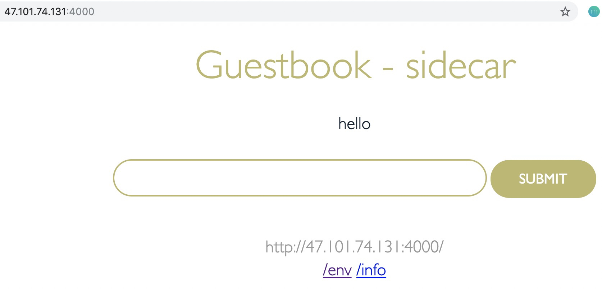

# Inject Sidecar Container with SidecarSet

The sidecarset controller implements a MutatingAdmissionWebhook which watches for Pod creation and automatically injects the containers specified in sidecarset CRDs
into the matched pods. This tutorial demonstrates how sidecarset controller automatically injects a guestbook sidecar container for gusetbook Pods.

## Install guestbook sidecarset

`kubectl apply -f https://raw.githubusercontent.com/kruiseio/kruise/master/docs/tutorial/v1/guestbook-sidecar.yaml`

**guestbook-sidecar at a glance**

```yaml
apiVersion: apps.kruise.io/v1alpha1
kind: SidecarSet
metadata:
  name: guestbook-sidecar
spec:
  selector: # select the pods to be injected with sidecar containers
    matchLabels:
      app.kubernetes.io/name: guestbook-with-sidecar
  containers:
    - name: guestbook-sidecar
      image: openkruise/guestbook:sidecar
      imagePullPolicy: Always
      ports:
        - name: sidecar-server
          containerPort: 4000 # different from main guestbook containerPort which is 3000
      volumeMounts:
        - name: log-volume
          mountPath: /var/log
  volumes:
    - name: log-volume
      emptyDir: {}

```

## Install guestbook application

Run following command to install the [helm chart](https://github.com/cloudnativeapp/workshop/tree/master/kubecon2019china/charts/guestbook-kruise) with release
name (application name) of `demo-v1`, replica of `20`:

```bash
helm install demo-v1 apphub/guestbook-kruise --set replicaCount=20,image.repository=openkruise/guestbook,image.tag=v2 nameOverride=guestbook-with-sidecar
```

Alternatively, install the application using YAML files:

```
kubectl apply -f https://raw.githubusercontent.com/kruiseio/kruise/master/docs/tutorial/v1/guestbook-sts-for-sidecar-demo.yaml
kubectl apply -f https://raw.githubusercontent.com/kruiseio/kruise/master/docs/tutorial/v1/guestbook-service-for-sidecar-demo.yaml
```

## Check guestbook Pod containers

Run `kubectl get sts.apps.kruise.io` to check the statefulset status.
Note that `statefulset.apps.kruise.io` or shortname `sts.apps.kruise.io` is the resource kind.
`app.kruise.io` postfix is needed to resolve the naming conflict with Kubernetes native `statefulset` kind.
Verify that all pods are READY.

```
NAME                        DESIRED    CURRENT    UPDATED    READY    AGE
guestbook-with-sidecar      20         20         20         20       17s
```

Run `kubectl get pod` to check the status of all replicas.

```
NAME                        READY   STATUS    RESTARTS   AGE
guestbook-with-sidecar-0    2/2     Running   0          18s
guestbook-with-sidecar-1    2/2     Running   0          18s
...
guestbook-with-sidecar-17   2/2     Running   0          13s
guestbook-with-sidecar-18   2/2     Running   0          13s
guestbook-with-sidecar-19   2/2     Running   0          12s
```

Run `kubectl describe pod guestbook-with-sidecar-0` to check one Pod and verify that the sidecar container is injected.

```yaml
    Containers:
      guestbook:
        Container ID:   docker://44f19a140c30de2c5b1a3f63c252c074efbb9c1b5eb7893ee7134461466b35c8
        Image:          openkruise/guestbook:v2
        Image ID:       docker-pullable://openkruise/guestbook@sha256:a5b6e5462982ca795fa9c7ddc378ea5b24a31e5d57eb806095526f7b21384dbd
        Port:           3000/TCP
        Host Port:      0/TCP
        State:          Running
          Started:      Wed, 19 Jun 2019 17:30:29 +0800
        Ready:          True
        Restart Count:  0
        Environment:    <none>
        Mounts:
          /var/run/secrets/kubernetes.io/serviceaccount from default-token-k5qpw (ro)
+     guestbook-sidecar:
+       Container ID:   docker://cbc379ce84624d9801928d5b2f1f2739e24094b440c55d62f7e0892eb31b0719
+       Image:          openkruise/guestbook:sidecar
+       Image ID:       docker-pullable://openkruise/guestbook@sha256:016eddf673cc7afc5da2fa96b5148161b521cff20583fb1d0c3aa44e6ac75272
+       Port:           4000/TCP
+       Host Port:      0/TCP
+       State:          Running
+         Started:      Wed, 19 Jun 2019 17:30:45 +0800
+       Ready:          True
+       Restart Count:  0
+       Environment:
+         IS_INJECTED:  true
+       Mounts:
+         /var/log from log-volume (rw)
```

## Access the Sidecar service

Now you can access the Sidecar guestbook service via web browser.

* **Local Host:**
    If you are running all Kubernetes components locally in a single node, navigate to `http://localhost:4000` to access the sidecar service.

* **Remote Host:**
    To access the sidecar service on a remote host, run `kubectl get services` and find the external IP of the service in the **EXTERNAL-IP** column of the output.
    e.g., `47.101.74.131` in this example.

```
NAME                      TYPE           CLUSTER-IP     EXTERNAL-IP     PORT(S)                         AGE
guestbook-with-sidecar    LoadBalancer   172.21.2.187   47.101.74.131   3000:31459/TCP,4000:32099/TCP   35m
```

The web browser output looks like:


The main guestbook service is running on port `3000`, e.g., `http://localhost:3000`. Check for the difference!

In above example, the `guestbook-with-sidecar` service uses `LoadBalancer` type. It works in a cloud environment where cloud provider supports external load balancers.
In case one wants to examine the same in local environment using `minikube`, change the `guestbook-with-sidecar` service type to `NodePort`.
An example `guestbook-service-for-sidecar-demo.yaml` looks like:

```yaml
apiVersion: v1
kind: Service
metadata:
  name: guestbook-with-sidecar
  labels:
    app: guestbook-with-sidecar
spec:
  ports:
  - nodePort: 30163
    port: 3000
    targetPort: http-server
    name: main-port
  - nodePort: 30164
    port: 4000
    targetPort: sidecar-server
    name: sidecar-port
  selector:
    app.kubernetes.io/name: guestbook-with-sidecar
  type: NodePort
```

Relaunch the `guestbook-with-sidecar` service, then one can navigate `http://MINIKUBE_IP:30164` to access the sidecar service.

## Update the sidecar

Use `kubectl edit sidecarset guestbook-sidecar`, change image to "openkruise/guestbook:sidecar-v2"

Use `kubectl get sidecarset guestbook-sidecar`, check if all pods are updated according to UPDATED field

When all pods are updated, visit `http://47.101.74.131:4000` again


## Clean up

Using helm to uninstall apps is very easy.

First you may want to list your helm apps:

```
helm list
NAME          NAMESPACE  REVISION  UPDATED                               STATUS    CHART
demo-v1       default    1         2019-06-23 13:33:21.278013 +0800 CST  deployed  guestbook-kruise-0.3.0
```

Then uninstall it:

```
helm uninstall demo-v1
```

If you are not using helm, deleting the application using below commands:

```
kubectl delete sts.apps.kruise.io guestbook-with-sidecar
kubectl delete svc guestbook-with-sidecar
kubectl delete sidecarset guestbook-sidecar
```
